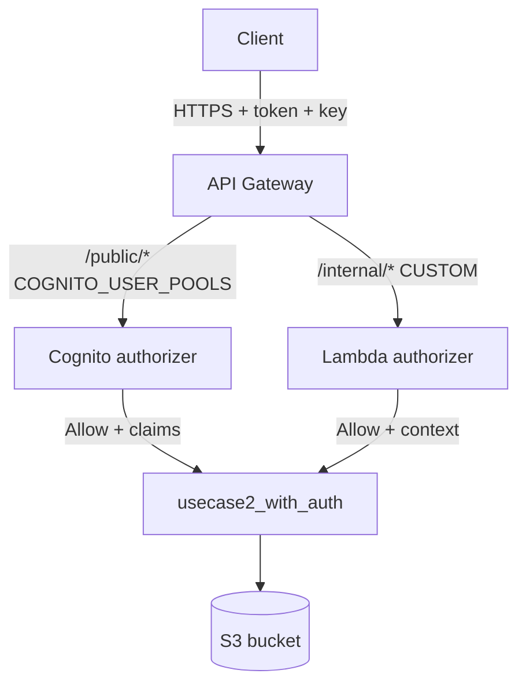

# usecase2_with_auth

Secured version of the Use Case 2 REST API from section 8. The API
has two resources, each protected by a different authorizer:

- `/public/{proxy+}` — Cognito User Pool Authorizer (L36c)
- `/internal/{proxy+}` — Lambda Authorizer with HS256 JWT (L36b)

Both routes run through a **single** integration Lambda
(`lambda_function.py`) that branches on
`event["requestContext"]["resourcePath"]`.

## Files

| File | Purpose |
|---|---|
| `lambda_function.py` | The integration handler. Branches on route, reads `requestContext.authorizer` in either shape. |
| `api_setup.py` | boto3 script that creates the REST API, resources, both authorizers, both integrations, and deploys. |
| `enable_api_key.py` | L36e helper. Flips `apiKeyRequired=true` on both routes. |
| `test_lambda_function.py` | `moto`-backed pytest suite — 10 tests covering both auth modes and the failure paths. |
| `requirements.txt` | Runtime + test deps. |

## Quick start (offline tests)

```bash
cd 09_api_security_lambda_cognito_auth/code/usecase2_with_auth
python -m venv .venv && source .venv/bin/activate
pip install -r requirements.txt
pytest -v
```

You should see `10 passed`.

## Quick start (against real AWS)

The script is idempotent. You need:

1. An S3 bucket (`usecase2-objects` by default).
2. A Lambda function with `lambda_function.lambda_handler` as the
   handler and `BUCKET_NAME` set to the bucket above.
3. A Lambda Authorizer (the one from L37 is fine).
4. A Cognito User Pool with a `client_credentials` App Client (the
   one from L39 is fine).

Then:

```bash
export AWS_REGION=us-east-1
export LAMBDA_ARN=arn:aws:lambda:us-east-1:123456789012:function:usecase2-with-auth
export AUTHORIZER_ARN=arn:aws:lambda:us-east-1:123456789012:function:usecase2-token-authorizer
export USER_POOL_ARN=arn:aws:cognito-idp:us-east-1:123456789012:userpool/us-east-1_abc
python api_setup.py
```

Save the printed `API_ID`. Then enable the API Key (L36e):

```bash
export API_ID=...
python enable_api_key.py
```

## Architecture



One Lambda, two routes, two authorizers, one S3 bucket. The
integration never has to know which authorizer ran — it just
reads the `requestContext.authorizer` block in whatever shape it
arrives.

## How the handler discriminates routes

The handler reads `event["requestContext"]["resourcePath"]` (the
matched **resource definition**, e.g. `/internal/{proxy+}`), not
the URL. The resource path is always present on a proxy-integrated
event and does not include path parameters, which keeps the
dispatching logic simple.

## Failure modes

| Symptom | Cause | Fix |
|---|---|---|
| `403 Invalid permissions on Lambda function` | API Gateway cannot invoke the authorizer or the integration | Re-run `add-permission` with the right source-arn |
| `401 Unauthorized` from the integration | The authorizer's `context` was empty, or the Cognito `claims` block had no `sub` | Re-check the authorizer's return shape |
| `404 Not Found` from the integration | `resourcePath` did not start with `/public` or `/internal` | The integration is misconfigured; check `api_setup.py` |
| `403 Forbidden` on `/internal/*` | The S3 key does not start with `internal/` | Internal callers are scoped; use `/public/...` if the key should be public |
| `401` from API Gateway | Token missing, expired, or signature invalid | Re-mint the token |

## Tear down

```bash
aws apigateway delete-rest-api --rest-api-id "$API_ID"
aws cognito-idp delete-user-pool --user-pool-id "$USER_POOL_ID"
aws lambda delete-function --function-name usecase2-token-authorizer
```

The integration Lambda and S3 bucket are reused in sections 12
(CDK) and 13 (CloudFormation) — leave them in place if you intend
to do those sections next.
