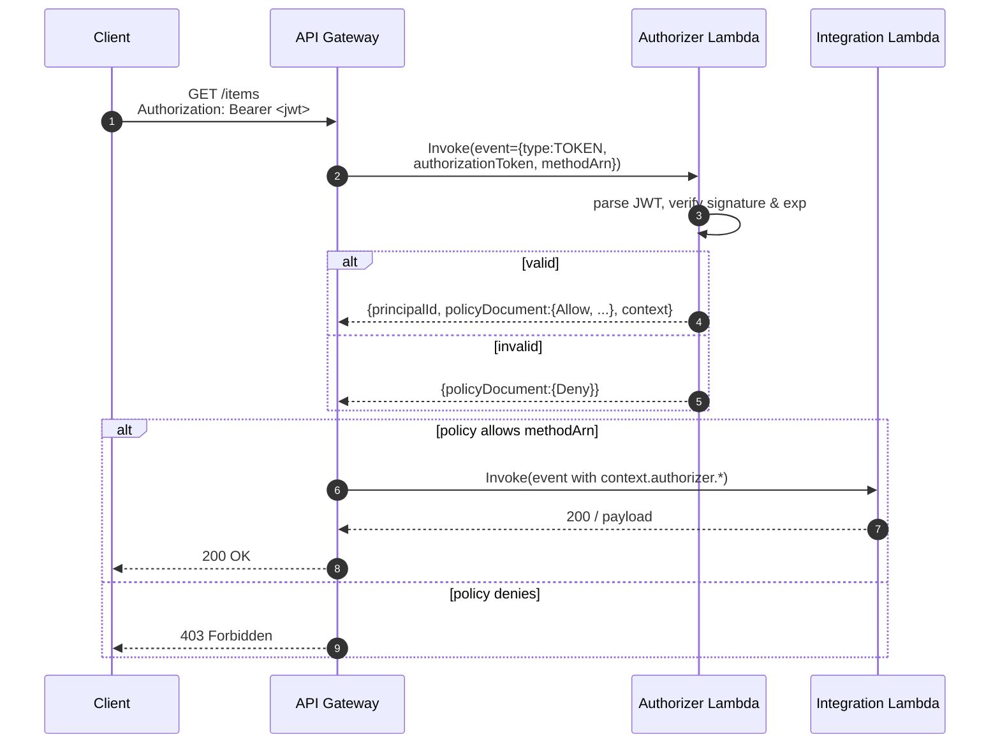

# L36 — Securing APIs using AWS Lambda Authorizer — Theory

> **Author:** Prem Vishnoi <pvishnoi@avilx.com>
> **Section:** 09
> **Duration target:** 3:30
> **Lecture ID:** L36

## Status

Authored. Paired with the hands-on L37 and the `code/lambda_authorizer/` artifact.

## Prereqs

- Sections 7 and 8 complete (REST API with a Lambda integration in place).
- Comfortable reading IAM policy JSON.
- A vague idea of what a JWT is — we will not dive deep into JWS in this
  course, but you should know it is a signed JSON object with three
  base64url segments.

## Key terms

- **Lambda Authorizer** — a Lambda function API Gateway invokes *before*
  the integration. It receives the caller's token (or full request) and
  returns an IAM policy.
- **Token-based vs request-based** — the two flavors of Lambda
  authorizer, differing in what API Gateway puts in the event.
- **`AuthResponse`** — the exact JSON shape the authorizer must return.
- **Caching** — both flavors cache the policy keyed on the token (or on
  the token + some headers) for a configurable TTL.
- **`lambda:InvokeFunction`** — the IAM permission API Gateway needs on
  the authorizer function.

## Lecture

### 1. Why a custom authorizer at all

In section 7 you saw the full menu of API Gateway auth options: IAM
sigv4, Cognito, Lambda, and the no-auth "open" mode. IAM sigv4 is
excellent for service-to-service calls inside AWS, but for browser,
mobile, or B2B partner traffic you almost always want a **bearer token**
flow — the client gets a token from some identity provider, sends it in
the `Authorization` header, and the API trusts it. API Gateway offers two
managed ways to validate that token (Cognito, covered in L38) and one
fully programmable way — **Lambda Authorizer**.

Use Lambda Authorizer when:

- The token format is non-standard (a legacy session id, a custom
  signed blob, a SAML assertion, an opaque token from a third-party IdP
  whose public keys API Gateway does not know about).
- You need to embed business context into the IAM policy at request
  time — e.g. "this caller is allowed to read S3 keys prefixed with
  `partner-acme/`" because their token carries a `tenant` claim.
- You are migrating from an old in-house auth system and want a
  drop-in replacement that you control end-to-end.

### 2. Token-based vs request-based

There are exactly two event shapes the authorizer Lambda can receive:

**Token-based** (a.k.a. `TOKEN` authorizer):

```json
{
  "type": "TOKEN",
  "authorizationToken": "Bearer eyJhbGciOi...",
  "methodArn": "arn:aws:execute-api:us-east-1:123456789012:abcd/prod/GET/items"
}
```

API Gateway hands you the value of the `Authorization` header as a
single string. You parse it (typically as a JWT) and decide allow/deny.
This is the most common flavor and is what we use in L37.

**Request-based** (a.k.a. `REQUEST` authorizer):

```json
{
  "type": "REQUEST",
  "methodArn": "...",
  "resource": "/items",
  "path": "/items",
  "httpMethod": "GET",
  "headers": { "...": "..." },
  "queryStringParameters": { "...": "..." },
  "pathParameters": { "...": "..." },
  "requestContext": { "...": "..." }
}
```

You get the **full request**, not just the token. Use this when your
policy decision depends on the path, query string, or headers (e.g. a
multi-tenant API where the tenant is in the `X-Tenant-Id` header).

Both are configured the same way in API Gateway — the only thing that
changes is the **identitySource** (`method.request.header.Authorization`
for token-based, multiple headers/queries for request-based).

### 3. The `AuthResponse` shape — the contract you must obey

This is the single most common source of bugs. The authorizer must
return a JSON object of this exact shape:

```json
{
  "principalId": "user|abc123",
  "policyDocument": {
    "Version": "2012-10-17",
    "Statement": [
      {
        "Effect": "Allow",
        "Action": "execute-api:Invoke",
        "Resource": [
          "arn:aws:execute-api:us-east-1:123456789012:abcd/prod/GET/items",
          "arn:aws:execute-api:us-east-1:123456789012:abcd/prod/GET/items/*"
        ]
      }
    ]
  },
  "context": {
    "tenant": "acme",
    "scope": "read"
  },
  "usageIdentifierKey": "..." 
}
```

Rules:

- `principalId` is required and becomes the `context.authorizer.principalId`
  in the integration event. Use a stable identifier (sub claim, user id).
- `policyDocument.Statement[0].Resource` **must** include the incoming
  `methodArn` (or a wildcard covering it). API Gateway will reject
  the policy otherwise.
- `Action` is almost always `execute-api:Invoke`. There is no other
  valid value here.
- To **deny**, return the same shape with `Effect: "Deny"`. There is
  no `{"isAuthorized": false}` shortcut in REST APIs (that is the
  HTTP-API v2 shape — do not confuse them).
- `context` is optional but is where you pass claims to the
  integration Lambda. It must be a flat string-only map.
- `usageIdentifierKey` is only relevant if you are also using API keys
  and usage plans; leave it out for now.

### 4. Caching

API Gateway caches the **policy** keyed on the **identity source** (the
token for TOKEN authorizers, the combination of headers/queries for
REQUEST). Default TTL is 300 seconds, minimum 0, maximum 3600. Configure
it on the authorizer itself.

Why cache?

- The authorizer Lambda is in the hot path of every API call.
- Token validation often involves a network round trip to a JWKS
  endpoint or a database lookup.
- Cache aggressively for read-heavy traffic; keep TTL low if claims
  expire quickly.

A subtle gotcha: if you build a TOKEN authorizer and the identity source
is the **entire `Authorization` header**, two different tokens will
invalidate each other's cache slots. That is what you want. If you
build a REQUEST authorizer and your identity source is the `Authorization`
header **plus** a `X-Tenant-Id` header, the cache is keyed on the
combination — the same token on a different tenant gets a separate slot.

### 5. The `lambda:InvokeFunction` permission

This is the only IAM piece you need. API Gateway assumes the role you
pass when configuring the integration (the integration role), but for
the **authorizer** itself API Gateway invokes your function with its
**own** service principal — and it needs explicit permission on the
function resource policy.

The trust statement on the authorizer function must allow
`apigateway.amazonaws.com` to call it, and the resource policy must
grant `lambda:InvokeFunction` to the API Gateway service principal for
the right source ARN:

```json
{
  "Effect": "Allow",
  "Principal": { "Service": "apigateway.amazonaws.com" },
  "Action": "lambda:InvokeFunction",
  "Resource": "arn:aws:lambda:us-east-1:123456789012:function:my-authorizer",
  "Condition": {
    "ArnLike": {
      "AWS:SourceArn": "arn:aws:execute-api:us-east-1:123456789012:abcd/*"
    }
  }
}
```

Without this, every API call returns `403 Invalid permissions on Lambda
function` — and it does not show up in the function's CloudWatch logs
because the call is rejected before invoke.

### 6. Sequence diagram



## Hands-on preview (full walk-through in L37)

In L37 we will:

1. Create a tiny authorizer Lambda that validates a JWT signed with
   `HS256` against a shared secret stored in `JWT_SECRET`.
2. Wire it onto the `GET /items` method of the REST API from section 8.
3. Test it with a Python `requests` script that mints a token with
   `pyjwt` and sends it in the `Authorization` header.
4. Run the same flow under `moto` to make it testable offline.

## Quiz prep

Before you take the section 9 quiz, make sure you can answer:

- What are the two Lambda Authorizer event types and when do you pick
  each?
- What is the exact `policyDocument` shape your function must return?
- Which IAM permission does API Gateway need on the authorizer function
  and where is it granted (function resource policy, not role)?
- What does API Gateway cache and for how long?

## Further reading

- AWS Docs — [Lambda authorizer input/output](https://docs.aws.amazon.com/apigateway/latest/developerguide/apigateway-use-lambda-authorizer.html)
- AWS Blog — [Introducing fine-grained IAM authorization for API Gateway](https://aws.amazon.com/blogs/compute/introducing-fine-grained-iam-authorization-for-aws-api-gateway/)
- RFC 8725 — JSON Web Token Best Current Practices
