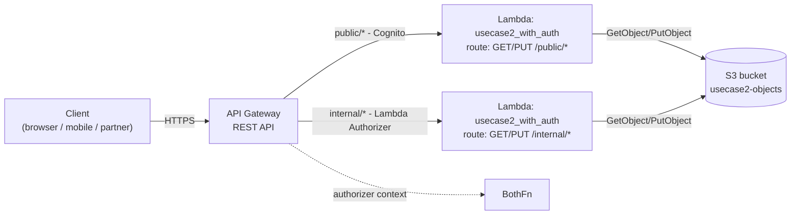

# L36a — Use Case 2 Re-Walk — Architecture (security lens)

> **Author:** Prem Vishnoi <pvishnoi@avilx.com>
> **Section:** 09
> **Duration target:** 6:00
> **Lecture ID:** L36a

## Status

Authored. Companion to the running artifact at
`code/usecase2_with_auth/`. Reads cleanly **after** L36 (Lambda
Authorizer theory) and **before** L36b (wiring the authorizer).

## Prereqs

- Sections 7–8 complete. You have built the open Use Case 2 API at
  least once (L30–L32) — `GET / POST /{proxy+}` proxied to two Lambda
  integrations reading and writing S3.
- L36 watched/read. You know the difference between `TOKEN` and
  `REQUEST` authorizers and the `AuthResponse` shape.
- A vague idea of OAuth 2.0 — you do not need to be a security
  engineer, but you should know what a bearer token is.

## Key terms

- **Secured API** — a REST API where at least one method requires
  successful authentication *and* authorization before the integration
  is invoked.
- **Public route** — endpoints that anonymous or end-user clients
  hit. Best protected with a managed OIDC IdP (Cognito) so you do
  not write password / session code.
- **Internal route** — endpoints that only trusted back-office
  callers hit (cron jobs, internal Lambdas, partner systems). A
  Lambda Authorizer with a custom-signed token is appropriate when
  the IdP is not Cognito.
- **Defense in depth** — layering multiple authn/authz checks
  (network policy + authorizer + IAM + application logic) instead
  of relying on any single one.
- **`requestContext.authorizer`** — the dict API Gateway injects
  into the integration event after the authorizer returns. The
  integration reads it to learn *who* called.

## Lecture

The first walk-through of Use Case 2 (section 8) gave us a perfectly
fine **open** API: any client could `GET / POST /{proxy+}` against an
S3-backed CRUD. That is fine for a teaching demo, but the moment the
endpoint sits behind a real domain name you have a problem: there is
no way to tell who the caller is, no way to keep one tenant from
seeing another's objects, and no way to slow down a noisy client.

This lecture re-walks the same architecture through a **security
lens**. We are not inventing new services — we are asking a different
question of the same three components.

### 1. The same three services, two new edges



The shape is identical to L30: one REST API, one Lambda function (or
two), one S3 bucket. The only difference is that **API Gateway now
holds two edges that did not exist before**:

- a public edge where authentication is delegated to a managed
  OIDC identity provider (Cognito);
- an internal edge where authentication is delegated to a Lambda
  Authorizer that knows the partner's secret.

Everything past the API Gateway edge is unchanged. We deliberately
keep it that way — the integration Lambda does not change, the IAM
execution role does not change, the S3 bucket does not change. The
authorizer runs *before* the integration and stamps the caller
identity into the event for the integration to consume.

### 2. Why two different authorizers?

A real API rarely has a single class of caller. Re-using Use Case 2
as the running example:

| Caller | Path | Best authorizer | Why |
|---|---|---|---|
| End-user mobile / browser app fetching their own thumbnails | `GET /public/orders/123` | Cognito User Pool | OIDC JWT, no custom secret handling, JWT verifies offline against the User Pool's JWKS. |
| Internal admin tool listing every audit object under `internal/` | `GET /internal/audit/...` | Lambda Authorizer with shared HMAC secret | No human is involved, no need for password flows; the partner already holds the secret from onboarding. Token format is custom and would not survive a Cognito author's JWKS validation. |
| Partner B2B system pushing daily batch files | `PUT /internal/batch/2026-10-10.json` | Lambda Authorizer | Same reason — credential lives outside Cognito. |

The decision rule is the same one we covered in L36 / L38: if your
tokens are OIDC JWTs issued by Cognito, use the managed Cognito
authorizer. If not, use a Lambda Authorizer. You almost always end
up with **both** in a non-trivial API.

### 3. The information the integration needs

The integration Lambda does not care *how* the caller was
authenticated. It cares about three things, all of which API Gateway
forwards via `event["requestContext"]["authorizer"]` regardless of
authorizer flavor:

1. **Who** — a stable identifier (`sub`, `client_id`,
   `principalId`). Used for log correlation and tenant routing.
2. **What** — claims or scope (`scope`, `cognito:groups`, custom
   `tenant` claim). Used for authorization decisions inside the
   Lambda.
3. **Where from** — the `route` under which the method was
   registered (`/public/*` vs `/internal/*`). Pulled from
   `event["requestContext"]["resourcePath"]` and used to short-
   circuit obvious mistakes.

A clean handler reads those three values once at the top of the
function and passes them as a small dict to the rest of the code. We
will see exactly that shape in `code/usecase2_with_auth/lambda_function.py`.

### 4. What stays the same — and what changes

| Component | Section 8 (open) | Section 9 (secured) |
|---|---|---|
| API Gateway type | REST | REST (unchanged) |
| Resource paths | `/{proxy+}` only | `/public/{proxy+}` and `/internal/{proxy+}` (split into two nested resources) |
| Methods on each path | `GET`, `POST` | `GET`, `PUT` |
| Lambda integrations | `api_get_object`, `api_put_object` | one `usecase2_with_auth` function that branches on `event.path` |
| Authorizer | none | `COGNITO_USER_POOLS` on `/public/*`, `CUSTOM` (token) on `/internal/*` |
| IAM execution role | S3 `Get/PutObject` on the bucket | same — authorizer does not change the integration IAM |
| S3 bucket | the same one | the same one |
| Caching | n/a | 300-second TTL on both authorizers |

The point to internalize: **only the edge changes**. The authorizer
runs *before* the integration and either lets the request through
or denies it; it never *modifies* the request body, never *rewrites*
the URL, never *validates* the body schema. Those are still the
job of API Gateway's request-validation settings and the integration
Lambda itself.

### 5. The new runtime contract for the Lambda

The integration Lambda now sees a slightly richer `requestContext`:

```json
{
  "resource": "/public/{proxy+}",
  "path": "/public/orders/123",
  "httpMethod": "GET",
  "requestContext": {
    "resourceId": "abc",
    "apiId": "abcd",
    "authorizer": {
      "principalId": "user|abc123",
      "tenant": "acme",
      "scope": "read",
      "route": "public"
    }
  }
}
```

vs the Cognito variant:

```json
{
  "requestContext": {
    "authorizer": {
      "principalId": "service-uuid",
      "claims": {
        "sub": "service-uuid",
        "client_id": "<APP_CLIENT_ID>",
        "scope": "demo-pool/read:items",
        "iss": "https://cognito-idp.us-east-1.amazonaws.com/..."
      }
    }
  }
}
```

The handler has to handle both shapes because **both routes run
through the same Lambda**. That is fine — we branch on
`requestContext.resourcePath` (which is filled in by API Gateway
from the resource definition, not the authorizer), and we know which
authorizer populated `requestContext.authorizer` based on which
route matched.

### 6. The "secure by default" checklist

Before we wire any of this up in L36b and L36c, write down the
five properties the secured API must have:

1. **Default deny.** A method without an authorizer is `403`.
2. **No anonymous fallback.** There is no `authType: NONE` on any
   production method.
3. **Context is reachable.** The integration can read the
   `authorizer` block. The authorizer returns a non-empty `context`
   (or, for Cognito, a non-empty `claims` block).
4. **Cache key matches identity.** Two distinct callers do not share
   a cached policy.
5. **IAM is least-privilege.** The Lambda execution role grants only
   the S3 actions needed on only the bucket prefix the route needs
   (e.g. internal callers may not see `public/` keys).

These five come back in every security review. They also map 1:1 to
the quiz questions at the end of L36b and L36c.

### 7. What you will build next

In **L36b** we add the Lambda Authorizer from L37 to the
`/internal/*` resource. The integration Lambda reads `sub`, `tenant`
and `scope` from the authorizer `context` and enforces a simple
"internal callers may only read keys under `internal/`" rule.

In **L36c** we add the Cognito User Pool Authorizer from L39 to the
`/public/*` resource. The same integration Lambda now branches on
`event["requestContext"]["resourcePath"]` and reads `claims` instead
of `context` for the public path.

The point of this three-lecture arc is to show that **the only thing
that changes when you "secure" an API is the edge**. The integration
gets a richer event but its core logic (read S3, write S3, return
JSON) does not change.

## Hands-on preview

In the companion artifact (`code/usecase2_with_auth/`):

- `lambda_function.py` — single handler for `GET` and `PUT` on both
  `/public/*` and `/internal/*`. Branches on `resourcePath`. Reads
  caller identity from `requestContext.authorizer`.
- `api_setup.py` — boto3 script that creates the REST API, the two
  resources, both authorizers, both integrations, and a deployment.
- `test_lambda_function.py` — six `moto`-backed tests covering
  happy path, missing key, both auth modes, IAM denial, and the
  route branch.

Full walkthrough in L36b and L36c. This lecture is the contract
both hands-on lectures will implement.

## Quiz prep

- What is the difference between "the integration logic" and "the
  edge" of a secured API?
- Why would you ever use *two* different authorizers on the same
  REST API?
- Name the three pieces of caller information every integration
  Lambda needs to read from `requestContext.authorizer`.
- What does "default deny" mean and how does API Gateway enforce it?

## Further reading

- AWS Docs — [Control access to a REST API with IAM permissions](https://docs.aws.amazon.com/apigateway/latest/developerguide/permissions.html)
- AWS Security Best Practices — [Serverless applications lens](https://docs.aws.amazon.com/wellarchitected/latest/serverless-applications-lens/welcome.html)
- OWASP — [API Security Top 10 (2023)](https://owasp.org/API-Security/editions/2023/en/0x11-t10/)
