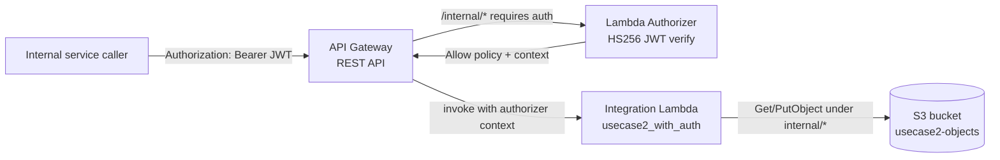

# L36b — Use Case 2 — Part 2: Add Lambda Authorizer to the API

> **Author:** Prem Vishnoi <pvishnoi@avilx.com>
> **Section:** 09
> **Duration target:** 10:00
> **Lecture ID:** L36b

## Status

Authored. First of two hands-on lectures that re-walk Use Case 2 with
a security edge. Pairs with the `/internal/*` resource in
`code/usecase2_with_auth/`. Watch L36 and L37 first if you have not
already.

## Prereqs

- L36 and L36a read end-to-end. You know the `AuthResponse` shape and
  the security lens on the Use Case 2 architecture.
- L37 done. You have already written and unit-tested
  `lambda_authorizer.py` and deployed it once.
- A deployed REST API with a `/public/{proxy+}` and
  `/internal/{proxy+}` resource, or the ability to spin one up via
  `code/usecase2_with_auth/api_setup.py` (this lecture uses that).
- Python 3.11+, `boto3 >= 1.34`, `moto >= 5`, `pytest`, `pyjwt`,
  `requests`.

## Key terms

- **Nested resource** — a child resource of another resource in
  API Gateway. `/{proxy+}` is a child of `/internal`, which is a
  child of `/`. Authorizers can be attached to a parent and
  inherited by children.
- **Resource inheritance** — if a child method has no
  `authorizationType` override, it inherits from the parent. We
  rely on this so we only have to wire the authorizer on the
  parent `/internal` resource.
- **`update_method` with `authorizerId`** — the boto3 call that
  switches a method to use a custom authorizer. Same call works to
  swap authorizer flavors later (L36c).
- **`lambda:InvokeFunction` on the authorizer** — same L37 grant,
  but now scoped to the `execute-api` ARN of *this* API, with a
  condition that limits the authorizer to methods under `/internal`.

## Lecture

In this lecture we take the open Use Case 2 API and put a
**Lambda Authorizer in front of the `/internal/*` resource**. The
public side stays open for now — that is L36c's job. The goal is to
end up with one REST API, two resources, one of which is locked
down.

### 1. What we are building



Two steps, in order:

1. **Stand up the authorizer.** Reuse the `lambda_authorizer` from
   L37; grant API Gateway permission to invoke it; create the
   authorizer resource on the REST API; set the `/internal`
   resource's `authorizationType` to `CUSTOM` and `authorizerId`
   to the new authorizer.
2. **Branch the integration on `resourcePath`.** The handler
   inspects `event["requestContext"]["resourcePath"]`. If it starts
   with `/internal`, it reads `requestContext.authorizer.sub /
   .tenant / .scope`. If it starts with `/public`, it does not
   trust the authorizer block (will be filled in by Cognito in
   L36c).

### 2. The handler — the only file that really changes

`code/usecase2_with_auth/lambda_function.py` (excerpt):

```python
"""GET/PUT on /public/{proxy+} and /internal/{proxy+}.

The same function serves two routes:

* /public/*  — protected by a Cognito User Pool Authorizer (L36c).
* /internal/* — protected by a Lambda Authorizer (this lecture).

The authorizer block in event["requestContext"]["authorizer"] has
two distinct shapes depending on which authorizer ran. We branch
on the resource path and read whichever shape applies.
"""

from __future__ import annotations

import json
import logging
import os
from typing import Any, Dict, Optional

import boto3
from botocore.exceptions import ClientError

LOG = logging.getLogger()
LOG.setLevel(logging.INFO)

BUCKET: str = os.environ["BUCKET_NAME"]
_s3 = boto3.client("s3")


def _caller_for_internal(event: Dict[str, Any]) -> Dict[str, str]:
    """Read the authorizer context produced by the Lambda Authorizer."""
    auth = event.get("requestContext", {}).get("authorizer") or {}
    # Lambda Authorizer: the flat 'context' map is hoisted to the
    # top level of the authorizer block by API Gateway.
    return {
        "principal_id": str(auth.get("principalId", "anonymous")),
        "tenant": str(auth.get("tenant", "")),
        "scope": str(auth.get("scope", "")),
        "sub": str(auth.get("sub", "")),
    }


def _caller_for_public(event: Dict[str, Any]) -> Dict[str, str]:
    """Read the claims produced by the Cognito User Pool Authorizer.

    Filled in by L36c. The block below is here so the function
    imports cleanly even before the public authorizer is wired.
    """
    claims = (
        event.get("requestContext", {})
        .get("authorizer", {})
        .get("claims", {})
    ) or {}
    return {
        "principal_id": str(claims.get("sub", "anonymous")),
        "client_id": str(claims.get("client_id", "")),
        "scope": str(claims.get("scope", "")),
    }


def _route_of(event: Dict[str, Any]) -> str:
    """Return 'public' or 'internal' based on the matched resource."""
    path = event.get("requestContext", {}).get("resourcePath", "")
    if path.startswith("/public"):
        return "public"
    if path.startswith("/internal"):
        return "internal"
    return "unknown"


def _resolve_key(event: Dict[str, Any]) -> str:
    """Read the S3 key from the {proxy+} path parameter."""
    path = event.get("pathParameters") or {}
    return (path.get("proxy") or "").strip("/")


def _json(status: int, payload: Dict[str, Any]) -> Dict[str, Any]:
    return {
        "statusCode": status,
        "headers": {"Content-Type": "application/json"},
        "body": json.dumps(payload),
    }


def lambda_handler(event: Dict[str, Any], context: Any) -> Dict[str, Any]:
    key = _resolve_key(event)
    if not key:
        return _json(400, {"error": "key is required in the URL path"})

    route = _route_of(event)
    method = event.get("httpMethod", "GET").upper()

    # The internal route enforces a prefix on the S3 key — internal
    # callers may not read or write under /public/ in the bucket.
    if route == "internal" and not key.startswith("internal/"):
        return _json(
            403,
            {"error": "internal callers may only touch internal/ keys"},
        )

    caller = (
        _caller_for_internal(event)
        if route == "internal"
        else _caller_for_public(event)
    )

    if method == "GET":
        try:
            resp = _s3.get_object(Bucket=BUCKET, Key=key)
        except ClientError as exc:
            code = exc.response.get("Error", {}).get("Code")
            if code in ("NoSuchKey", "404"):
                return _json(404, {"error": "not found", "key": key})
            LOG.exception("S3 GetObject failed for key=%s", key)
            raise
        body = resp["Body"].read().decode("utf-8")
        return _json(
            200,
            {
                "key": key,
                "route": route,
                "caller": caller,
                "content": body,
                "size": resp.get("ContentLength"),
            },
        )

    if method == "PUT":
        body_bytes = (event.get("body") or "").encode("utf-8")
        if not body_bytes:
            return _json(400, {"error": "body is empty"})
        _s3.put_object(Bucket=BUCKET, Key=key, Body=body_bytes)
        LOG.info(
            "wrote s3://%s/%s by route=%s principal=%s",
            BUCKET, key, route, caller["principal_id"],
        )
        return _json(
            200,
            {
                "key": key,
                "route": route,
                "caller": caller,
                "bytes": len(body_bytes),
            },
        )

    return _json(405, {"error": f"method {method} not allowed"})
```

Three things to notice:

1. **One Lambda, two routes.** We are not creating a
   `internal_get_object` function. The route is a runtime decision
   based on `resourcePath` — which is *always* present on a
   proxy-integrated event.
2. **The authorizer context is hoisted to the top level of
   `requestContext.authorizer`.** The `context` map you returned
   from the Lambda Authorizer's `AuthResponse` becomes the flat
   `authorizer` dict the integration sees. There is no nested
   `context` key to chase.
3. **A simple "prefix matches route" rule.** This is a teaching
   example, not a security boundary. In production the rule would
   live in the authorizer (deny tokens whose `tenant` claim does
   not match the requested key prefix) or in a custom IAM policy
   generated by the authorizer.

### 3. The boto3 wiring — `api_setup.py`

This is the script that stands up the entire REST API from scratch.
We split it into helpers because it does five things in sequence:

```python
"""Stand up the secured Use Case 2 REST API end-to-end.

Idempotent: re-running with the same API_NAME returns the existing
api id and resource ids. Use it from CI as the source of truth.

Env vars:
    API_NAME        default: usecase2-secure
    STAGE_NAME      default: prod
    BUCKET_NAME     default: usecase2-objects
    LAMBDA_ARN      the integration Lambda ARN
    AUTHORIZER_ARN  the Lambda Authorizer function ARN
    USER_POOL_ARN   the Cognito User Pool ARN (L36c)
"""

from __future__ import annotations

import os
from typing import Dict, Tuple

import boto3
from botocore.exceptions import ClientError


REGION = os.environ.get("AWS_REGION", "us-east-1")
API_NAME = os.environ.get("API_NAME", "usecase2-secure")
STAGE_NAME = os.environ.get("STAGE_NAME", "prod")


def _client():
    return boto3.client("apigateway", region_name=REGION)


def _find_or_create_api() -> str:
    apigw = _client()
    paginator = apigw.get_paginator("get_rest_apis")
    for page in paginator.paginate():
        for api in page["items"]:
            if api["name"] == API_NAME:
                return api["id"]
    return apigw.create_rest_api(name=API_NAME, endpointConfiguration={"types": ["REGIONAL"]})["id"]


def _find_child(parent_id: str, path_part: str) -> Optional[str]:
    apigw = _client()
    paginator = apigw.get_paginator("get_resources")
    for page in paginator.paginate(restApiId=parent_id):
        for r in page["items"]:
            if r.get("pathPart") == path_part and r.get("parentId") is not None:
                return r["id"]
    return None


def _ensure_resource(api_id: str, parent_id: str, path_part: str) -> str:
    apigw = _client()
    existing = _find_child(parent_id, path_part)
    if existing:
        return existing
    return apigw.create_resource(
        restApiId=api_id, parentId=parent_id, pathPart=path_part,
    )["id"]


def _ensure_proxy_child(api_id: str, parent_id: str) -> str:
    apigw = _client()
    existing = _find_child(parent_id, "{proxy+}")
    if existing:
        return existing
    return apigw.create_resource(
        restApiId=api_id, parentId=parent_id, pathPart="{proxy+}",
    )["id"]


def _ensure_method(
    api_id: str, resource_id: str, method: str, lambda_uri: str,
    authorizer_id: Optional[str] = None,
) -> None:
    apigw = _client()
    kwargs: Dict[str, str] = {
        "restApiId": api_id,
        "resourceId": resource_id,
        "httpMethod": method,
        "authorizationType": "CUSTOM" if authorizer_id else "NONE",
        "apiKeyRequired": False,
    }
    if authorizer_id:
        kwargs["authorizerId"] = authorizer_id
    try:
        apigw.put_method(**kwargs)
    except ClientError as exc:
        if exc.response["Error"]["Code"] != "ConflictException":
            raise


def _ensure_integration(api_id: str, resource_id: str, method: str, lambda_uri: str) -> None:
    apigw = _client()
    try:
        apigw.put_integration(
            restApiId=api_id,
            resourceId=resource_id,
            httpMethod=method,
            type="AWS_PROXY",
            integrationHttpMethod="POST",
            uri=lambda_uri,
        )
    except ClientError as exc:
        if exc.response["Error"]["Code"] != "ConflictException":
            raise


def _ensure_lambda_authorizer(
    api_id: str, function_arn: str, name: str = "usecase2-token-authorizer",
) -> str:
    apigw = _client()
    paginator = apigw.get_paginator("get_authorizers")
    for page in paginator.paginate(restApiId=api_id):
        for a in page["items"]:
            if a["name"] == name:
                return a["id"]
    return apigw.create_authorizer(
        restApiId=api_id,
        name=name,
        type="TOKEN",
        authorizerUri=(
            f"arn:aws:apigateway:{REGION}:lambda:path/2015-03-31"
            f"/functions/{function_arn}/invocations"
        ),
        identitySource="method.request.header.Authorization",
        authorizerResultTtlInSeconds=300,
    )["id"]


def main() -> int:
    apigw = _client()
    api_id = _find_or_create_api()
    print(f"API: {api_id}")

    # 1. /public and /internal resources (no methods yet).
    public_id = _ensure_resource(api_id, _get_root(api_id), "public")
    internal_id = _ensure_resource(api_id, _get_root(api_id), "internal")

    # 2. /public/{proxy+} and /internal/{proxy+} children.
    public_proxy_id = _ensure_proxy_child(api_id, public_id)
    internal_proxy_id = _ensure_proxy_child(api_id, internal_id)

    # 3. The integration Lambda URI (AWS_PROXY expects the function ARN
    #    in the "arn:aws:apigateway:..." shape).
    lambda_arn = os.environ["LAMBDA_ARN"]
    lambda_uri = (
        f"arn:aws:apigateway:{REGION}:lambda:path/2015-03-31"
        f"/functions/{lambda_arn}/invocations"
    )

    # 4. Lambda Authorizer on the internal resource.
    authorizer_id = _ensure_lambda_authorizer(api_id, os.environ["AUTHORIZER_ARN"])

    # 5. Methods on /internal/{proxy+} — protected.
    for method in ("GET", "PUT"):
        _ensure_method(api_id, internal_proxy_id, method, lambda_uri, authorizer_id)
        _ensure_integration(api_id, internal_proxy_id, method, lambda_uri)

    # 6. Methods on /public/{proxy+} — open for now, Cognito added in L36c.
    for method in ("GET", "PUT"):
        _ensure_method(api_id, public_proxy_id, method, lambda_uri)
        _ensure_integration(api_id, public_proxy_id, method, lambda_uri)

    # 7. Redeploy.
    apigw.create_deployment(restApiId=api_id, stageName=STAGE_NAME)
    print(f"Deployed to {STAGE_NAME}")
    return 0


def _get_root(api_id: str) -> str:
    apigw = _client()
    resources = apigw.get_resources(restApiId=api_id)["items"]
    for r in resources:
        if r.get("path") == "/" and r.get("parentId") is None:
            return r["id"]
    raise RuntimeError("root resource not found")


if __name__ == "__main__":
    raise SystemExit(main())
```

You can read top-to-bottom and see the seven steps in order: API,
parent resources, proxy children, integration URI, authorizer,
methods, deployment. The script is idempotent — re-running it does
not duplicate authorizers or fail on existing methods.

### 4. The `lambda:InvokeFunction` grant, again

Same grant as L37, but this time the `source-arn` is the *new* API
id:

```bash
aws lambda add-permission \
  --function-name usecase2-token-authorizer \
  --statement-id apigateway-invoke-usecase2-secure \
  --action lambda:InvokeFunction \
  --principal apigateway.amazonaws.com \
  --source-arn "arn:aws:execute-api:us-east-1:123456789012:${API_ID}/*"
```

If you skip this, every internal call returns `403 Invalid
permissions on Lambda function` *before* the authorizer runs.

### 5. Smoke test the internal route

```python
"""Mint a JWT and call the secured GET /internal/audit/2026-10-10 endpoint."""

import os, time, jwt, requests

API_BASE = os.environ["API_BASE"]  # https://abcd.execute-api.us-east-1.amazonaws.com/prod
SECRET = os.environ["JWT_SECRET"]

token = jwt.encode(
    {"sub": "svc-acme", "tenant": "acme", "scope": "read", "exp": int(time.time()) + 300},
    SECRET, algorithm="HS256",
)

# 1. Internal, no token — 403
r = requests.get(f"{API_BASE}/internal/audit/2026-10-10", timeout=10)
print("internal, no token  ->", r.status_code, r.text[:80])

# 2. Internal, with token — 200
r = requests.get(
    f"{API_BASE}/internal/audit/2026-10-10",
    headers={"Authorization": f"Bearer {token}"},
    timeout=10,
)
print("internal, with token ->", r.status_code, r.text[:240])

# 3. Public, no token — still 200 (open, will be closed in L36c)
r = requests.get(f"{API_BASE}/public/orders/123", timeout=10)
print("public, no token    ->", r.status_code, r.text[:80])
```

You should see `200` for both the open public route and the
internal-with-token case, and `403` for the internal-without-token
case.

### 6. Common failure modes for the internal route

| Symptom | Cause | Fix |
|---|---|---|
| `403 Invalid permissions on Lambda function` | Missing `lambda:InvokeFunction` on the authorizer | Re-run `add-permission` with the right source-arn |
| `401 Unauthorized` with a valid token | Authorizer threw or returned malformed JSON | Look at the authorizer's CloudWatch logs — usually a JWT verification error |
| Integration sees empty `requestContext.authorizer` | You forgot the `context` field in `AuthResponse` | Add a flat `string→string` context; nested objects are dropped |
| `403 Forbidden` even on `internal/...` keys | The integration's prefix check is wrong | The handler enforces `key.startswith("internal/")` — make sure the S3 key matches the path |
| Token works for 5 minutes then 401 | Cache TTL or secret rotation | Wait the TTL, or change the authorizer name to force a fresh cache |

### 7. Cleanup

```bash
aws apigateway delete-rest-api --rest-api-id "$API_ID"
aws lambda delete-function --function-name usecase2-token-authorizer
```

The integration Lambda and the S3 bucket are reused by L36c, so
leave them in place.

## Hands-on summary

You have now:

- stood up a single REST API with two resources
  (`/public/{proxy+}` and `/internal/{proxy+}`),
- attached a Lambda Authorizer to the `/internal/*` resource only,
- branched the integration on `resourcePath`,
- enforced a prefix-on-key check inside the integration.

L36c reuses every file we just wrote and adds a Cognito
authorizer to the `/public/*` resource. The integration gets a
second branch in `_caller_for_public`.

## Quiz prep

- Why do we branch the integration on `resourcePath` and not on
  `path`?
- What does API Gateway do with the `context` map you returned
  from the Lambda Authorizer?
- Why is the `lambda:InvokeFunction` grant needed for the
  authorizer but not for the integration Lambda?
- What is the simplest prefix rule a teaching integration can
  enforce, and where would the equivalent production rule live?

## Further reading

- AWS Docs — [Set up a REST API with private integration](https://docs.aws.amazon.com/apigateway/latest/developerguide/set-up-private-integration.html)
- AWS Samples — [Serverless CRUD example with auth](https://github.com/aws-samples/aws-apigateway-lambda-authorizer-blueprints)
- boto3 — [apigateway.put_method](https://boto3.amazonaws.com/v1/documentation/api/latest/reference/services/apigateway.html#APIGateway.Client.put_method)
