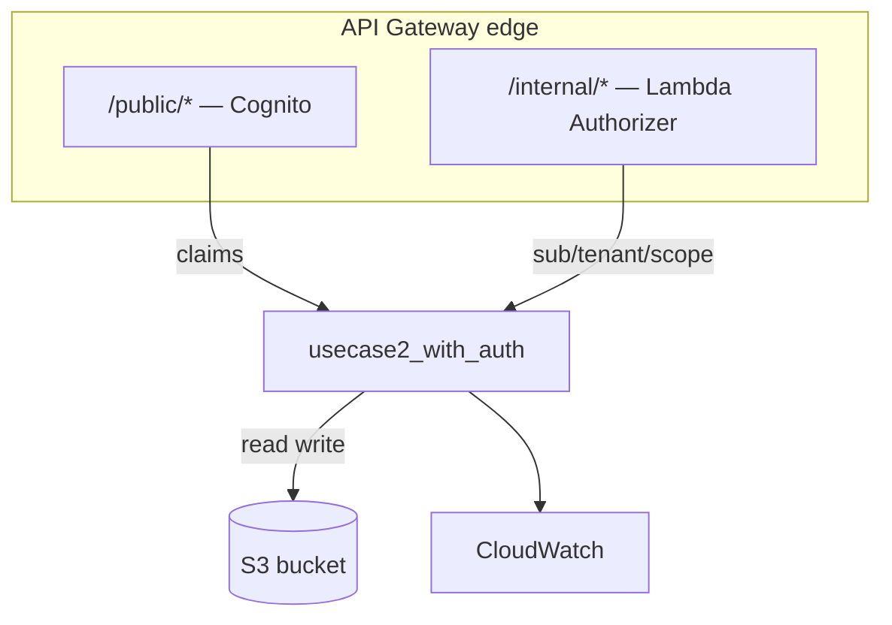

# L36c — Use Case 2 — Part 3: Add Cognito Authorizer to the API

> **Author:** Prem Vishnoi <prem.vishnoi@example.com>
> **Section:** 09
> **Duration target:** 10:00
> **Lecture ID:** L36c

## Status

Authored. Third lecture in the Use Case 2 security re-walk. Pairs
with the `/public/*` resource in `code/usecase2_with_auth/`. Watch
L36, L36a, L36b, and L38 before this one.

## Prereqs

- L38 watched/read. You know the difference between User Pool and
  Identity Pool, the three claims API Gateway verifies, and how
  `client_credentials` works.
- L36b done. The REST API exists with two resources, the
  `/internal/*` resource is locked behind a Lambda Authorizer, and
  the integration Lambda branches on `resourcePath`.
- A Cognito User Pool with a `client_credentials` App Client (or
  the willingness to create one via `code/cognito_setup/create_user_pool.py`
  from L39).
- Python 3.11+, `boto3 >= 1.34`, `moto >= 5`, `pytest`, `requests`.

## Key terms

- **`providerARNs`** — the list of User Pool ARNs the managed
  Cognito authorizer trusts. REST API v1 authorizers accept up to
  one; HTTP API v2 accepts up to 20. We pass one.
- **Authorizer type change** — to swap from `CUSTOM` to
  `COGNITO_USER_POOLS` on a resource you patch the method's
  `authorizationType` and `authorizerId`. Same `update_method` call
  as L36b, different values.
- **`cognito:groups` flattening** — API Gateway joins array
  claims into a single space-separated string. If you need the
  list, split on whitespace.
- **Scope-down** — restricting a method to a specific OAuth scope.
  We add it on `/public/PUT` to require `write:items`; we leave
  `/public/GET` open to any valid token.

## Lecture

We finish the secured Use Case 2 by adding a **Cognito User Pool
Authorizer** to the `/public/*` resource. The `/internal/*`
authorizer and the integration Lambda from L36b are unchanged.

### 1. What we are building

```mermaid
flowchart LR
    Client["End-user client<br/>(browser / mobile)"]
    CP["Cognito User Pool<br/>/oauth2/token"]
    APIGW["API Gateway<br/>REST API"]
    Int["Integration Lambda<br/>usecase2_with_auth"]
    S3[(S3 bucket<br/>usecase2-objects)]
    Client -->|client_credentials grant| CP
    CP -->|access_token (JWT)| Client
    Client -->|Authorization: Bearer JWT| APIGW
    APIGW -->|/public/* requires Cognito| APIGW
    APIGW -->|invoke with claims| Int
    Int -->|Get/PutObject under public/*| S3
```

Two new pieces, in order:

1. A **Cognito User Pool** with a `client_credentials` App Client
   and a custom scope `read:items` (and `write:items` for the
   `PUT` method).
2. A **`COGNITO_USER_POOLS` authorizer** on the `/public/*`
   resource, attached to both `GET` and `PUT`. The `PUT` method
   also gets a method-level scope check for `write:items`.

### 2. Bootstrap the User Pool (we already wrote this in L39)

```bash
cd 09_api_security_lambda_cognito_auth/code/cognito_setup
python create_user_pool.py
export USER_POOL_ID=...
export APP_CLIENT_ID=...
export APP_CLIENT_SECRET=...
```

We re-use the same `create_user_pool.py` from L39. The only
addition is a second scope — `write:items` — and the same scope
on the method's `authorizationScopes`.

If you have not yet added `write:items` to the resource server,
add it now:

```bash
aws cognito-idp update-resource-server \
  --user-pool-id "$USER_POOL_ID" \
  --identifier demo-section9-pool \
  --scopes \
    ScopeName=read:items,ScopeDescription="Read items" \
    ScopeName=write:items,ScopeDescription="Write items"
```

Then add the new scope to the App Client:

```bash
aws cognito-idp update-user-pool-client \
  --user-pool-id "$USER_POOL_ID" \
  --client-id "$APP_CLIENT_ID" \
  --allowed-o-auth-scopes \
    "demo-section9-pool/read:items" \
    "demo-section9-pool/write:items"
```

### 3. Update `api_setup.py` to attach the Cognito authorizer

We extend the existing script with one new helper. The full
diff is small: one new `_ensure_cognito_authorizer` function, one
new section in `main()` that swaps the `/public/*` method's
`authorizationType` from `NONE` to `COGNITO_USER_POOLS`.

```python
def _ensure_cognito_authorizer(
    api_id: str, user_pool_arn: str, name: str = "usecase2-cognito-authorizer",
) -> str:
    """Create or reuse a COGNITO_USER_POOLS authorizer on the API."""
    apigw = _client()
    paginator = apigw.get_paginator("get_authorizers")
    for page in paginator.paginate(restApiId=api_id):
        for a in page["items"]:
            if a["name"] == name:
                return a["id"]
    return apigw.create_authorizer(
        restApiId=api_id,
        name=name,
        type="COGNITO_USER_POOLS",
        providerARNs=[user_pool_arn],
        identitySource="method.request.header.Authorization",
        authorizerResultTtlInSeconds=300,
    )["id"]


def _set_method_scope(api_id: str, resource_id: str, method: str, scope: str) -> None:
    apigw = _client()
    apigw.update_method(
        restApiId=api_id,
        resourceId=resource_id,
        httpMethod=method,
        patchOperations=[
            {"op": "add", "path": "/authorizationScopes", "value": scope},
        ],
    )
```

In `main()`, after the existing internal wiring:

```python
# 8. Cognito authorizer on the public resource.
cognito_auth_id = _ensure_cognito_authorizer(api_id, os.environ["USER_POOL_ARN"])

# 9. Switch /public/{proxy+} methods to COGNITO_USER_POOLS.
for method in ("GET", "PUT"):
    apigw.update_method(
        restApiId=api_id,
        resourceId=public_proxy_id,
        httpMethod=method,
        patchOperations=[
            {"op": "replace", "path": "/authorizationType", "value": "COGNITO_USER_POOLS"},
            {"op": "replace", "path": "/authorizerId", "value": cognito_auth_id},
        ],
    )

# 10. Scope-down the PUT method.
_set_method_scope(
    api_id, public_proxy_id, "PUT", "demo-section9-pool/write:items",
)
```

The `update_method` patch is the **same** call that swaps between
authorizer types in L36b. There is no separate "switch to Cognito"
flow — API Gateway's `authorizationType` is just a string and the
authorizer id is just a pointer.

### 4. Update the integration — Cognito branch

The integration's `_caller_for_public` was stubbed in L36b. We
fill it in now:

```python
def _caller_for_public(event: Dict[str, Any]) -> Dict[str, str]:
    """Read the claims produced by the Cognito User Pool Authorizer."""
    claims = (
        event.get("requestContext", {})
        .get("authorizer", {})
        .get("claims", {})
    ) or {}
    return {
        "principal_id": str(claims.get("sub", "anonymous")),
        "client_id": str(claims.get("client_id", "")),
        "scope": str(claims.get("scope", "")),
        "iss": str(claims.get("iss", "")),
    }
```

API Gateway flattens the JWT body into a `string → string` map
under `requestContext.authorizer.claims`. There is no nested
`claims.claims` to chase. The integration already branches on
`resourcePath` (L36b), so the rest of the handler is unchanged.

### 5. Mint a token and call the public route

We already have a token-minting script from L39:

```bash
cd 09_api_security_lambda_cognito_auth/code/cognito_setup
python mint_token.py    # prints access_token
```

Save the token. Then:

```python
"""Call the secured GET /public/orders/123 and PUT /public/orders/124 endpoints."""

import os, requests

API_BASE = os.environ["API_BASE"]
TOKEN_READ = os.environ["TOKEN_READ"]     # scope=.../read:items
TOKEN_WRITE = os.environ["TOKEN_WRITE"]   # scope=.../read:items .../write:items

# 1. Public, no token — 401 (Cognito authorizer rejects).
r = requests.get(f"{API_BASE}/public/orders/123", timeout=10)
print("public, no token      ->", r.status_code, r.text[:80])

# 2. Public GET with read scope — 200.
r = requests.get(
    f"{API_BASE}/public/orders/123",
    headers={"Authorization": f"Bearer {TOKEN_READ}"},
    timeout=10,
)
print("public, read scope    ->", r.status_code, r.text[:200])

# 3. Public PUT with read scope only — 403 (scope-down).
r = requests.put(
    f"{API_BASE}/public/orders/124",
    headers={"Authorization": f"Bearer {TOKEN_READ}"},
    data='{"item":"new"}',
    timeout=10,
)
print("public, read on PUT   ->", r.status_code, r.text[:80])

# 4. Public PUT with write scope — 200.
r = requests.put(
    f"{API_BASE}/public/orders/124",
    headers={"Authorization": f"Bearer {TOKEN_WRITE}"},
    data='{"item":"new"}',
    timeout=10,
)
print("public, write on PUT  ->", r.status_code, r.text[:80])
```

You should see the full `200 / 401 / 403 / 200` progression. The
`403` on case (3) is **not** "your token is bad" — it is
"your token is fine, but the method requires `write:items` and
you only have `read:items`." This is the cleanest way to do
scope-based authorization without writing a single line of
Lambda.

### 6. The full secured architecture (final form)



Three takeaways:

- The integration is one function, not two. The route is a
  property of the request, not a property of the function.
- The authorizer types are different on the two edges, but the
  integration's contract is the same: read the caller identity
  from `requestContext.authorizer` and use it.
- IAM is unchanged. The authorizer does not grant the integration
  any new S3 permission — it is purely a *front gate*.

### 7. The "secure by default" checklist revisited

Run through the five properties from L36a:

1. **Default deny.** A method without an authorizer is `403`.
   Both `/public/*` and `/internal/*` now have authors set.
2. **No anonymous fallback.** There is no `authType: NONE` on any
   production method. (For teaching, we keep the `/public/GET`
   open to any valid token — no method-level scope.)
3. **Context is reachable.** The integration reads both
   `requestContext.authorizer` (Cognito) and
   `requestContext.authorizer` (Lambda) — the *shape* of the dict
   differs, but the *location* is the same.
4. **Cache key matches identity.** Cognito caches per token;
   Lambda Authorizer caches per `Authorization` header. Both
   default to 300 s.
5. **IAM is least-privilege.** The integration's execution role
   allows `s3:GetObject` and `s3:PutObject` on the bucket. The
   authorizer does not need any S3 permission.

### 8. Common failure modes for the public route

| Symptom | Cause | Fix |
|---|---|---|
| `401 Unauthorized` on every call, including with a valid token | User Pool has no domain, so `iss` does not match | `aws cognito-idp create-user-pool-domain ...` |
| `403 Forbidden` with a valid token on `PUT` | Scope not present in the access token | Mint a new token with `scope=demo-pool/read:items demo-pool/write:items` |
| `Invalid scope` in the token response | Resource server scope is misspelled | Re-check `Identifier/ScopeName` pair in the resource server |
| Integration sees empty `claims` | `providerARNs` is wrong | The ARN must be `arn:aws:cognito-idp:<region>:<acct>:userpool/<id>` |
| Token works once, then `401` for 5 minutes | Cache hit on an old policy | Deploy a new stage to invalidate the cache, or shorten `authorizerResultTtlInSeconds` |

### 9. Cleanup

```bash
aws apigateway delete-rest-api --rest-api-id "$API_ID"
aws cognito-idp delete-user-pool --user-pool-id "$USER_POOL_ID"
```

The integration Lambda and S3 bucket stay — they are reused in
section 12 (CDK) and section 13 (CloudFormation).

## Hands-on summary

You now have a fully secured Use Case 2:

- `/public/{proxy+}` is protected by Cognito with a scope-down on
  the `PUT` method.
- `/internal/{proxy+}` is protected by a Lambda Authorizer.
- One integration Lambda serves both routes, branching on
  `resourcePath`.
- One S3 bucket, unchanged.

This is the production-shaped version of section 8. The same
artifacts (`lambda_function.py`, `api_setup.py`) are reproduced
verbatim in CDK (section 12) and CloudFormation (section 13).

## Quiz prep

- What three claims does the Cognito authorizer enforce on the
  incoming JWT?
- How does scope-down differ from authentication?
- Why is the integration's `requestContext.authorizer` shape
  different on the public route vs. the internal route, and how
  does the handler cope?
- What happens if you forget to redeploy the API after changing
  the `authorizationType` of a method?

## Further reading

- AWS Docs — [Control access to a REST API with Amazon Cognito user pools as authorizer](https://docs.aws.amazon.com/apigateway/latest/developerguide/apigateway-integrate-with-cognito.html)
- AWS Samples — [Cognito API Gateway integration](https://github.com/aws-samples/amazon-cognito-api-gateway)
- IETF — [RFC 6749: The OAuth 2.0 Authorization Framework](https://www.rfc-editor.org/rfc/rfc6749)
