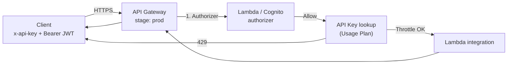

# L36d — API Keys and Usage Plan — Theory (security lens)

> **Author:** Prem Vishnoi <pvishnoi@avilx.com>
> **Section:** 09
> **Duration target:** 4:00
> **Lecture ID:** L36d

## Status

Authored. The same conceptual content as L33, but reframed for
the security section: API Keys are a **complementary** mechanism
that sits beside (not under) the authorizer stack. The hands-on
walkthrough is in L36e.

## Prereqs

- L25–L32. You know what a stage is and how a REST API deploys.
- L36–L39. You know what a Lambda Authorizer and a Cognito
  Authorizer are. This lecture deliberately positions API Keys
  *relative* to those.

## Key terms

- **API Key** — an opaque string the client sends in the
  `x-api-key` header. Identifies the caller for **metering and
  throttling**, *not* for authentication.
- **Usage Plan** — a bundle of rate and quota limits associated
  with one or more stages. "Any key attached to this plan may
  make N requests / sec and M requests / period."
- **Throttling** — requests-per-second limit (steady-state + burst).
- **Quota** — long-term limit per day / week / month, enforced in
  UTC.
- **`API Key Required`** — the binary on/off on a method that
  makes the `x-api-key` header mandatory.
- **Defense in depth** — combining API Keys with a real authorizer
  (Cognito or Lambda) so the API is both *metered* and *secure*.

## Lecture

The first thing to internalize about API Keys is the same thing we
said in L33, and it is the thing this entire section is about:

> An API Key tells us **who** is calling. It does not tell us
> **whether they are who they say they are**.

In a properly secured API the API Key is a *secondary* mechanism. It
sits beside the authorizer, not below it. The authorizer is the
front gate; the API Key is the speed bump.

### 1. The relationship to the authorizer stack

Order of operations on a typical request:

1. **Authorizer runs first.** If the token is bad, the request is
   `401` / `403` and the API Key is *never consulted*. This is by
   design — we want a hard authentication failure to short-circuit
   the rest of the pipeline.
2. **API Key is checked.** If the method requires a key and the
   header is missing or invalid, `403 Forbidden`.
3. **Throttle / quota are checked.** If exceeded, `429 Too Many
   Requests`.
4. **Integration runs.**

The consequence is that an attacker cannot avoid the authorizer
by sending a valid key with no token, and cannot avoid the key by
sending a valid token without a key. You can require *both*.

### 2. Why bother with API Keys at all?

If the authorizer already proves who the caller is, why add a
second identifier? Three reasons, in order of importance:

| Reason | Why it matters |
|---|---|
| **Per-caller throttling** | A noisy client can be slowed down *without* revoking their auth. You can have a "freemium" tier and a "premium" tier simply by attaching different keys to different usage plans. |
| **Billing / metering** | CloudWatch's `4XXError`, `Count`, and `Latency` metrics can be sliced by `ApiKey` dimension. You can charge per key. The authorizer's `sub` claim is opaque to CloudWatch. |
| **Soft front gate** | A leaked key is equivalent to a leaked URL. Discourages casual abuse. **Not** a security boundary — but a useful one for public APIs. |

These are the same three reasons from L33, but in the security
section the framing is sharper: the API Key is a *metering layer
sitting next to a real authn/authz layer*, not a substitute for
it.

### 3. Throttling vs. quota

| | Throttling | Quota |
|---|---|---|
| Unit | requests / second | requests / period |
| Typical values | 10 000 tps (account default) | 1 000 000 / month (free) |
| Resets | continuous (token bucket) | at period start (UTC) |
| CloudWatch | `4XXError` + `Throttle` | `QuotaExceeded` |
| Visible per-key? | yes | yes |

The Usage Plan throttling is *per key, per stage*. The account-level
throttling is global. If you have a noisy key, you tune the
Usage Plan; if you have a noisy account, you tune the account.

### 4. Method-level throttling overrides

You can override throttling on a single method. The override
applies to *all* callers of that method, regardless of which key
they hold. This is the right knob for protecting a slow
downstream (e.g. the integration in L36b/c that talks to S3 — you
might cap `PUT /internal/{proxy+}` at 5 tps even if the Usage Plan
allows 100 tps).

### 5. What API Keys do *not* do

It is worth being explicit about the things an API Key cannot do
on its own:

- **No signing.** The key is a static shared secret in a header.
  Anyone who can read network traffic between the client and
  API Gateway can read the key.
- **No rotation.** There is no built-in expiry. You rotate by
  issuing a new key, deprecating the old one in the plan, then
  deleting it.
- **No identity.** The key has no claims, no scopes, no
  attributes. If you want to know *who* the caller is, use the
  authorizer.
- **No replay protection.** An attacker who captures a key can
  use it from anywhere until you delete it.

If you need any of those, use a real auth mechanism. The authorizer
is the place for it; the API Key is the place for throttling.

### 6. Where API Keys fit in the security section's mental model

A production-shaped Use Case 2 (sections 8 + 9 combined) has three
orthogonal concerns. Each is implemented by a separate AWS feature:

| Concern | Implemented by | Lecture |
|---|---|---|
| **Who is the caller?** | Cognito or Lambda Authorizer | L36–L39, L36a–L36c |
| **How many requests can they make?** | Usage Plan + API Key | L33–L34, L36d–L36e |
| **What resources can they touch?** | The authorizer's IAM policy or the integration's own check | L36, L36b |

These are independent. You can have an authorizer without a Usage
Plan (most internal APIs). You can have a Usage Plan without an
authorizer (most public "API-as-a-product" APIs). The most
defensive shape is **all three**, and that is what we build in
L36e.

### 7. The 4xx you'll see in this lecture

| Code | When |
|---|---|
| `401 Unauthorized` | Authorizer rejected the token. The key is irrelevant here. |
| `403 Forbidden` | `API Key Required` is on and the key is missing/invalid. Or the author's `scope` check failed. |
| `429 Too Many Requests` | Throttle or quota exceeded. The key is in the plan but the limit is hit. |

`401` is "I don't know who you are." `403` is "I know who you are
but you cannot do this." `429` is "I know who you are, you are
allowed to do this, but please slow down."

## Hands-on

Nothing hands-on in this lecture. L36e builds the entire boto3
wiring and tests the four scenarios above against the secured
Use Case 2 API from L36a–L36c.

## Quiz prep

- Is an API Key an authentication mechanism? (No — it's metering.)
- What HTTP status do you get for a throttled request? (`429`)
- What is the difference between throttling and quota?
- Why is an API Key a useful complement to an authorizer, but not
  a substitute?
- What is the order of operations between authorizer, API Key
  check, and integration invoke?

## Further reading

- API Gateway — [Create and use usage plans with API keys](https://docs.aws.amazon.com/apigateway/latest/developerguide/api-gateway-api-usage-plans.html)
- AWS — [Throttle API requests for better throughput](https://docs.aws.amazon.com/apigateway/latest/developerguide/api-gateway-request-throttling.html)
- OWASP — [API4:2023 Unrestricted Resource Consumption](https://owasp.org/API-Security/editions/2023/en/0xa4-unrestricted-resource-consumption/)
