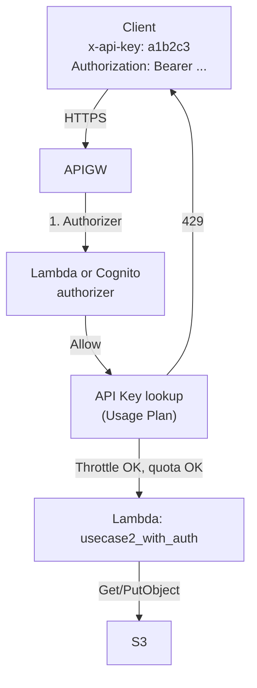
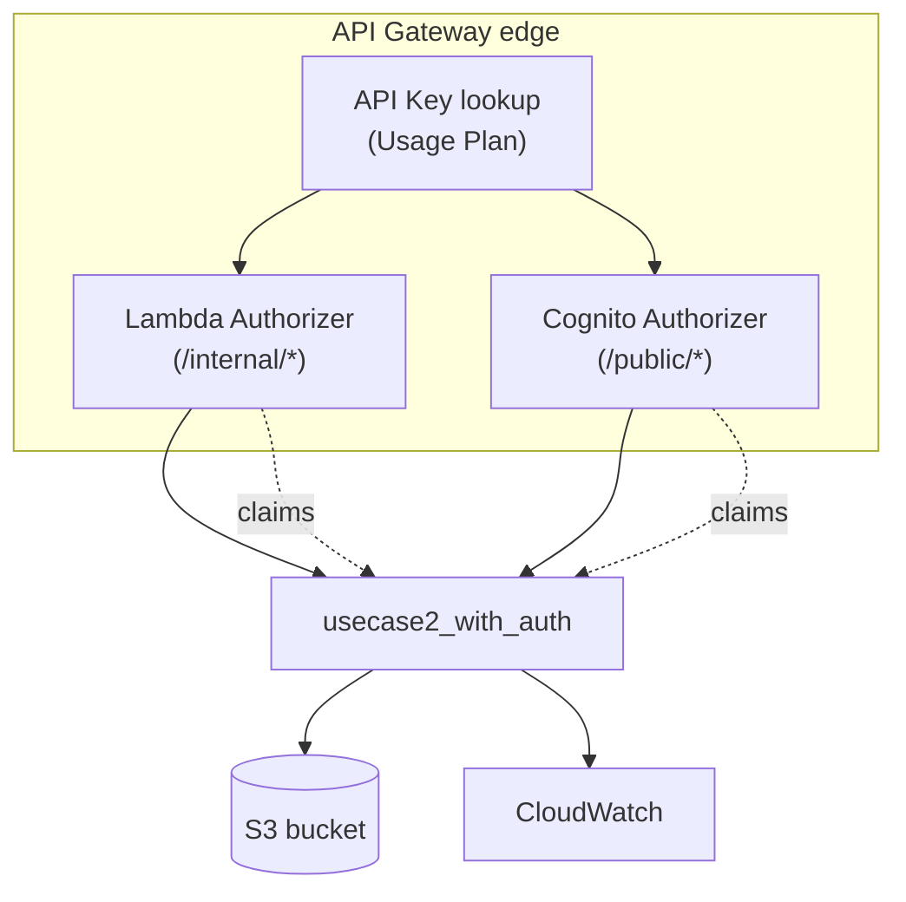

# L36e — API Keys and Usage Plan — Hands On (security lens)

> **Author:** Prem Vishnoi <prem.vishnoi@example.com>
> **Section:** 09
> **Duration target:** 8:00
> **Lecture ID:** L36e

## Status

Authored. Builds on L36d and the secured REST API from
L36a–L36c. The hands-on artifact lives at
`code/usecase2_with_auth/api_keys.py` and reuses
`code/api_keys_setup/create_api_key.py` from L34.

## Prereqs

- L36d watched/read. You understand that an API Key is metering,
  not authentication, and that it sits beside the authorizer
  stack.
- L36a–L36c done. The REST API exists with `/public/*` and
  `/internal/*`, with the Cognito and Lambda authorizers wired.
- L33–L34 done. You have already used `create_api_key.py` once.

## Key terms

- **`x-api-key` header** — the only place REST API v1 looks for
  the key. Always lowercase.
- **`apiKeyRequired`** — boolean on a method. When `true`, missing
  or invalid keys yield `403`.
- **Method-throttle override** — per-method throttle that
  supersedes the Usage Plan default. We add one on `PUT` to
  protect S3.
- **`usageIdentifierKey`** — optional field in a Lambda
  Authorizer's `AuthResponse`. We do *not* set it in this course;
  mention it so the student recognizes it if they see it in
  another team's code.

## Lecture

In this lecture we take the secured Use Case 2 API and put a
**Usage Plan + API Key** on top of it. The plan applies to the
whole `prod` stage; the API Key is required on both `/public/*` and
`/internal/*` methods. The authorizer stack is unchanged.

### 1. What we are building



Order of operations: authorizer first, then API Key, then
throttle/quota, then integration.

### 2. Reuse `create_api_key.py` from L34

The script in `code/api_keys_setup/create_api_key.py` is already
idempotent and parameterised. Re-run it pointed at the secured
API:

```bash
cd 09_api_security_lambda_cognito_auth/../08_usecase2_apigw_lambda_s3/code/api_keys_setup
export API_NAME=usecase2-secure      # the L36a API
export STAGE_NAME=prod
export API_KEY_NAME=usecase2-secure-key
export USAGE_PLAN_NAME=usecase2-secure-plan
export RATE=20        # tps — modest for a teaching API
export BURST=40
export QUOTA=10000
export QUOTA_PERIOD=DAY
python create_api_key.py
```

The script prints the API key value. Save it as
`$API_KEY_VALUE` for the smoke test below.

### 3. Enable `API Key Required` on both routes

This is a method-level patch, not a plan-level setting:

```python
"""Flip API Key Required to true on both /public/{proxy+} and /internal/{proxy+}.

Reuses the resource ids cached on disk by api_setup.py, or asks
API Gateway to find them by path.
"""

import os
import boto3
from botocore.exceptions import ClientError

REGION = os.environ.get("AWS_REGION", "us-east-1")
API_ID = os.environ["API_ID"]


def _client():
    return boto3.client("apigateway", region_name=REGION)


def _resource_id_by_path(path: str) -> str:
    apigw = _client()
    items = apigw.get_resources(restApiId=API_ID)["items"]
    for r in items:
        if r.get("path") == path:
            return r["id"]
    raise RuntimeError(f"resource {path!r} not found")


def _set_key_required(resource_id: str, method: str) -> None:
    apigw = _client()
    apigw.update_method(
        restApiId=API_ID,
        resourceId=resource_id,
        httpMethod=method,
        patchOperations=[
            {"op": "replace", "path": "/apiKeyRequired", "value": "true"},
        ],
    )


def main() -> int:
    public_proxy = _resource_id_by_path("/public/{proxy+}")
    internal_proxy = _resource_id_by_path("/internal/{proxy+}")
    for rid in (public_proxy, internal_proxy):
        for method in ("GET", "PUT"):
            _set_key_required(rid, method)
            print(f"apiKeyRequired=true on {rid} {method}")

    apigw = _client()
    apigw.create_deployment(restApiId=API_ID, stageName="prod")
    print("redeployed prod")
    return 0


if __name__ == "__main__":
    raise SystemExit(main())
```

Run:

```bash
export API_ID=...
python code/usecase2_with_auth/enable_api_key.py
```

Two things to notice:

1. The script does not touch the authorizer. The authorizer
   continues to be the front gate; the API Key is added on top.
2. The `create_deployment` call is required. Method-level changes
   are not visible until you redeploy the stage.

### 4. Smoke test the four scenarios

```python
"""Smoke test: 401 / 403 / 200 / 429 against the secured Use Case 2 API."""

import os, time, jwt, requests

API_BASE = os.environ["API_BASE"]
JWT_SECRET = os.environ["JWT_SECRET"]
API_KEY = os.environ["API_KEY_VALUE"]

# Mint a valid token for the internal route.
internal_token = jwt.encode(
    {"sub": "svc-1", "tenant": "acme", "scope": "read", "exp": int(time.time()) + 300},
    JWT_SECRET, algorithm="HS256",
)


def call(method: str, path: str, headers: dict) -> tuple[int, str]:
    r = requests.request(method, f"{API_BASE}{path}", headers=headers, timeout=10)
    return r.status_code, r.text[:80]


# 1. No token, no key -> 403 (authorizer never runs because the
#    method now requires an API Key; the key check happens first).
print("1:", call("GET", "/internal/audit/x", {}))

# 2. Token only, no key -> 403.
print("2:", call(
    "GET", "/internal/audit/x",
    {"Authorization": f"Bearer {internal_token}"},
))

# 3. Key only, no token -> 403 (authorizer rejects).
print("3:", call("GET", "/internal/audit/x", {"x-api-key": API_KEY}))

# 4. Key + token -> 200.
print("4:", call(
    "GET", "/internal/audit/x",
    {"x-api-key": API_KEY, "Authorization": f"Bearer {internal_token}"},
))
```

Expected:

```
1: 403 Forbidden
2: 403 Forbidden
3: 403 Forbidden
4: 200 OK {"key":"audit/x", "route":"internal", ...}
```

The point: **the authorizer and the key are independent layers,
both of which must pass**.

To trigger `429`, blast the key past its rate:

```bash
for i in $(seq 1 200); do
  curl -s -o /dev/null \
    -H "x-api-key: $API_KEY" \
    -H "Authorization: Bearer $INTERNAL_TOKEN" \
    "$API_BASE/internal/loop-$i"
done
# Eventually you will see 429 with "Rate Exceeded" or "Quota Exceeded".
```

### 5. The full secured architecture (final form)



Three orthogonal layers, each with a distinct job:

- **API Key** says "I know how to reach you with a 429 if you
  misbehave."
- **Authorizer** says "I know *who* you are."
- **Integration** says "Given who you are, are you allowed to do
  this *specific* thing?"

### 6. Method-level throttle override

The L34 script also shows how to add a per-method throttle.
For the secured Use Case 2 we recommend capping `PUT` (which
writes to S3) lower than `GET`:

```python
apigw.update_method(
    restApiId=API_ID,
    resourceId=public_proxy,
    httpMethod="PUT",
    patchOperations=[
        {"op": "replace", "path": "/throttling/rateLimit", "value": "5"},
        {"op": "replace", "path": "/throttling/burstLimit", "value": "10"},
    ],
)
```

This protects S3 from a runaway client even if the Usage Plan
allows more.

### 7. Common failure modes for the key layer

| Symptom | Cause | Fix |
|---|---|---|
| `403 Forbidden` even with a valid token | `apiKeyRequired=true` but the request omits the key | Send `x-api-key: ...` |
| `403 Forbidden` with a valid key | The key is not attached to a plan that includes this stage | Re-run `create_api_key.py`, confirm the plan lists the stage |
| `429 Rate Exceeded` from one call | The per-key rate limit is too low for the workload | Bump `RATE` in the plan, or split traffic across more keys |
| `429 Quota Exceeded` after a few hundred calls | The plan's per-day quota was hit | Wait until UTC midnight, or raise `QUOTA` |
| CloudWatch shows no `ApiKey` dimension | The Usage Plan is not attached to a stage, or the API was not redeployed after attaching the plan | Confirm `aws apigateway get-usage-plans` shows the stage in `stages` |

### 8. The four 4xx codes summarized

| Code | Layer | Meaning |
|---|---|---|
| `401 Unauthorized` | Authorizer | Token missing or invalid |
| `403 Forbidden` | Authorizer or Key | Token valid but caller not allowed / key missing or invalid |
| `429 Too Many Requests` | Usage Plan | Throttle or quota exceeded |
| `500 Internal Server Error` | Integration | The Lambda threw — see CloudWatch |

`4xx` is the client's problem. `5xx` is yours.

### 9. Cleanup

```bash
aws apigateway delete-api-key --api-key "$API_KEY_ID"
aws apigateway delete-usage-plan --usage-plan-id "$USAGE_PLAN_ID"
# Re-disable API Key Required on the methods:
aws apigateway update_method ... path=/apiKeyRequired,value=false
aws apigateway create-deployment ...
```

The authorizers, the REST API, the Lambda, and the S3 bucket stay
— they are reused in sections 12 (CDK) and 13 (CloudFormation).

## Hands-on summary

You have now layered a Usage Plan and API Key on top of the
secured Use Case 2 API from L36a–L36c. The combined effect:

- Every request must carry a valid API Key *and* a valid token.
- The authorizer stamps caller identity into the integration
  event.
- The Usage Plan caps per-key rate and quota.
- The integration enforces per-route business rules.

In production you will also see:

- a per-tenant API Key handed out by the onboarding team,
- a per-stage Usage Plan (different limits for `dev` and `prod`),
- a CloudWatch alarm on `4XXError` with the `ApiKey` dimension
  flipped on.

All of that is built on the same boto3 calls we just used.

## Quiz prep

- Why does the order "authorizer first, key second" matter?
- What is the difference between `429 Rate Exceeded` and
  `429 Quota Exceeded`?
- Why do we recommend a method-level throttle override on the
  `PUT` method?
- What is the CloudWatch dimension that lets you slice metrics by
  API Key?

## Further reading

- API Gateway — [Best practices for API keys and usage plans](https://docs.aws.amazon.com/whitepapers/latest/aws-serverless-multi-tier-architectures-api-gateway-lambda/api-gateway-best-practices.html)
- AWS Samples — [Serverless SaaS — per-tenant API keys](https://github.com/aws-samples/saas-bootcamp)
- CloudWatch — [API Gateway dimensions](https://docs.aws.amazon.com/apigateway/latest/developerguide/api-gateway-metrics-and-dimensions.html)
