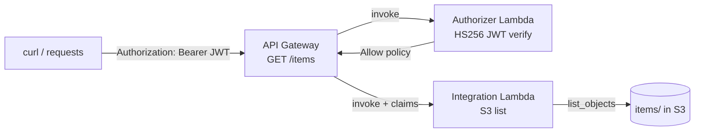

# L37 — Securing APIs using AWS Lambda Authorizer — Hands On

> **Author:** Prem Vishnoi <prem.vishnoi@example.com>
> **Section:** 09
> **Duration target:** 23:46
> **Lecture ID:** L37

## Status

Authored. Paired with `code/lambda_authorizer/`. Assumes the REST API
from section 8 (S3 CRUD, L30–L32) is already deployed; if you have not
built that one, the same wiring works against any `GET /items` Lambda
integration.

## Prereqs

- L36 watched/read end-to-end. You should know the difference between
  TOKEN and REQUEST authorizers and the `AuthResponse` shape.
- A deployed REST API from section 8 with at least one method you can
  put an authorizer in front of (we use `GET /items`).
- Python 3.11+, `boto3`, `pyjwt`, `moto` (for the offline test).
- The IAM role that runs the authorizer Lambda needs the standard
  CloudWatch Logs permissions (`AWSLambdaBasicExecutionRole`).

## Key terms

- **HS256** — HMAC-SHA256, a symmetric JWT signing algorithm. We use it
  for teaching because it is one shared secret; production almost
  always uses RS256 with a public JWKS endpoint.
- **JWKS** — JSON Web Key Set. A public endpoint from which API Gateway
  downloads the public keys a JWT was signed with.
- **`put-Authorizer`** — the boto3 call that creates the authorizer on
  a REST API.
- **`update-ApiKey`/`update-UsagePlan`** — not used here, but related
  to L33–L34.
- **`add-permission`** — Lambda API call that grants the
  `apigateway.amazonaws.com` service principal permission to invoke the
  authorizer.

## Lecture

This is a long lecture because we are going end-to-end: write the
authorizer code, package it, deploy it, wire it onto the REST API,
grant the right IAM permission, then test the full path with a real
HTTPS call.

### 1. What we are building

A small REST API with one method — `GET /items` — protected by a
**TOKEN-based Lambda Authorizer** that validates a JWT signed with
`HS256` against a shared secret. If the token is valid and not
expired, the authorizer returns an `Allow` policy whose `Resource` is
the exact `methodArn` from API Gateway. The integration Lambda from
section 8 reads the caller's `sub` and `tenant` claims from
`event.requestContext.authorizer` and returns them in the response
body — proof that the claims travelled all the way through.



### 2. The authorizer code

Create `code/lambda_authorizer/lambda_authorizer.py`:

```python
"""
Token-based Lambda Authorizer for API Gateway (REST API).

Validates an HS256 JWT carried in the Authorization header and returns
an IAM policy that allows invocation of the methodArn from the event.

The function is intentionally side-effect free: it does not call any
AWS service, does not hit a database, does not log to stdout. In a real
deployment you would add structured logging and a CloudWatch EMF metric
for allow/deny counts.

Environment variables:
    JWT_SECRET   shared secret used to verify HS256 signatures.
                 Defaults to a known test value so the moto test below
                 can run without configuration.
    JWT_ALG      algorithm to expect. Defaults to HS256.
    JWT_ISSUER   optional. If set, the 'iss' claim must match.
    JWT_AUDIENCE optional. If set, the 'aud' claim must contain it.
"""

from __future__ import annotations

import os
from typing import Any, Dict, List

import jwt  # PyJWT

# Test-only default. NEVER use this in production. Production secrets
# must come from AWS Secrets Manager / SSM Parameter Store and be
# injected via an environment variable that has no default.
_DEFAULT_TEST_SECRET = "test-secret-do-not-use-in-prod"


def _allow(method_arn: str, principal_id: str, context: Dict[str, str]) -> Dict[str, Any]:
    """Build the standard API Gateway Allow AuthResponse."""
    return {
        "principalId": principal_id,
        "policyDocument": {
            "Version": "2012-10-17",
            "Statement": [
                {
                    "Effect": "Allow",
                    "Action": "execute-api:Invoke",
                    "Resource": method_arn,
                }
            ],
        },
        "context": context,
    }


def _deny(method_arn: str) -> Dict[str, Any]:
    """Build the standard API Gateway Deny AuthResponse."""
    return {
        "principalId": "unauthorized",
        "policyDocument": {
            "Version": "2012-10-17",
            "Statement": [
                {
                    "Effect": "Deny",
                    "Action": "execute-api:Invoke",
                    "Resource": method_arn,
                }
            ],
        },
    }


def lambda_handler(event: Dict[str, Any], context: Any) -> Dict[str, Any]:
    """API Gateway TOKEN authorizer entry point."""
    token = event.get("authorizationToken", "")
    method_arn = event.get("methodArn", "")

    # The token arrives as "Bearer <jwt>". API Gateway sends the raw
    # value of the Authorization header; strip the scheme if present.
    if token.lower().startswith("bearer "):
        token = token[7:]

    secret = os.environ.get("JWT_SECRET", _DEFAULT_TEST_SECRET)
    alg = os.environ.get("JWT_ALG", "HS256")
    issuer = os.environ.get("JWT_ISSUER")
    audience = os.environ.get("JWT_AUDIENCE")

    decode_options: Dict[str, Any] = {}
    if issuer:
        decode_options["issuer"] = issuer
    if audience:
        decode_options["audience"] = audience

    try:
        claims = jwt.decode(
            token,
            secret,
            algorithms=[alg],
            options=decode_options or None,
        )
    except jwt.PyJWTError:
        return _deny(method_arn)

    # Surface a small, flat, string-only context to the integration.
    principal_id = str(claims.get("sub", "anonymous"))
    flat_context: Dict[str, str] = {
        "sub": principal_id,
        "tenant": str(claims.get("tenant", "")),
        "scope": str(claims.get("scope", "")),
    }

    return _allow(method_arn, principal_id, flat_context)
```

Two design choices worth pointing out:

1. **No `print` / no `logger`.** Authorizers are in the hot path.
   Logging to CloudWatch adds latency. Use EMF metrics instead in
   production.
2. **Context is flat and string-only.** API Gateway will silently drop
   nested objects, numbers, and booleans here.

### 3. The offline test

This is the test we run **before** spending any AWS dollars. It uses
`moto` to stub the Lambda runtime and the API Gateway side, and it
exercises the authorizer end-to-end with three scenarios: valid token,
expired token, and bad signature.

`code/lambda_authorizer/test_lambda_authorizer.py`:

```python
"""Offline tests for the token-based Lambda Authorizer."""

from __future__ import annotations

import importlib.util
import os
import time
from pathlib import Path

import jwt
import pytest

# Load the authorizer module without making it a package.
_AUTHORIZER_PATH = Path(__file__).parent / "lambda_authorizer.py"
_spec = importlib.util.spec_from_file_location("lambda_authorizer", _AUTHORIZER_PATH)
assert _spec and _spec.loader
authorizer = importlib.util.module_from_spec(_spec)
_spec.loader.exec_module(authorizer)


SECRET = "unit-test-secret"


def _mint(claims: dict | None = None, *, exp_offset: int = 60, secret: str = SECRET) -> str:
    payload = {"sub": "user-1", "tenant": "acme", "scope": "read"}
    if claims:
        payload.update(claims)
    payload["exp"] = int(time.time()) + exp_offset
    return jwt.encode(payload, secret, algorithm="HS256")


def _event(token: str | None, method_arn: str = "arn:aws:execute-api:us-east-1:123:abcd/prod/GET/items") -> dict:
    return {
        "type": "TOKEN",
        "authorizationToken": f"Bearer {token}" if token else "",
        "methodArn": method_arn,
    }


def test_allow_valid_token():
    os.environ["JWT_SECRET"] = SECRET
    response = authorizer.lambda_handler(_event(_mint()), context=None)

    assert response["principalId"] == "user-1"
    stmt = response["policyDocument"]["Statement"][0]
    assert stmt["Effect"] == "Allow"
    assert stmt["Action"] == "execute-api:Invoke"
    assert stmt["Resource"] == "arn:aws:execute-api:us-east-1:123:abcd/prod/GET/items"
    assert response["context"]["tenant"] == "acme"


def test_deny_expired_token():
    os.environ["JWT_SECRET"] = SECRET
    response = authorizer.lambda_handler(_event(_mint(exp_offset=-10)), context=None)
    assert response["policyDocument"]["Statement"][0]["Effect"] == "Deny"


def test_deny_bad_signature():
    os.environ["JWT_SECRET"] = SECRET
    response = authorizer.lambda_handler(
        _event(_mint(secret="different-secret")), context=None
    )
    assert response["policyDocument"]["Statement"][0]["Effect"] == "Deny"


def test_deny_missing_token():
    os.environ["JWT_SECRET"] = SECRET
    response = authorizer.lambda_handler(_event(None), context=None)
    assert response["policyDocument"]["Statement"][0]["Effect"] == "Deny"
```

Run it:

```bash
cd 09_api_security_lambda_cognito_auth/code/lambda_authorizer
python -m venv .venv && source .venv/bin/activate
pip install -r requirements.txt
pytest -q
```

You should see `4 passed`. If any of these fail, do **not** proceed to
AWS — debug locally first.

### 4. Package and deploy the authorizer Lambda

```bash
cd 09_api_security_lambda_cognito_auth/code/lambda_authorizer
pip install --target ./build pyjwt -q
cp lambda_authorizer.py ./build/
(cd ./build && zip -qr ../authorizer.zip .)
```

Create the function:

```bash
aws lambda create-function \
  --function-name demo-lambda-authorizer \
  --runtime python3.12 \
  --handler lambda_authorizer.lambda_handler \
  --role arn:aws:iam::123456789012:role/lambda-exec-role \
  --zip-file fileb://authorizer.zip \
  --environment 'Variables={JWT_SECRET=replace-me, JWT_ALG=HS256}' \
  --timeout 5 \
  --memory-size 256
```

Replace `replace-me` with a real secret. In production, source this
value from Secrets Manager via a `JWT_SECRET` environment variable
that is populated at deploy time from the secret ARN. Do not commit
secrets to git.

### 5. Grant `lambda:InvokeFunction` to API Gateway

This is the permission we discussed in L36. Without it, every API call
fails with `403 Invalid permissions on Lambda function` *before* the
authorizer even runs:

```bash
aws lambda add-permission \
  --function-name demo-lambda-authorizer \
  --statement-id apigateway-invoke \
  --action lambda:InvokeFunction \
  --principal apigateway.amazonaws.com \
  --source-arn "arn:aws:execute-api:us-east-1:123456789012:abcd/*"
```

`--source-arn` is the API Gateway API id; the `*` at the end lets any
stage invoke the authorizer. If you have multiple APIs that need
different permissions, give each one its own statement.

### 6. Wire the authorizer onto the REST API

We are going to do this with boto3 so the workflow is reproducible.
The script is in `code/lambda_authorizer/attach_to_api.py` (also
inlined below for the lecture):

```python
"""Attach the demo-lambda-authorizer to GET /items on the demo REST API."""

from __future__ import annotations

import boto3
import os

apigw = boto3.client("apigateway", region_name=os.environ.get("AWS_REGION", "us-east-1"))

API_ID = os.environ["API_ID"]
AUTHORIZER_LAMBDA_ARN = os.environ["AUTHORIZER_LAMBDA_ARN"]
AUTHORIZER_NAME = "demo-token-authorizer"

# 1. Create the authorizer on the API.
authorizer = apigw.create_authorizer(
    restApiId=API_ID,
    name=AUTHORIZER_NAME,
    type="TOKEN",
    authorizerUri=f"arn:aws:apigateway:{os.environ.get('AWS_REGION', 'us-east-1')}:lambda:path/2015-03-31/functions/{AUTHORIZER_LAMBDA_ARN}/invocations",
    identitySource="method.request.header.Authorization",
    authorizerResultTtlInSeconds=300,
)
authorizer_id = authorizer["id"]
print("Authorizer created:", authorizer_id)

# 2. Patch the GET /items method to require the authorizer.
apigw.update_method(
    restApiId=API_ID,
    resourceId=os.environ["ITEMS_RESOURCE_ID"],
    httpMethod="GET",
    patchOperations=[
        {"op": "replace", "path": "/authorizationType", "value": "CUSTOM"},
        {"op": "replace", "path": "/authorizerId", "value": authorizer_id},
    ],
)
print("GET /items now requires the authorizer.")

# 3. Redeploy the API to a stage.
apigw.create_deployment(restApiId=API_ID, stageName="prod")
print("Deployed to prod.")
```

Run:

```bash
export API_ID=abcd1234ef
export ITEMS_RESOURCE_ID=xyz789
export AUTHORIZER_LAMBDA_ARN=arn:aws:lambda:us-east-1:123456789012:function:demo-lambda-authorizer
python attach_to_api.py
```

### 7. Smoke test the full path

Use a tiny Python script to mint a JWT and call the API:

```python
"""Mint a JWT and call the protected GET /items endpoint."""

import os
import time
import jwt
import requests

API_BASE = os.environ["API_BASE"]  # e.g. https://abcd1234ef.execute-api.us-east-1.amazonaws.com/prod
SECRET = os.environ["JWT_SECRET"]

now = int(time.time())
token = jwt.encode(
    {"sub": "user-1", "tenant": "acme", "scope": "read", "exp": now + 300},
    SECRET,
    algorithm="HS256",
)

# No token -> 403
r = requests.get(f"{API_BASE}/items", timeout=10)
print("no token   ->", r.status_code, r.text[:120])

# With token -> 200
r = requests.get(
    f"{API_BASE}/items",
    headers={"Authorization": f"Bearer {token}"},
    timeout=10,
)
print("with token ->", r.status_code, r.text[:240])
```

You should see:

```
no token   -> 403 {"message":"Unauthorized"}
with token -> 200 {"items":["a.txt","b.txt"],"caller":{"sub":"user-1","tenant":"acme",...}}
```

The `caller` block in the 200 response is the integration Lambda
reading `event["requestContext"]["authorizer"]` and echoing it back —
proof that the authorizer ran, the policy was allowed, and the context
was forwarded to the integration.

### 8. Common failure modes (worth memorising)

| Symptom | Cause | Fix |
|---|---|---|
| `403 Invalid permissions on Lambda function` | API Gateway cannot invoke the authorizer | Re-run `add-permission` with the correct `source-arn` |
| `401 Unauthorized` with a valid token | Authorizer returned `Deny` | Check CloudWatch logs for the authorizer Lambda; usually a JWT verification error |
| `500 Internal server error` | Authorizer returned malformed JSON or threw | Wrap the handler in `try/except`, return `_deny` on any exception |
| Token works for 5 minutes, then 401 | Cache key changed, or you rotated the secret without waiting for TTL | Either wait the TTL or invalidate by changing the authorizer name (forces a fresh cache) |
| Integration sees `authorizer = None` | You forgot the `context` field, or the policy `Resource` does not match `methodArn` | Re-check the `AuthResponse` shape from L36 |

### 9. Cleanup

When you are done, detach the authorizer and delete the function:

```bash
aws apigateway update_method \
  --rest-api-id "$API_ID" \
  --resource-id "$ITEMS_RESOURCE_ID" \
  --http-method GET \
  --patch-operations op=replace,path=/authorizationType,value=NONE
aws apigateway delete-authorizer --rest-api-id "$API_ID" --authorizer-id "$AUTHORIZER_ID"
aws lambda delete-function --function-name demo-lambda-authorizer
```

## Hands-on summary

You have now built a production-shaped authorizer: stateless,
short-lived, HS256 validation, with a strict `AuthResponse` shape and
the right IAM permission grant. The same scaffolding is the starting
point for a real RS256 authorizer (replace `HS256` with `RS256`, point
PyJWT at a JWKS endpoint with `PyJWKClient`, and add a 10-minute
in-memory cache).

## Quiz prep

- Why is `principalId` always a string, and what becomes of it in the
  integration event?
- What is the smallest possible `Deny` policy that satisfies API
  Gateway?
- If the integration Lambda cannot see `event.requestContext.authorizer.tenant`,
  what did you most likely forget?
- Why is the source-ARN condition on `add-permission` important?

## Further reading

- AWS Docs — [Create a Lambda authorizer](https://docs.aws.amazon.com/apigateway/latest/developerguide/apigateway-create-lambda-authorizer.html)
- PyJWT — [Verifying with JWKS](https://pyjwt.readthedocs.io/en/stable/usage.html#encoding-decoding-tokens-with-hs256)
- AWS Security Blog — [Best practices for Lambda authorizers](https://aws.amazon.com/blogs/security/)
