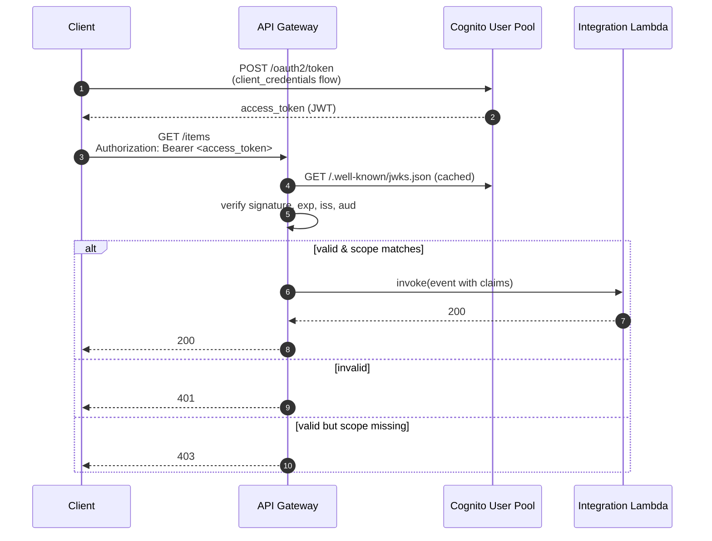

# L38 — Securing APIs using AWS Cognito Authorizer — Theory

> **Author:** Prem Vishnoi <pvishnoi@avilx.com>
> **Section:** 09
> **Duration target:** 2:42
> **Lecture ID:** L38

## Status

Authored. Paired with the hands-on L39 and the `code/cognito_setup/` artifact.

## Prereqs

- L36 watched/read. The Lambda Authorizer contract is the conceptual
  baseline.
- Sections 7 and 8 complete.
- A vague idea of OAuth 2.0 — you should know that Cognito is an
  *authorization server* in OAuth terms, and that the tokens it issues
  follow the OIDC spec.

## Key terms

- **User Pool** — the user directory. Sign-up, sign-in, MFA, password
  recovery, attribute schema, app clients, hosted UI, JWT issuance.
- **Identity Pool** — a different thing: federates identities (User
  Pools, Google, Facebook, etc.) into AWS IAM credentials. **Not used
  by the API Gateway Cognito Authorizer** — that is a common point of
  confusion.
- **App Client** — a client id/secret pair registered against a User
  Pool, allowed to call specific OAuth flows (authorization code,
  client credentials, etc.).
- **ID token** vs **access token** — both are JWTs; the ID token
  describes the user (`sub`, `email`, `cognito:groups`), the access
  token describes what the user is allowed to do (`scope`).
- **JWKS** — the JSON Web Key Set the User Pool publishes. API Gateway
  downloads it and uses it to verify signatures.
- **`COGNITO_USER_POOLS`** — the literal value of `authorizationType`
  on a REST API Method when you wire up this authorizer.

## Lecture

### 1. What the Cognito Authorizer actually is

It is **not** a Lambda. It is a managed authorizer built into API
Gateway. You give it the ARN of a Cognito User Pool, and from that
moment on API Gateway will:

1. Read the `Authorization` header on every incoming request.
2. Parse the bearer token as a JWT.
3. Download the User Pool's JWKS (cached on the API Gateway side).
4. Verify the signature against the JWKS.
5. Verify the `exp` (not expired), `iss` (matches the User Pool URL),
   and `aud` / `client_id` (matches one of the registered App Clients).
6. If all checks pass, **generate the IAM policy for you** with
   `Effect: Allow` on the method ARN, populate
   `context.authorizer.claims` with the JWT claims, and forward the
   request to the integration.

You write **zero** code. The cost of this convenience is that you must
adopt Cognito's token format — there is no way to plug in a custom
token with a Cognito authorizer. If you need that, use a Lambda
Authorizer (L36/L37).

### 2. User Pool vs Identity Pool

These are two completely different services that share the "Cognito"
brand. They are not interchangeable.

| | User Pool | Identity Pool |
|---|---|---|
| What it is | A user directory + OIDC IdP | A federation broker → AWS IAM credentials |
| Issues | OIDC ID/access/refresh JWTs | AWS `AccessKeyId` / `SecretAccessKey` / `SessionToken` |
| Used for | Browser/mobile sign-in, OAuth flows | Server-side code that needs to call AWS APIs as the user |
| Picked up by API Gateway authorizer? | **Yes** | No |
| Cognito charges | MAU (monthly active users) | Free |

The API Gateway authorizer is **only** wired to a User Pool. Identity
Pools are a different feature for granting AWS service access to
federated users; you may have both in a real app, but they solve
different problems.

### 3. What the integration Lambda receives

When a request is allowed through, the integration event looks like:

```json
{
  "resource": "/items",
  "path": "/items",
  "httpMethod": "GET",
  "headers": { "Authorization": "Bearer eyJ..." },
  "requestContext": {
    "accountId": "123456789012",
    "apiId": "abcd",
    "authorizer": {
      "claims": {
        "sub": "abcd-1234-...",
        "email": "alice@example.com",
        "cognito:username": "alice",
        "cognito:groups": ["admins"],
        "exp": "1730000000",
        "iss": "https://cognito-idp.us-east-1.amazonaws.com/us-east-1_xyz",
        "client_id": "..."
      }
    }
  }
}
```

Three things to note:

- The `claims` map is a flat `string → string` map. Numbers and
  arrays (like `cognito:groups`) are joined into a single string by
  API Gateway. If you need a structured list, parse it.
- `cognito:groups` is the standard place to encode coarse-grained
  authorization (e.g. `admins`, `readers`). You can branch on these
  in the integration Lambda or in a custom authorizer on top.
- The `iss` claim tells you exactly which User Pool issued the token —
  useful for multi-tenant systems that share an API across pools.

### 4. Caching, identity sources, and scope down

Like the Lambda Authorizer, the Cognito authorizer caches the policy
per token (default 300s). You can tune the TTL.

You can also **scopes**-down access: when you create the method, you
list the OAuth scopes the caller must have in the access token. For
example, if the access token has `scope = "openid email"`, and the
method requires `scope = "read:items"`, API Gateway returns 403 even
though the JWT is valid. This is the cleanest way to do scope-based
authorization without writing any code.



### 5. When to pick this over a Lambda Authorizer

Use a **Cognito User Pool Authorizer** when:

- You are already using Cognito for sign-in (or you are happy to).
- Your token format is OIDC JWT — exactly what Cognito issues.
- You do not need to call out to a third-party IdP, database, or
  custom verification logic at request time.
- You want zero Lambda invocations on the auth path (cheaper, faster,
  no cold starts).

Use a **Lambda Authorizer** when:

- The token is from a third-party IdP (Okta, Auth0, a custom SSO).
- You need to enrich the IAM policy with business context (tenant
  limits, feature flags, etc.) that requires a database lookup.
- You are doing protocol translation (e.g. a SAML assertion → IAM
  policy).

You can also **combine** them: a Cognito authorizer validates the
token, and a Lambda authorizer chains on top to add per-route policy
logic. That is an advanced pattern and out of scope for this course.

### 6. What you will build in L39

L39 is a single, focused hands-on:

1. Create a User Pool with `boto3` (`code/cognito_setup/create_user_pool.py`).
2. Create an App Client with the `client_credentials` OAuth flow so
   we can mint machine-to-machine tokens without a human.
3. Wire the User Pool ARN as a `COGNITO_USER_POOLS` authorizer on the
   `GET /items` method of the REST API from section 8.
4. Run the `client_credentials` flow to get an access token.
5. Call the API with the token; observe the claims arriving in the
   integration Lambda.

## Quiz prep

- What is the difference between a Cognito User Pool and an Identity
  Pool, and which one powers the API Gateway authorizer?
- What three claims does API Gateway verify on the incoming JWT?
- How do you scope down a method to require a specific OAuth scope?
- What does the integration event look like after a successful
  Cognito-authorized call?

## Further reading

- AWS Docs — [Control access with a Cognito User Pool authorizer](https://docs.aws.amazon.com/apigateway/latest/developerguide/apigateway-integrate-with-cognito.html)
- AWS Docs — [Cognito User Pool JWT](https://docs.aws.amazon.com/cognito/latest/developerguide/amazon-cognito-user-pools-using-tokens-with-identity-providers.html)
- RFC 6749 — The OAuth 2.0 Authorization Framework
