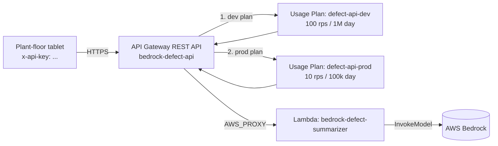

# api_keys_for_bedrock

Idempotent boto3 script that wires up **API Key + dev Usage Plan + prod
Usage Plan** for the L45 `bedrock-defect-api` REST API. One key, two
plans:

| Plan | Throttle | Quota | Stage |
|---|---|---|---|
| `defect-api-dev` | 100 RPS, 200 burst | 1,000,000 / day | `dev` |
| `defect-api-prod` | 10 RPS, 50 burst | 100,000 / day | `prod` |

The same `defect-api-key` is attached to both plans, so the same
caller (the plant-floor tablet, or the CI runner) can hit either stage
and the throttling is appropriate to that stage.

## Where this fits in section 10



- **L42–L44** — the Lambda that calls Bedrock.
- **L45** — the REST API that fronts the Lambda.
- **L44a (this lecture)** — the API Key + two Usage Plans that bound
  per-key RPS and per-day quota at the API Gateway edge.

The API Key protects the **API Gateway → caller** edge. The Lambda →
Bedrock call is separately protected by the IAM role from L43
(scoped to a single model ARN).

## Files

- `create_api_key.py` — the boto3 script.
- `test_create_api_key.py` — `moto.mock_aws`-backed pytest suite (8 tests).

## Run the tests

```bash
cd 10_generative_ai_bedrock/code/api_keys_for_bedrock
python -m pytest -v
```

The suite is hermetic — no AWS credentials or live account needed.

## Run the script against your AWS account

The script assumes L45's REST API is already deployed (with at
least the `prod` stage).

```bash
export AWS_REGION=us-east-1

# Defaults
python create_api_key.py

# Tighten the prod quota
python create_api_key.py --prod-rate 5 --prod-quota 50000

# Different API name
python create_api_key.py --api-name my-bedrock-api
```

The script prints:

```
================================================================
API ID      : abc123def
DEV PLAN    : ghi456jkl  (100.0 rps, 1000000 / DAY)
PROD PLAN   : mno789pqr  (10.0 rps, 100000 / DAY)
KEY ID      : stu012vwx
KEY VALUE   : a1b2c3d4e5f6g7h8
================================================================
```

The `KEY VALUE` is the only thing the tablet needs.

## IAM required

```json
{
  "Version": "2012-10-17",
  "Statement": [
    {
      "Effect": "Allow",
      "Action": [
        "apigateway:GET",
        "apigateway:POST",
        "apigateway:PATCH"
      ],
      "Resource": "arn:aws:apigateway:*::/*"
    }
  ]
}
```

## After running the script

1. API Gateway console → `bedrock-defect-api` → **Resources** →
   `/defects` → **POST** → **Method Request**.
2. **Settings → API Key Required:** `true`.
3. **Actions → Deploy API** → stage `prod`.
4. Test with `curl`:

   ```bash
   INVOKE="https://abc123def.execute-api.us-east-1.amazonaws.com/prod"
   KEY="a1b2c3d4e5f6g7h8"

   # Without key → 403 Forbidden
   curl -i -X POST "$INVOKE/defects" \
        -H "Content-Type: application/json" \
        -d '{"defect_description": "smoke from cabinet on line 2"}'

   # With key → 200 OK
   curl -i -X POST "$INVOKE/defects" \
        -H "Content-Type: application/json" \
        -H "x-api-key: $KEY" \
        -d '{"defect_description": "smoke from cabinet on line 2"}'
   ```
