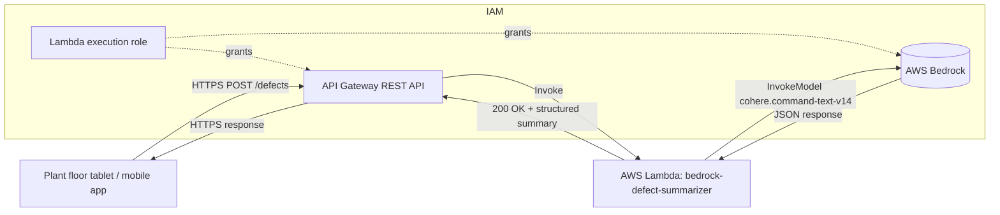

# L41 — Generative AI Use Case and Architecture

> In this lecture we walk through the **manufacturing defect
> summarizer** end-to-end, then draw the architecture diagram that we
> will implement over the next three lectures.

## Prereqs

- L40 (section overview).
- Comfort with API Gateway, Lambda, IAM.

## Key terms

- **Edge sensor / line operator** — the human or machine that originates a defect report.
- **REST POST** — the HTTP verb the operator uses to send the defect.
- **Prompt template** — the parameterized string the Lambda sends to Bedrock.
- **Round-trip latency** — the time from `POST` to response; Bedrock typically adds 1–2 s.

## The use case

You are a serverless engineer at a **discrete-manufacturing plant** that
produces automotive sub-assemblies. Three lines run a shift each:

- **Mechanical line** (stamping, welding).
- **Electrical line** (harnessing, PCB population).
- **Pneumatic line** (actuators, valves).

A line operator notices a defect. They open the **plant-floor tablet** and
type a free-form description:

> "Line 3 stamping press #2 is producing parts with a 2 mm burr on the
> trailing edge of the flange; coolant pressure dropped to 12 psi at
> 14:08. Production rate halved."

That description is meaningful to a human but useless to the
**maintenance ticket system** downstream. We need a serverless API that
turns that paragraph into a structured record the ticket system can
index:

```json
{
  "summary": "Stamping press #2 on line 3 producing flanges with 2 mm trailing-edge burr; coolant pressure dropped to 12 psi; throughput halved.",
  "category": "mechanical",
  "severity": "high"
}
```

## Why a foundation model?

A traditional rules engine fails here because defect descriptions are
free text and **don't follow a fixed schema** — operators use different
words for the same problem, mix metrics, and write in run-on sentences.
A foundation model is the right tool because it:

1. **Generalizes** across vocabulary without you hand-writing synonyms.
2. **Extracts multiple fields** in a single forward pass.
3. **Summarizes** longer descriptions into one- or two-sentence records.

We use AWS Bedrock so we don't manage GPUs, model weights, or scaling.

## Architecture



### Component responsibilities

| Component | Responsibility |
|---|---|
| **API Gateway** | Public HTTPS endpoint, request validation, throttling, CORS. |
| **Lambda** | Validates the event, calls Bedrock, post-processes the model output, returns JSON. |
| **Bedrock (Cohere Command)** | Generates the structured summary. |
| **IAM Role** | Grants the Lambda `bedrock:InvokeModel` on the specific Cohere model ARN. |
| **CloudWatch Logs** | Records each invocation, model latency, and token usage. |

### Why a REST API (not HTTP API)?

Section 7 covered this, but for the GenAI use case the decision is
clearer: **API Gateway REST APIs** support per-method API keys and
usage plans, request/response transformations, and CloudWatch access
logging out of the box. If the defect-summarizer ever needs to be billed
per-call to internal teams, REST is the path of least resistance.

## Data flow (one defect)

1. Operator's tablet sends `POST /defects` with body
   `{"defect_description": "..."}`.
2. API Gateway validates the JSON shape, invokes
   `arn:aws:lambda:...:function:bedrock-defect-summarizer` with the
   request payload.
3. Lambda builds a prompt from `prompt_template.txt` and the operator
   text, then calls `bedrock-runtime.invoke_model` with
   `modelId="cohere.command-text-v14"`.
4. Cohere returns a JSON document. Lambda parses it, normalizes the
   `category` and `severity` enums, and returns a clean response.
5. API Gateway returns `200 OK` with the structured JSON.

## Cost

- **API Gateway** — $3.50 per million REST requests.
- **Lambda** — billed per ms; this handler typically runs 1.5–2.5 s,
  512 MB → roughly $0.000005 per call.
- **Bedrock Cohere Command** — on-demand, charged per input and output
  token. A 200-word defect plus a 50-word JSON response is well under
  $0.001.

End-to-end **cost per defect** is in the fractions of a cent.

## Lecture

What we will build, in order, over L43–L46:

1. **IAM role** with `bedrock:InvokeModel` on the Cohere model ARN
   (L43).
2. **Lambda** that calls Bedrock and parses the response (L44).
3. **API Gateway REST API** wired to the Lambda (L45).
4. **End-to-end demo** with `curl` (L46).

## Hands-on

Nothing to run in this lecture — it is a walk-through. Open
`code/sample_defects.json` and skim the five example defects. They
are the inputs we will POST in L46.

## Quiz prep

You should be able to:

- Name the four moving parts in the architecture.
- State which AWS service is invoked by the Lambda.
- Explain why the operator does not call Bedrock directly.

## Further reading

- AWS Bedrock — [How it works](https://docs.aws.amazon.com/bedrock/latest/userguide/how-it-works.html)
- Cohere Command — [Model card](https://docs.cohere.com/docs/command-r)
- API Gateway REST APIs — [https://docs.aws.amazon.com/apigateway/latest/developerguide/apigateway-rest-api.html](https://docs.aws.amazon.com/apigateway/latest/developerguide/apigateway-rest-api.html)
