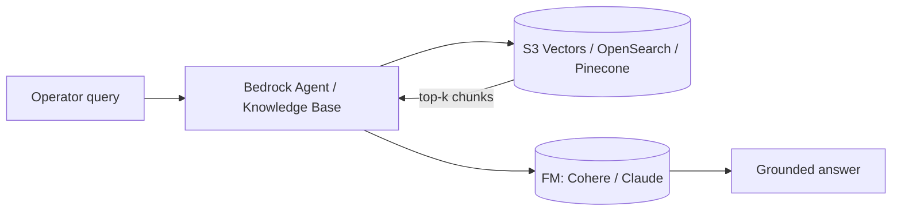

# L42 — Generative AI: AWS Bedrock Overview

> A two-minute tour of AWS Bedrock: the families of foundational models
> it exposes, how pricing works, and where it sits in the broader
> Retrieval-Augmented Generation (RAG) pattern.

## Prereqs

- L41 (architecture). General familiarity with HTTP APIs.

## Key terms

- **Bedrock Runtime** — the API surface you call (`bedrock-runtime:InvokeModel`).
- **Foundational Model (FM)** — a large pre-trained model you can call but not modify.
- **Custom model** — a fine-tuned model hosted on Bedrock; you bring the labelled data.
- **Knowledge Base** — a managed RAG pattern: Bedrock retrieves from your vector store and re-prompts the model.
- **Tokens** — the units (≈ ¾ of a word) Bedrock charges on.

## What AWS Bedrock is

AWS Bedrock is a **serverless, fully managed service** that exposes
several foundational model families through one HTTP API. You do not
provision GPUs, you do not download weights, and you do not patch model
servers. You call `bedrock-runtime.invoke_model` with a model ID, a
prompt, and a few hyperparameters; you get a response back.

It launched at re:Invent 2023 and now lists more than two dozen models
across five families.

## Model families available on Bedrock

| Family | Example model IDs | Strength |
|---|---|---|
| **Anthropic Claude** | `anthropic.claude-3-5-sonnet-20240620-v1:0`, `anthropic.claude-3-haiku-20240307-v1:0` | Long-context reasoning, tool use. |
| **Cohere Command** | `cohere.command-text-v14`, `cohere.command-r-plus-v1:0` | Fast, instruction-following, JSON-friendly. |
| **Meta Llama** | `meta.llama3-70b-instruct-v1:0`, `meta.llama3-8b-instruct-v1:0` | Open weights lineage, broad coverage. |
| **AI21 Jurassic** | `ai21.j2-ultra-v1` | Long-form generation. |
| **Stability** | `stability.stable-diffusion-xl-v1` | Image / multimodal (different `InvokeModel` body shape). |

> **Region availability matters.** `us-east-1` (N. Virginia) and
> `us-west-2` (Oregon) have the broadest catalogue — including the
> Cohere `command-text-v14` model we use in this course. Some models
> are gated per-account; you must click **"Manage model access"** in the
> Bedrock console (or call `CreateFoundationModelAgreement`) before
> the first invocation succeeds. We cover that in L43.

## Pricing model

Bedrock charges **per input token and per output token**, separately,
for on-demand inference. There is no per-minute charge, no idle cost,
and no cold-start GPU spin-up fee.

Approximate on-demand prices (Oct 2026, US regions; verify on the AWS
pricing page before quoting):

| Model | Input $/1k tok | Output $/1k tok |
|---|---|---|
| `cohere.command-text-v14` | 0.0015 | 0.0020 |
| `cohere.command-r-plus-v1:0` | 0.0030 | 0.0150 |
| `anthropic.claude-3-haiku-20240307-v1:0` | 0.00025 | 0.00125 |
| `anthropic.claude-3-5-sonnet-20240620-v1:0` | 0.00300 | 0.01500 |

A 200-word input + 50-word JSON output with `command-text-v14` costs
roughly $0.0003 per defect. The numbers above change; always check
[aws.amazon.com/bedrock/pricing/](https://aws.amazon.com/bedrock/pricing/).

There are also **Provisioned Throughput** plans (buy tokens-per-second)
for high-volume production; we do not need them for this course.

## Retrieval-Augmented Generation (RAG)

The basic pattern in this section is **prompt-in / answer-out**.
For more advanced use cases where the model needs *your* data (a parts
catalogue, a maintenance manual), Bedrock offers **Knowledge Bases**:

RAG lets you ground the model's answer in documents you choose
without retraining. We will not build a Knowledge Base in this
section, but the architecture you build today is the **first half** of
a RAG pipeline (the FM call) — so the work you do here transfers
directly to a Knowledge Base in a later project.

## Two important non-features

- **No persistent state.** Bedrock is stateless between calls; if you
  want conversation history, your Lambda must pass it in the `messages`
  or `prompt` array yourself.
- **No built-in function calling on Cohere Command.** Cohere exposes
  tool use via a different API shape than Claude. We focus on
  **structured JSON output** in this section, which works on every FM
  on Bedrock.

## Lecture summary

- Bedrock = serverless FM API, one HTTP surface, many model families.
- Pricing is per-token, on-demand, with optional provisioned plans.
- Cohere `command-text-v14` is fast, cheap, and JSON-friendly — a
  good default for our manufacturing summarizer.
- Region availability matters: pick `us-east-1` or `us-west-2` unless
  you have a reason not to.

## Hands-on

Nothing to run in this lecture. The next lecture (L43) is where we
provision IAM permissions and toggle model access in the console.

## Quiz prep

- Which AWS service exposes foundational models through one API?
- What unit does Bedrock bill on?
- Which region has the most model options?

## Further reading

- AWS Bedrock — [Supported models](https://docs.aws.amazon.com/bedrock/latest/userguide/models-supported.html)
- AWS Bedrock — [Pricing](https://aws.amazon.com/bedrock/pricing/)
- Cohere Command — [Documentation](https://docs.cohere.com/docs/command-r)
- Knowledge Bases — [https://docs.aws.amazon.com/bedrock/latest/userguide/knowledge-base.html](https://docs.aws.amazon.com/bedrock/latest/userguide/knowledge-base.html)