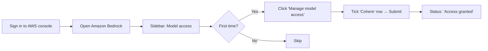

# L43 — Generative AI: AWS Lambda Prerequisites

> Before we write a single line of Python, three AWS-side prerequisites
> must be in place: the **Bedrock model access toggle** in the console,
> the **IAM permissions** that allow the Lambda to invoke the model,
> and the **Lambda function itself** packaged with `boto3 >= 1.34`.

## Prereqs

- L42 (Bedrock overview).
- IAM basics from section 2 of the IAM/KMS/SNS module of the Glue
  course, and section 4 of this course.

## Key terms

- **`bedrock:InvokeModel`** — IAM action for synchronous FM calls.
- **`bedrock:InvokeModelWithResponseStream`** — IAM action for streaming (we will not use it in this section, but we grant it for future use).
- **Model access** — the per-account, per-region toggle that lets you actually *call* a model.
- **Resource policy** — Bedrock also supports a resource-based policy on the model; we use identity policy on the Lambda role because it is simpler and follows least-privilege.

## 1. Enable model access

Bedrock is opt-in per model family. The first time you use Bedrock in a
region, the console asks you to opt in.



### Console walkthrough (≈ 90 s)

1. Sign in to the AWS console in **`us-east-1`** (or `us-west-2`).
2. Open **Amazon Bedrock**.
3. In the lower-left sidebar click **Model access**.
4. Click **Manage model access**.
5. Tick the **Cohere** row — for this lecture `cohere.command-text-v14`.
6. Tick **Anthropic Claude** too (we will use it for an assignment
   stretch goal).
7. Click **Save changes**. AWS may take up to a minute to flip the
   status to **Access granted**.

> Until the status flips, every `InvokeModel` call returns
> `AccessDeniedException` with the message "Account does not have
> access to this model". This is the most common first-attempt
> failure in this section.

### Programmatic equivalent (optional)

```python
import boto3
client = boto3.client("bedrock", region_name="us-east-1")
# List available models for your account
resp = client.list_foundation_models()
for m in resp["modelSummaries"]:
    print(m["modelId"], m["modelLifecycle"]["status"])
```

`list_foundation_models` returns every model — including ones you do
*not* yet have access to. Use the console toggle to actually gain
access.

## 2. IAM permissions for the Lambda

The Lambda we will write in L44 needs to call `bedrock-runtime:InvokeModel`
against the **specific** Cohere model. The minimum policy is:

```json
{
  "Version": "2012-10-17",
  "Statement": [
    {
      "Sid": "BedrockInvokeCohere",
      "Effect": "Allow",
      "Action": [
        "bedrock:InvokeModel",
        "bedrock:InvokeModelWithResponseStream"
      ],
      "Resource": "arn:aws:bedrock:us-east-1::foundation-model/cohere.command-text-v14"
    }
  ]
}
```

> We grant **only** the Cohere `command-text-v14` model. We do **not**
> grant `bedrock:*` on `*`. Least-privilege matters even for GenAI
> because model calls are billed per-token and a policy error is the
> most common cause of runaway cost.

The same file ships under `code/iam_policy.json` so you can copy it
verbatim into the IAM console:

```bash
cd 10_generative_ai_bedrock/code
cat iam_policy.json
```

### How to attach

1. Open **IAM → Roles → Create role**.
2. Trusted entity: **Lambda**.
3. Skip the managed policies step.
4. Paste `code/iam_policy.json` into the **JSON** tab under
   **Add permissions → Create policy → JSON**.
5. Name the policy `BedrockInvokeCoherePolicy`.
7. Name the role `bedrock-defect-summarizer-role`.
8. After L44 is built, set the Lambda's **Execution role** to
   `bedrock-defect-summarizer-role`.

## 3. Lambda packaging decisions

### Runtime

Use **Python 3.11** or later. The default `boto3` baked into the
Python 3.11 runtime is recent enough (≥ 1.34) to support the
`bedrock-runtime` service. You do **not** need a deployment package —
just the inline editor or a 1-file zip.

If you are using an older runtime that ships `boto3 < 1.34`, add a
`boto3>=1.34` line to a `requirements.txt` and ship a deployment
package.

### Memory and timeout

- **Memory:** 512 MB is plenty. Bedrock calls are CPU-light; the model
  runs in AWS's account, not yours.
- **Timeout:** 30 s. Cohere on-demand latencies are 1–2 s; the headroom
  absorbs cold-start and transient throttles.

### Environment variables

| Name | Default | Purpose |
|---|---|---|
| `BEDROCK_MODEL_ID` | `cohere.command-text-v14` | The model the handler calls. Lets you A/B Cohere vs. Claude by changing one env var. |
| `BEDROCK_REGION` | `us-east-1` | Region of the Bedrock endpoint. |
| `MAX_INPUT_CHARS` | `4000` | Truncate the operator input to avoid runaway token costs. |

We will hardcode defaults in `bedrock_lambda.py` so the file works
without any env-var setup, and override them in production via the
console.

## 5. CloudWatch

The Lambda automatically gets a CloudWatch log group
(`/aws/lambda/bedrock-defect-summarizer`). We will log:

- The model ID and region.
- The full prompt (so you can audit prompt injections).
- The input and output token counts returned by Bedrock
  (charge-back metric).
- The total wall-clock latency.

These lines are emitted by the handler in L44 — they are the basis
for the cost dashboard and the prompt-debugging workflow.

## Lecture summary

- Enable **Cohere** model access in the Bedrock console for your
  region. Wait for **Access granted**.
- Create an IAM role whose only Bedrock permission is
  `bedrock:InvokeModel` (and `:InvokeModelWithResponseStream`) on the
  specific Cohere model ARN.
- Plan to deploy the Lambda on **Python 3.11**, 512 MB / 30 s, with
  the role above as execution role.

## Hands-on (≈ 4 minutes)

```bash
# 1. Verify the policy JSON parses
python3 -c "import json; print(json.load(open('10_generative_ai_bedrock/code/iam_policy.json'))['Statement'][0]['Action'])"
# -> ['bedrock:InvokeModel', 'bedrock:InvokeModelWithResponseStream']

# 2. Confirm boto3 in your environment has the bedrock-runtime client
python3 -c "import boto3; print(boto3.client('bedrock-runtime', region_name='us-east-1').meta.service_model.service_name)"
# -> bedrock-runtime
```

If step 2 errors with `UnknownServiceError`, your `boto3` is too old.
Upgrade with `pip install -U boto3 botocore`.

## Quiz prep

- What is the difference between `bedrock:InvokeModel` and
  `bedrock:InvokeModelWithResponseStream`?
- Why is the IAM policy scoped to a specific model ARN?
- Why is Python 3.11 the recommended runtime?

## Further reading

- Bedrock — [Setting up Bedrock](https://docs.aws.amazon.com/bedrock/latest/userguide/setting-up.html)
- IAM — [Bedrock identity-based policies](https://docs.aws.amazon.com/bedrock/latest/userguide/security-iam.html)
- Lambda — [Execution role](https://docs.aws.amazon.com/lambda/latest/dg/lambda-intro-execution-role.html)