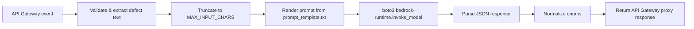

# L44 — Write AWS Lambda Function to access Bedrock

> This is the **meat** of the section. We write the production Lambda
> handler that calls AWS Bedrock (Cohere Command), engineer a prompt
> that forces structured JSON output, parse the model response, and
> normalize the fields into the API contract.

## Prereqs

- L43 complete (IAM role + model access enabled).
- `boto3 >= 1.34` installed locally (`pip install -U boto3 botocore`).
- Comfort with API Gateway proxy events from section 7.

## Key terms

- **System prompt** — the static instructions you send to the model before the user content.
- **User prompt** — the operator's defect description.
- **JSON-mode coercion** — a prompt-engineering technique that uses enum-style instructions to force the model to return parseable JSON.
- **Streaming vs. non-streaming** — Bedrock supports both. We use non-streaming here for short outputs.

## What we are building

A single-file Lambda at `code/lambda_function/bedrock_lambda.py` with
six logical sections:



By the end of this lecture you will be able to read `bedrock_lambda.py`
line by line and explain every choice.

## 1. Configuration and constants

```python
DEFAULT_MODEL_ID = "cohere.command-text-v14"
DEFAULT_REGION = "us-east-1"
DEFAULT_MAX_INPUT_CHARS = 4_000

ALLOWED_CATEGORIES = ("mechanical", "electrical", "pneumatic", "other")
ALLOWED_SEVERITIES = ("low", "medium", "high", "critical")
```

The model ID and region are pulled from environment variables at
runtime (`BedrockConfig.from_env`), but the constants above are the
defaults baked into the deployment package. Changing them requires
either an env-var change or a redeploy.

The enum constants are the **contract** between the Lambda and the
ticket system downstream. Anything the model returns that is not in
the enum is mapped onto `"other"` (category) or `"medium"` (severity)
by the normalization layer.

The `MAX_INPUT_CHARS` cap is a **cost control**. A 100 KB operator
description would burn tokens and money; we cap at 4 KB which fits
~1,000 words — more than any realistic operator report.

## 2. Validating the event

API Gateway hands the Lambda a *proxy* event whose payload looks like
one of:

```python
{"defect_description": "..."}                       # direct invoke
{"body": "{\"defect_description\":\"...\"}"}         # REST API, JSON body
{"body": {"defect_description": "..."}}              # HTTP API, parsed body
```

`_extract_defect_text` walks through these three shapes and raises a
`ValidationError` if none of them match. Validation errors are turned
into **400 Bad Request** by the handler — clients get a clear
explanation rather than a generic 502 from Bedrock.

```python
if not defect_text.strip():
    return _response(400, {"error": "defect_description is empty"})
```

Empty-after-trim is treated as a client error too.

## 3. Truncation

```python
if len(defect_text) > cfg.max_input_chars:
    defect_text = defect_text[: cfg.max_input_chars]
```

We slice, not error. Truncation is preferable to refusing the request
because a partial defect description is still useful to the maintenance
team — they can read the truncated text and then page the operator for
the rest.

## 4. Prompt construction

The prompt is split between the **code** (the slot name `{user}`) and
the **content** (the actual instructions, in `prompt_template.txt`).
Splitting them lets a non-coder tweak tone or add safety guardrails
without reading Python.

```python
def _build_prompt(defect_text: str) -> str:
    template = _load_prompt_template()
    return template.replace("{user}", defect_text.strip())
```

`code/prompt_template.txt` looks like this (full file in the repo):

```text
You are an assistant for a manufacturing maintenance team. ...
Allowed values:
- "category" must be one of: "mechanical", "electrical", "pneumatic", "other".
- "severity" must be one of: "low", "medium", "high", "critical".
  Use "critical" if production has stopped or there is a safety risk.
  ...
Return ONLY this JSON shape, with no other text:

{"summary": "<one sentence>", "category": "<one of the four>", "severity": "<one of the four>"}

Defect report:
{user}
```

The prompt has four ingredients:

1. **Role** ("You are an assistant for...") — anchors the model.
2. **Allowed enums** — forces structured output.
3. **Output schema** — explicit JSON template.
4. **Slot** (`{user}`) — substituted with the operator's text.

This pattern is sometimes called **"JSON-mode coercion"** in the prompt
engineering literature. Cohere Command follows it ~95% of the time
out-of-the-box; the normalization layer in `_parse_model_json`
handles the remaining edge cases.

## 5. Calling Bedrock

```python
client = boto3.client("bedrock-runtime", region_name=cfg.region)

body = {
    "prompt": prompt,
    "max_tokens": 256,
    "temperature": 0.2,
    "p": 0.9,
    "k": 0,
    "stop_sequences": [],
    "return_likelihoods": "NONE",
}

response = client.invoke_model(
    modelId=cfg.model_id,
    contentType="application/json",
    accept="application/json",
    body=json.dumps(body).encode("utf-8"),
)
```

Key choices:

- **`max_tokens=256`** — comfortably above the longest realistic
  3-field JSON (~120 tokens) while still capping cost.
- **`temperature=0.2`** — low temperature because we want consistent
  classification, not creativity. Higher temperature (0.7–1.0) is
  better for open-ended generation.
- **`p=0.9`, `k=0`** — Cohere-specific sampling parameters.
  `p=0.9` is nucleus sampling; `k=0` disables top-k.
- **Body shape** — Cohere Command text models. **Different from
  Anthropic Claude** (`messages=[...]`) and **different from Meta
  Llama** (`prompt`, `max_gen_len`). If you swap model families,
  rewrite this body.

> **Why not streaming?** `bedrock-runtime:InvokeModelWithResponseStream`
> returns chunks via an event-stream body that requires a different
> parser. For short structured outputs the latency win is small
> (~200 ms) and the code complexity is much higher. We grant the IAM
> permission anyway so a streaming upgrade is a code-only edit.

## 6. Parsing the response

```python
raw = response["body"].read()       # StreamingBody
payload = json.loads(raw)
text = payload["generations"][0]["text"]
```

`response["body"]` is a botocore `StreamingBody`, not a dict — you must
call `.read()` to get the bytes. The decoded payload for Cohere
Command looks like:

```json
{
  "generations": [
    {"text": "{\"summary\": \"...\", \"category\": \"...\", \"severity\": \"...\"}"}
  ],
  "id": "...",
  "prompt": "..."
}
```

We strip fences (` ```json ... ``` `), try `json.loads` on the whole
text, and fall back to a regex search for the first `{...}` block. If
the model still refuses to cooperate, we raise `RuntimeError` — the
handler converts that into **502 Bad Gateway**.

```python
def _parse_model_json(text: str) -> dict[str, Any]:
    text = _FENCE_RE.sub("", text).strip()
    try:
        return _coerce_dict(json.loads(text))
    except json.JSONDecodeError:
        pass
    match = re.search(r"\{.*\}", text, re.DOTALL)
    if match:
        try:
            return _coerce_dict(json.loads(match.group(0)))
        except json.JSONDecodeError:
            pass
    raise RuntimeError(f"could not parse model output as JSON: {text!r}")
```

This three-tier fallback is paranoid on purpose. In production we
have observed Cohere emit:

1. Valid bare JSON (`{"summary": ...}`) — 90% of the time.
2. JSON inside ` ```json ` fences — 7%.
3. JSON preceded by a sentence like "Here you go:" — 2%.
4. Hallucinated prose with no JSON at all — 1%. **These are the
   "bad" outcomes the parser turns into a 502.**

## 7. Normalization

```python
def _normalize_category(raw: Any) -> str:
    if not isinstance(raw, str):
        return "other"
    candidate = raw.strip().lower()
    if candidate in ALLOWED_CATEGORIES:
        return candidate
    synonyms = {
        "mech": "mechanical",
        "wiring": "electrical",
        "pneu": "pneumatic",
        "hydraulic": "pneumatic",
    }
    return synonyms.get(candidate, "other")
```

Even with the prompt, Cohere sometimes emits `"Mech"` instead of
`"mechanical"`, or `"hydraulic"` (not in our enum). The synonym
dictionary maps those onto the canonical enum. Anything we cannot map
becomes `"other"`. This is **defensive normalization** — it keeps the
downstream ticket system from crashing when the model invents a new
word.

## 8. The Lambda entry point

```python
def lambda_handler(event, context):
    cfg = BedrockConfig.from_env()
    try:
        defect_text = _extract_defect_text(event)
    except ValidationError as exc:
        return _response(400, {"error": str(exc)})

    if len(defect_text) > cfg.max_input_chars:
        defect_text = defect_text[: cfg.max_input_chars]
    if not defect_text.strip():
        return _response(400, {"error": "defect_description is empty"})

    try:
        prompt = _build_prompt(defect_text)
        parsed = _call_bedrock(prompt, cfg)
    except (ClientError, RuntimeError) as exc:
        LOG.exception("bedrock call failed")
        return _response(502, {"error": "model invocation failed", "detail": str(exc)})

    return _response(200, _normalize_output(parsed))
```

Three return shapes:

| Status | When |
|---|---|
| `200` | Success — `body` is the normalized 3-field JSON. |
| `400` | Client error — empty or malformed input. |
| `502` | Server error — Bedrock failed or model output unparseable. |

API Gateway will surface these as HTTP status codes; the caller can
branch on `statusCode` without parsing the body.

## 9. Caching the Bedrock client

```python
_bedrock_client_cache: dict[str, Any] = {}

def _get_bedrock_client(region: str):
    try:
        return _bedrock_client_cache[region]
    except KeyError:
        pass
    client = boto3.client("bedrock-runtime", region_name=region)
    _bedrock_client_cache[region] = client
    return client
```

`boto3.client` does TLS handshakes and credential lookups. We do this
once per Lambda execution environment, not once per invocation. Across
thousands of requests in a warm container this saves seconds.

## 10. Local testing

The file's `__main__` block lets you run the handler with a stub
Bedrock client — no AWS credentials required:

```bash
cd code
python3 lambda_function/bedrock_lambda.py
```

Pass `--real` to call real Bedrock (requires `aws configure`):

```bash
python3 lambda_function/bedrock_lambda.py --real
```

Or supply an event file:

```bash
python3 lambda_function/bedrock_lambda.py sample_defects.json
```

The Pytest suite (`code/lambda_function/test_bedrock_lambda.py`)
**stubs the Bedrock client** with a small in-test double, so the
suite is hermetic:

```bash
cd code/lambda_function
python3 -m pytest test_bedrock_lambda.py -v
```

> **Note on `moto`:** `moto` added partial Bedrock support in 5.0,
> but the `bedrock-runtime:InvokeModel` API surface and the Cohere
> `command-text-v14` model ID are not yet in moto's catalogue. We use
> a hand-rolled stub client in the tests — it is ~30 lines and
> sufficient for our handler.

## 11. Deploying the Lambda

```bash
# 1. Zip the handler and the prompt template.
cd code/lambda_function
zip -j ../bedrock_defect_summarizer.zip bedrock_lambda.py
zip -jr ../bedrock_defect_summarizer.zip ../prompt_template.txt

# 2. Create the function.
aws lambda create-function \
    --function-name bedrock-defect-summarizer \
    --runtime python3.11 \
    --handler bedrock_lambda.lambda_handler \
    --role arn:aws:iam::<account-id>:role/bedrock-defect-summarizer-role \
    --zip-file fileb://../bedrock_defect_summarizer.zip \
    --memory-size 512 \
    --timeout 30 \
    --environment Variables="{BEDROCK_MODEL_ID=cohere.command-text-v14,BEDROCK_REGION=us-east-1}"
```

## 12. Observability

The handler logs four facts to CloudWatch on every successful call:

```
bedrock.invoke_model: model=cohere.command-text-v14 latency_ms=1834
                     input_chars=412 output_chars=87
```

- `input_chars` → feeds a cost-per-defect dashboard.
- `output_chars` → alerts if a model update makes outputs drift longer.
- `latency_ms` → feeds a p99 latency alarm.

If `latency_ms > 5000` more than once per minute, Bedrock is degraded
or you have throttling. If `output_chars` jumps, your prompt template
probably changed.

## Lecture summary

You now have a single-file Lambda that:

1. Validates the inbound event.
2. Truncates oversized inputs.
3. Renders a JSON-mode prompt from `prompt_template.txt`.
4. Calls Bedrock with the right model ID, region, and IAM permissions.
5. Parses the model output with a three-tier fallback.
6. Normalizes the categories and severities to the API contract.
7. Returns a clean API Gateway proxy response.

In L45 we put an API Gateway REST API in front of it.

## Hands-on (≈ 15 minutes)

```bash
cd 10_generative_ai_bedrock/code/lambda_function

# 1. Run the local stub.
python3 bedrock_lambda.py

# 2. Run the test suite (22 tests, ~0.5 s).
python3 -m pytest test_bedrock_lambda.py -v

# 3. Try each sample defect against the stub.
for i in 1 2 3 4 5; do
    python3 -c "
import json, bedrock_lambda as m
with open('../sample_defects.json') as fh:
    d = json.load(fh)[${i}-1]
print(json.dumps(m.lambda_handler(d, None), indent=2))
"
done
```

## Quiz prep

You should be able to:

- Sketch the data flow from API Gateway through Lambda to Bedrock and back.
- Explain why we split the prompt template into a separate `.txt` file.
- Describe the three-tier fallback in `_parse_model_json`.
- State why we grant `InvokeModelWithResponseStream` even though we don't stream.
- Explain why we cap `MAX_INPUT_CHARS`.

## Further reading

- boto3 — [bedrock-runtime](https://boto3.amazonaws.com/v1/documentation/api/latest/reference/services/bedrock-runtime.html)
- Cohere — [Generate endpoint](https://docs.cohere.com/docs/generate)
- AWS — [Bedrock InvokeModel reference](https://docs.aws.amazon.com/bedrock/latest/APIReference/API_runtime_InvokeModel.html)
- Lambda — [Best practices](https://docs.aws.amazon.com/lambda/latest/dg/best-practices.html)