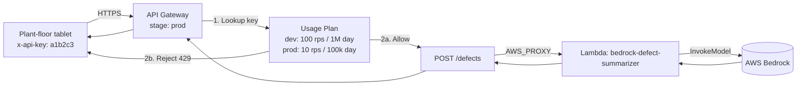
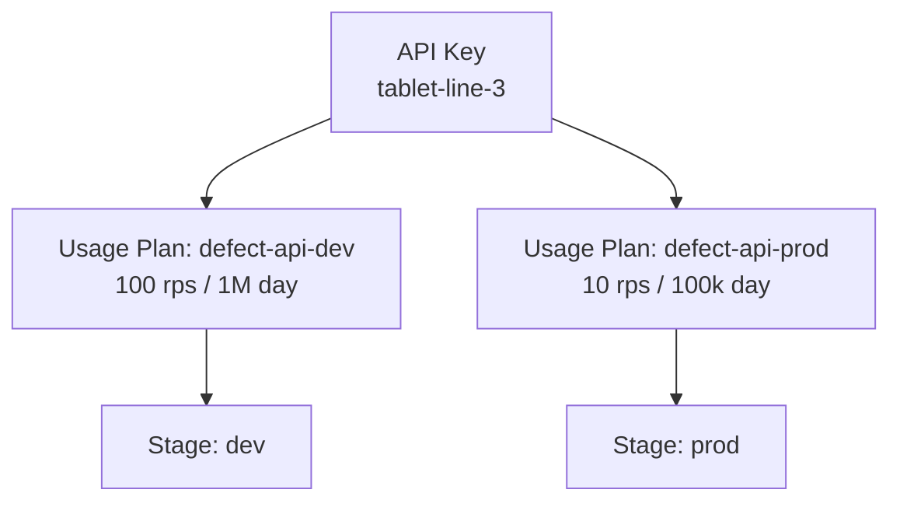

# L44a — API Keys and Usage Plan for the Bedrock API

> Bedrock itself authenticates with **IAM**, never with API keys. But the
> REST API we put in front of Bedrock in L45 is a normal API Gateway
> REST API, and it can — and should — be protected with **API Keys +
> Usage Plans**. This lecture is the Bedrock-specific application of
> the section 8 material.

## Prereqs

- L44 complete (Lambda deployed, Bedrock IAM permissions in place).
- L33 (API Keys theory) and L34 (hands-on for Use Case 2).
- L45 lecture read or watched — we are protecting the `bedrock-defect-api`
  REST API with the `prod` stage.

## Key terms

- **API Key** — an opaque string (e.g. `a1b2c3d4...`) the client sends
  in the `x-api-key` header. It identifies the caller for metering and
  throttling, not for authentication.
- **Usage Plan** — a bundle of throttling (RPS + burst) and quota
  (requests per period) limits attached to one or more API stages.
- **Stage** — a deployed snapshot of the API. L45 deploys to `prod`.
- **Rate limit** — steady-state requests per second the key may make.
- **Burst limit** — the token-bucket capacity that allows short spikes
  above the rate.
- **Quota** — long-term ceiling per `DAY`, `WEEK`, or `MONTH`. Enforced
  in UTC.
- **Two-stage deployment** — `dev` (loose limits, used by the
  integration tests) and `prod` (tight limits, used by the tablet UI).

## Why API Keys for a Bedrock-backed API?

The defect-summarizer is a **cost amplifier**: each `POST /defects`
call bills a few cents to Bedrock depending on the input length. A
single misbehaving client (a runaway script, a leaked key, an
infinite loop in the tablet UI) can rack up real cost in minutes. The
defense in depth is:

1. **JSON Schema validation in API Gateway** (L45) — rejects malformed
   requests with 400 before Lambda runs.
2. **Stage throttling** (L45) — bounds aggregate RPS across all keys.
3. **API Key + Usage Plan** (this lecture) — bounds per-key RPS and
   per-period quota so one caller cannot starve the others.
4. **Bedrock IAM scope** (L43/L44) — limits the Lambda to a single
   model ARN so even a prompt-injection cannot pivot to a more
   expensive model.

Layers 1 and 4 are already in place. Layer 2 is configured in the
stage settings. This lecture installs layer 3.

> **Common confusion:** Bedrock itself uses **IAM**, not API keys.
> The boto3 call from Lambda to Bedrock is signed with the execution
> role's SigV4 credentials. The API Key is purely for the
> *API Gateway → caller* edge. If you ever see a "use this API key to
> call Bedrock" tutorial, it is wrong.

## Architecture



The key, the plan, and the stage association are three distinct AWS
resources. None of them imply the others — you can have a key without
a plan, a plan without a stage, or a key on a plan that does not
include the `prod` stage. The lecture wires all three together.

## 1. The throttling-and-quota numbers

For a manufacturing defect pipeline:

| Stage | Rate (RPS) | Burst | Quota | Why |
|---|---|---|---|---|
| `dev` | 100 | 200 | 1,000,000 / day | Load tests, integration tests, ad-hoc exploration. |
| `prod` | 10 | 50 | 100,000 / day | 10 RPS is ~4–5 tablets × 2 RPS each. The quota is a backstop in case a tablet's client enters a retry loop. |

RPS=10 for `prod` looks tiny. Bedrock latency is around 1.5 s, so 10
RPS gives us ~15 in-flight requests. The plant runs at most 3 lines
and each tablet fires at most one request per minute. 10 RPS is
**2,400× the expected steady-state**. The quota at 100k/day is
**480× the expected daily volume**. Both are real ceilings, not
production targets.

If you ever raise these, raise the Bedrock budget alarm first.

## 2. The two-stage deployment

The script in this lecture creates **two usage plans**, one per
stage, plus a single API key. The same key is attached to both plans,
so the same client (the tablet, or a CI runner) can hit either stage
and the throttling is appropriate to that stage.



The stage association is what makes the throttling "active" for a
given request. A plan with no stage association is dormant; a key
attached to a dormant plan has no effect.

## 3. boto3 calls (in order)

The script runs the following API Gateway calls:

```text
1. apigateway.get_rest_apis                        → find bedrock-defect-api
2. apigateway.get_stages                           → confirm dev + prod exist
3. apigateway.create_api_key / get_api_keys        → mint or reuse one key
4. apigateway.create_usage_plan × 2                → defect-api-dev, defect-api-prod
5. apigateway.create_usage_plan_key × 2            → attach key to each plan
6. apigateway.get_api_key(includeValue=True)       → print the key value
```

All six are wrapped in helpers (`ensure_api_key`,
`ensure_usage_plan`, `attach_key_to_plan`, ...) that look up the
existing resource by name first. The script is **idempotent** — run
it twice and you get the same state, the same key value, and the
same `x-api-key`.

## 4. The script

The full script is in
`10_generative_ai_bedrock/code/api_keys_for_bedrock/create_api_key.py`.
Key bits:

```python
def ensure_usage_plan(
    client,
    name: str,
    *,
    rate_limit: float,
    burst_limit: int,
    quota_limit: int,
    quota_period: str,
    stages: list[dict],
) -> str:
    """Create or update a Usage Plan with the given throttle / quota."""
    paginator = client.get_paginator("get_usage_plans")
    existing = None
    for page in paginator.paginate():
        for p in page["items"]:
            if p["name"] == name:
                existing = p
                break
        if existing:
            break

    if existing:
        plan_id = existing["id"]
        client.update_usage_plan(
            usagePlanId=plan_id,
            patchOperations=[
                {"op": "replace", "path": "/throttle/rateLimit", "value": str(rate_limit)},
                {"op": "replace", "path": "/throttle/burstLimit", "value": str(burst_limit)},
                {"op": "replace", "path": "/quota/limit", "value": str(quota_limit)},
                {"op": "replace", "path": "/quota/period", "value": quota_period},
            ],
        )
    else:
        resp = client.create_usage_plan(
            name=name,
            throttle={"rateLimit": rate_limit, "burstLimit": burst_limit},
            quota={"limit": quota_limit, "period": quota_period},
            stages=stages,
        )
        plan_id = resp["id"]
    return plan_id
```

The same shape appears for `ensure_api_key` (create-if-missing,
update-if-exists) and `attach_key_to_plan` (no-op-if-already-attached).
The two plans are created by calling `ensure_usage_plan` twice with
different names and different throttle/quota values.

## 5. Running the script

```bash
cd 10_generative_ai_bedrock/code/api_keys_for_bedrock
python create_api_key.py
```

Defaults are tuned for the section 10 use case. Override with
`--api-name`, `--dev-stage`, `--prod-stage`, `--dev-rate`,
`--prod-rate`, `--dev-quota`, `--prod-quota`, etc. The script prints:

```
API ID    : abc123def
DEV PLAN  : ghi456jkl (100 rps, 1M / day)
PROD PLAN : mno789pqr (10 rps, 100k / day)
KEY ID    : stu012vwx
KEY VALUE : a1b2c3d4e5f6g7h8
```

The `KEY VALUE` line is the only thing the tablet needs.

## 6. Enabling "API Key Required" on the `POST /defects` method

By default, API Gateway accepts requests with or without a key. To
enforce:

1. API Gateway → `bedrock-defect-api` → **Resources** → `/defects` →
   **POST** → **Method Request**.
2. **Settings → API Key Required:** `true`.
3. **Actions → Deploy API** → stage `prod`.

Until you redeploy, the toggle does nothing. After redeploy, calls
without `x-api-key` get **403 Forbidden** and Bedrock is never
billed.

## 7. Verifying with `curl`

```bash
INVOKE="https://abc123def.execute-api.us-east-1.amazonaws.com/prod"
KEY="a1b2c3d4e5f6g7h8"

# 1) No key → 403
curl -i -X POST "$INVOKE/defects" \
     -H "Content-Type: application/json" \
     -d '{"defect_description": "smoke from cabinet on line 2"}'

# 2) With key → 200
curl -i -X POST "$INVOKE/defects" \
     -H "Content-Type: application/json" \
     -H "x-api-key: $KEY" \
     -d '{"defect_description": "smoke from cabinet on line 2"}'

# 3) Burst test against prod throttling (10 RPS, burst 50)
for i in $(seq 1 80); do
  curl -s -o /dev/null -w "%{http_code}\n" -X POST "$INVOKE/defects" \
       -H "Content-Type: application/json" \
       -H "x-api-key: $KEY" \
       -d "{\"defect_description\": \"burst test $i\"}"
done | sort | uniq -c
# Expect mostly 200, some 429 once the bucket empties.
```

## 8. CloudWatch dimensions for the new key

Per-key metrics show up in the `AWS/ApiGateway` namespace with the
dimension `ApiKey=<your-key-id>`. The most useful are:

- **`Count`** — request volume per key. Spot the noisy neighbor.
- **`4XXError`** — 403s, mostly key-related.
- **`5XXError`** — Lambda or Bedrock errors.
- **`IntegrationLatency`** — Bedrock round-trip.
- **`Throttle`** — should be 0 in steady state.

Add a CloudWatch alarm on `Throttle > 0 for 1 minute` to get paged
the moment a key bumps the rate ceiling.

## 9. Common mistakes

- **Treating the key as a secret.** It is — but a leaked key is
  equivalent to a leaked URL. There is no signing and no rotation
  story. Rotate by issuing a new key, attaching it to the plans,
  updating the tablet, then deleting the old one.
- **Forgetting to redeploy.** The "API Key Required" toggle only
  takes effect after a deploy.
- **Setting quota at the account level, not the plan level.** Account
  quota is hard to track per-key; the plan quota is the right knob.
- **Putting the same key on `dev` and `prod` with the same limits.**
  Either the `dev` limit is too tight (CI fails) or the `prod` limit
  is too loose (cost risk). Two plans, one key.
- **Enabling API Key Required on `OPTIONS`.** CORS preflight is a
  browser feature, not an API call — leaving it open is correct.

## Lecture summary

- API Keys in this section are for the API Gateway edge, not for
  Bedrock itself.
- One key, two plans: `defect-api-dev` (loose) and `defect-api-prod`
  (tight). The same key is attached to both.
- The script is idempotent — re-running it updates the existing
  resources and prints the same key.
- After enabling "API Key Required" and redeploying, the tablet must
  send `x-api-key` on every `POST /defects`.

## Hands-on (≈ 4 minutes)

```bash
cd 10_generative_ai_bedrock/code/api_keys_for_bedrock

# 1. Run the test suite (5 tests, ~0.5 s).
python -m pytest -v

# 2. Run the script (requires L45's REST API to be deployed).
python create_api_key.py

# 3. Test in the API Gateway console:
#    - POST /defects → Method Request → API Key Required = true
#    - Actions → Deploy API → prod
#    - curl with and without the key
```

## Quiz prep

- Is the API Key used to call Bedrock, or to call the REST API?
- What is the difference between throttling and quota?
- Why have two usage plans (dev + prod) attached to one key?
- What must you do after flipping "API Key Required" to true?
- Which CloudWatch dimension exposes per-key request counts?

## Further reading

- API Gateway — [Create and use usage plans with API keys](https://docs.aws.amazon.com/apigateway/latest/developerguide/api-gateway-api-usage-plans.html)
- API Gateway — [Throttle API requests for better throughput](https://docs.aws.amazon.com/apigateway/latest/developerguide/api-gateway-request-throttling.html)
- boto3 — [apigateway client](https://boto3.amazonaws.com/v1/documentation/api/latest/reference/services/apigateway.html)
- L33, L34 — section 8 API Keys theory and hands-on (the same pattern, different API).
