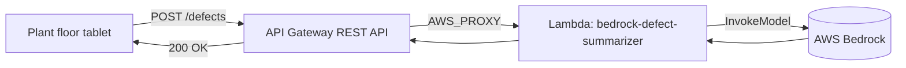

# L45 — Create REST API using API Gateway to access Bedrock

> Wire the Bedrock-backed Lambda behind a public REST API so plant-floor
> apps can `POST` a defect. We cover request validation, CORS for the
> browser-based tablet UI, and throttling to bound Bedrock cost.

## Prereqs

- L44 complete (Lambda deployed, IAM permissions in place).
- Section 7 (API Gateway overview).

## Key terms

- **REST API** — the API Gateway v1 API type. Distinct from HTTP API (v2).
- **Resource path** — a node in the API URL tree, e.g. `/defects`.
- **Method** — an HTTP verb bound to a resource (POST here).
- **Integration type** — Lambda Proxy (`AWS_PROXY`) is what we use.
- **CORS** — Cross-Origin Resource Sharing. Browser preflight `OPTIONS` calls must succeed.
- **Throttling** — per-stage and per-method rate limits to bound cost.

## Why REST (not HTTP)?

Section 7 covered the comparison in depth; the short version for this
section is:

| Feature | HTTP API | REST API |
|---|---|---|
| Lambda proxy | yes | yes |
| API keys + usage plans | **no** | **yes** |
| Request validation | basic | full JSON Schema |
| CloudWatch access logs | extra setup | built-in |

The defect-summarizer is a **B2B-style internal API** that may need to
be billed per call to internal teams later. REST APIs give you that
path without rebuilding the API.

## Endpoints we will create

| Method | Path | Purpose |
|---|---|---|
| `POST` | `/defects` | Submit a defect for summarization. |
| `OPTIONS` | `/defects` | CORS preflight. |
| `GET` | `/health` | Liveness check — does not invoke Bedrock. |

## Architecture (post-generate)



## Step-by-step (console)

1. **API Gateway → Create API → REST API → New API.**

   - **API name:** `bedrock-defect-api`
   - **Endpoint type:** Regional
   - Click **Create API**.

3. **Resources → Actions → Create Resource.**

   - **Resource name:** `Defects`
   - **Resource path:** `/defects`
   - **Enable API Gateway CORS:** ✓

5. **On `/defects` → Actions → Create Method → POST.**

   - **Integration type:** Lambda Function
   - **Lambda Region:** `us-east-1`
   - **Lambda Function:** `bedrock-defect-summarizer`
   - **Use Lambda Proxy integration:** ✓ (this is the default for new methods)
   - Click **Save**. Confirm "Add Permission to Lambda Function" by clicking **OK**.

7. **Request validation.**

   - On the `POST` method → **Method Request**.
   - **Settings** → **Request Validator:** Validate body.
   - **Request Body** → Add model `defectDescription` with schema:
     ```json
     {
       "$schema": "http://json-schema.org/draft-04/schema#",
       "title": "DefectReport",
       "type": "object",
       "required": ["defect_description"],
       "properties": {
         "defect_description": { "type": "string", "minLength": 1, "maxLength": 4000 }
       }
     }
     ```
   - Save.

11. **Deploy the API.**

    - **Actions → Deploy API.**
    - **Deployment stage:** `[New Stage]`
    - **Stage name:** `prod`
    - Click **Deploy**.
    - Note the **Invoke URL** — it looks like
      `https://abc123def4.execute-api.us-east-1.amazonaws.com/prod`.

13. **Test it.**

    ```bash
    curl -X POST https://abc123def4.execute-api.us-east-1.amazonaws.com/prod/defects \
         -H "Content-Type: application/json" \
         -d '{"defect_description": "Line 3 stamping press #2 producing 2 mm burr; coolant pressure dropped to 12 psi."}'
    ```

    Expected response:

    ```json
    {
      "summary": "Stamping press #2 producing 2 mm burr on flange; coolant pressure dropped to 12 psi.",
      "category": "mechanical",
      "severity": "high"
    }
    ```

## CORS

The plant-floor tablet is a browser app on a different origin, so we
need CORS. The `Enable API Gateway CORS` checkbox above adds an
`OPTIONS` method with a mock integration that returns:

```
Access-Control-Allow-Origin: *
Access-Control-Allow-Methods: POST,OPTIONS
Access-Control-Allow-Headers: Content-Type
```

The Lambda's `headers` block also sets `Access-Control-Allow-Origin: *`
on every response so actual `POST`s carry the header. **Both** are
required — preflight needs the `OPTIONS` mock, and the actual response
needs the header on the `200 OK`.

> For production, replace `*` with your tablet's origin
> (`Access-Control-Allow-Origin: https://tablet.plant.example.com`).
> Wildcard origins plus credentials are not allowed by browsers.

## Throttling

Bedrock charges per token. A single misbehaving client could rack up
real cost. Throttle aggressively.

- **Default stage throttle:** 100 RPS, 2000 burst. For a defect
  pipeline that is enormous — the tablet UI fires perhaps one request
  per minute per line. Tighten to **10 RPS, 200 burst**.
- **Quota:** optional per-month or per-day cap. Set **100,000
  requests/day** as a guard.

Where to configure:

- **Stages → prod → Settings → Default Method Throttling.**
- **Stages → prod → Usage Plan** → if you also want API keys, see
  section 8.

If you exceed the throttle, API Gateway returns **429 Too Many
Requests** with `Retry-After`. The Lambda is never invoked, so Bedrock
is never billed.

## Request validation

JSON Schema validation in API Gateway is **cheaper than Lambda** —
a malformed request never invokes our function. This is the cheapest
possible DDoS mitigation:

- Empty body → 400 from API Gateway.
- Wrong type → 400 from API Gateway.
- No `defect_description` → 400 from API Gateway.

You can see the request shape in the response body if you enable
**Method Response → Default 4XX → mapping template**.

## Logging

Turn on CloudWatch logs at the **stage** level:

- **Stages → prod → Logs/Tracing → Enable CloudWatch Logs.**
- **Log level:** INFO.
- **Access logging:** enable and point at a fresh log group
  `arn:aws:logs:us-east-1:...:log-group:/aws/apigateway/bedrock-defect-api-prod`.

You will see one log line per request — caller IP, request id,
response status, latency — which is the data you need to debug "why
is this defect ticket late?" tickets.

## API key + usage plan (optional)

If you need to bill internal teams per call:

- **API Keys → Actions → Create API Key → Name: `tablet-line-3`.**
- **Usage Plans → Create → Name: `defect-api-plan`, Throttle: 10 RPS,
  Quota: 100k/month.**
- **Associated API Stages:** `prod`.
- **Usage Plan → API Keys → Add Key:** `tablet-line-3`.

The tablet sends `x-api-key: <key>` and API Gateway enforces the
throttle and quota on that key. See section 8 lectures for the full
hands-on.

## Lecture summary

- REST API with one resource (`/defects`), one POST method, Lambda
  proxy integration.
- CORS enabled; Lambda also emits `Access-Control-Allow-Origin`.
- Throttle to 10 RPS to bound Bedrock cost.
- JSON Schema validation rejects malformed requests before Lambda.
- CloudWatch access logs enabled for the `prod` stage.

## Hands-on (≈ 4 minutes)

```bash
# Verify the API is live.
curl -i https://<api-id>.execute-api.us-east-1.amazonaws.com/prod/defects \
     -X POST -H "Content-Type: application/json" \
     -d '{"defect_description": "Smoke from main cabinet on line 2."}'

# A 400 for missing field.
curl -i https://<api-id>.execute-api.us-east-1.amazonaws.com/prod/defects \
     -X POST -H "Content-Type: application/json" -d '{}'
```

## Quiz prep

- Why REST API instead of HTTP API for this use case?
- What does Lambda Proxy integration mean for the event shape?
- Where do you throttle the API?
- What is the cheapest DDoS mitigation in this architecture?

## Further reading

- API Gateway — [REST API overview](https://docs.aws.amazon.com/apigateway/latest/developerguide/apigateway-rest-api.html)
- API Gateway — [CORS](https://docs.aws.amazon.com/apigateway/latest/developerguide/how-to-cors.html)
- API Gateway — [Throttling](https://docs.aws.amazon.com/apigateway/latest/developerguide/api-gateway-request-throttling.html)
- API Gateway — [Request validation](https://docs.aws.amazon.com/apigateway/latest/developerguide/api-gateway-request-validation.html)