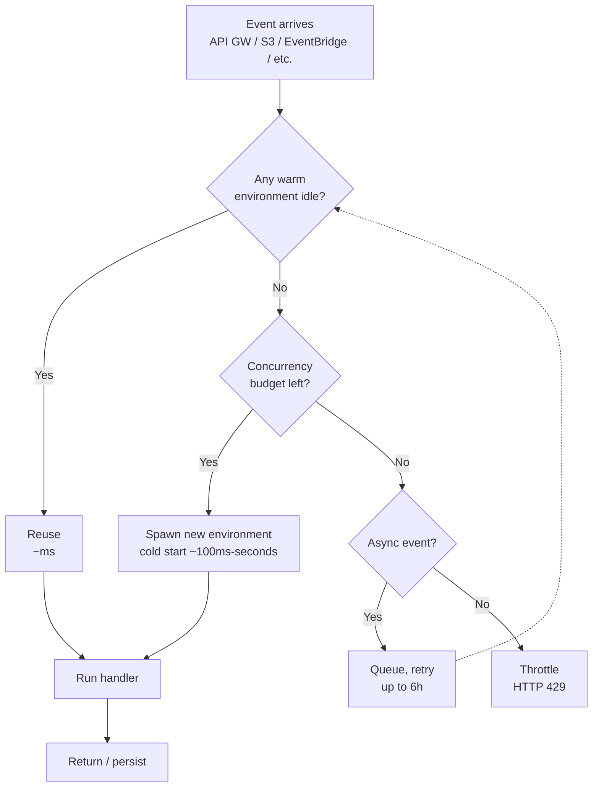

# L48 — Lambda Execution and Concurrency

> Lambda "concurrency" is the number of function instances that are
> running your code at the same instant. It is the single most
> important operational dial on the service — if you understand
> nothing else in this section, understand this lecture.

## Prereqs

- L19–L22 (Lambda basics, invocation model, timeout).
- Section 4 of the Glue course for IAM fundamentals.

## Key terms

- **Concurrency** — number of function instances processing
  invocations simultaneously. Each instance handles one invocation at
  a time.
- **Account concurrency limit** — soft cap of 1,000 concurrent
  executions per AWS Region, per account.
- **Burst concurrency** — initial pool of 500–3,000 that scales out
  from a shared regional pool.
- **Scale rate** — additional concurrency can be provisioned at
  roughly 1,000 instances per minute (per function, per Region).
- **Throttle** — when a function cannot scale fast enough, new
  invocations receive a `TooManyRequestsException` (HTTP 429).
- **Cold start** — first invocation on a new instance; pays the
  init-time tax (runtime boot + your handler imports).

## 1. What concurrency is

When an event triggers your function, Lambda either:

1. **Reuses a warm execution environment** that already booted your
   container image and finished running your handler's top-level
   code — fast (single-digit ms).
2. **Spins up a new environment** to handle this and any other queued
   invocations — slow (100ms–10s depending on runtime and code).

A function with `concurrency = 50` means up to 50 environments are
running your code in parallel. Two thousand invocations arriving at
once on a function with concurrency 50 will *queue* — Lambda retries
asynchronous invocations for up to 6 hours, but synchronous callers
(such as API Gateway) get HTTP 429.

## 2. Where the limit comes from

Two layers:

| Layer | Default | What controls it |
|---|---|---|
| **Account** | 1,000 | Set with `GetAccountSettings` / `PutAccountSettings` in the Lambda console or `put_account_concurrency` in the AWS SDK |
| **Function** | unbounded within account limit | Set with `put_function_concurrency` |

> Scaling the account limit is a *soft limit*. Request an increase
> through AWS Support; it is almost always granted but takes 24–48 h.

A single function can also have a **reserved concurrency** that
*caps* it — useful for protecting downstream systems (see L49).

## 3. How Lambda scales



What this diagram is telling you is that Lambda's concurrency
control is a *budget*: every invocation either reuses idle capacity,
borrows against future capacity, or is rejected. Async sources (S3,
SNS, EventBridge) retry on your behalf; sync sources (API Gateway,
ALB, synchronous Invoke) bubble a 429 back to the caller.

## 4. Reading the concurrency metric

CloudWatch metric `ConcurrentExecutions` (namespace `AWS/Lambda`) tells
you the *instantaneous* count at any one-second resolution.

```python
import boto3
from datetime import datetime, timedelta

cw = boto3.client("cloudwatch", region_name="us-east-1")
resp = cw.get_metric_statistics(
    Namespace="AWS/Lambda",
    MetricName="ConcurrentExecutions",
    StartTime=datetime.utcnow() - timedelta(hours=1),
    EndTime=datetime.utcnow(),
    Period=60,
    Statistics=["Maximum"],
)
for p in resp["Datapoints"]:
    print(p["Timestamp"], p["Maximum"])
```

If the maximum you see ever approaches your account limit, you are
about to be throttled. The proper response is either to raise the
account limit, lower per-function reserved concurrency to free
budget, or add provisioned concurrency (L49) to the hot functions.

## 5. When to worry

| Symptom | Likely cause |
|---|---|
| `Throttles` metric > 0 | Concurrency budget exhausted or reserved cap hit |
| `ConcurrentExecutions` max == account limit | Need to raise account limit |
| Sudden cold-start spikes | Idle environments reaped (≈ 15 min of no invocations) |
| Memory pressure errors | Increase memory, see L50 |

## Lecture summary

- Concurrency = the number of in-flight function instances.
- Account soft limit is 1,000 per Region.
- Lambda scales by adding environments; cold starts are the tax.
- Sync throttles return 429 to the caller; async sources queue and
  retry.

## Hands-on (≈ 3 minutes)

```bash
# 1. Show current account concurrency ceiling
aws lambda get-account-settings --region us-east-1 \
    --query 'AccountLimit.ConcurrentExecutions' --output text
# -> 1000

# 2. Show current usage
aws lambda get-account-settings --region us-east-1 \
    --query 'AccountUsage.[ConcurrentExecutions,UnreservedConcurrentExecutions]' \
    --output text

# 3. Run a 200-event burst at a function and watch concurrent executions
python 11_lambda_advanced_concepts/code/concurrency_burst.py
```

## Quiz prep

- What is the default account-level concurrency limit per Region?
- What metric tells you whether you're about to be throttled?
- When does Lambda return `TooManyRequestsException` vs. queue?

## Further reading

- AWS — [Lambda concurrent executions](https://docs.aws.amazon.com/lambda/latest/dg/lambda-concurrency.html)
- AWS — [Scaling behavior for Lambda](https://docs.aws.amazon.com/lambda/latest/dg/invocation-scaling.html)
