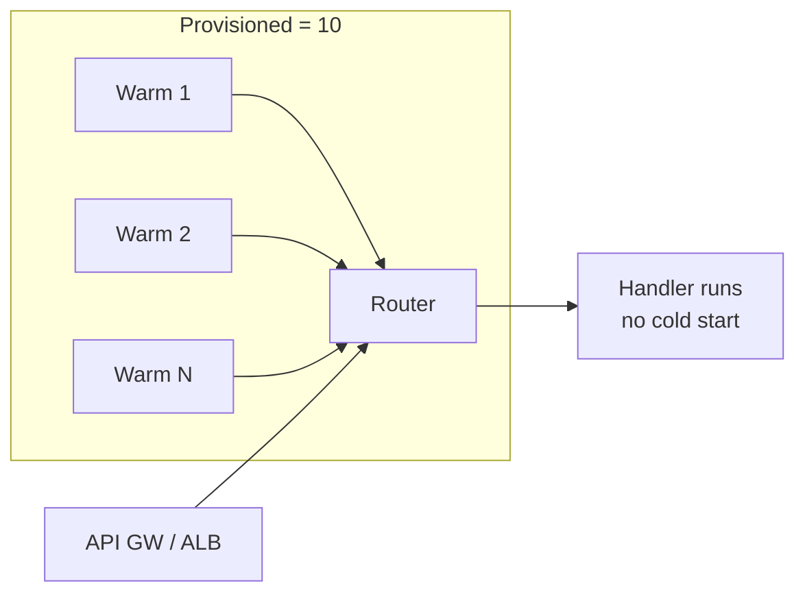

# L49 — Lambda — Reserved and Provisioned Concurrency

> Reserved concurrency caps a function. Provisioned concurrency
> *warms* a function. They are two different dials, often confused,
> and they have very different price tags.

## Prereqs

- L48 (concurrency fundamentals).

## Key terms

- **Reserved concurrency** — caps a function's max concurrency. Free.
  Protects downstream systems and reserves budget.
- **Provisioned concurrency** — pre-warms N environments that are
  *always* ready to serve. Billed per hour, per environment, even when
  idle.
- **Scaling on provisioned** — provisioned concurrency auto-scales
  with traffic up to the configured max, but cannot exceed it.
- **`PutFunctionConcurrency`** — boto3 API for reserved concurrency.
- **`PutProvisionedConcurrencyConfig`** — boto3 API for provisioned
  concurrency.

## 1. Reserved concurrency

Setting `ReservedConcurrentExecutions = 50` on a function says: this
function will never run more than 50 instances at once, regardless of
how much traffic arrives or how much account budget is free.

Three reasons to do this:

1. **Protect a downstream database** — cap a heavy worker so it can't
   open 500 connections to your RDS instance.
2. **Reserve budget** — guarantees this function always has 50 slots
   even if a noisy neighbor consumes the rest of the account pool.
3. **Throttle intentionally** — overrun = 429 rather than degraded
   performance everywhere.

```python
import boto3, json
lam = boto3.client("lambda", region_name="us-east-1")
lam.put_function_concurrency(
    FunctionName="my-heavy-worker",
    ReservedConcurrentExecutions=50,
)
```

Setting reserved concurrency to 0 *pauses* a function: events queue
async or 429 sync.

## 2. Provisioned concurrency

Reserved concurrency solves *capacity*. It does not solve *cold
starts*. If your function is sensitive to latency — say it sits behind
an API Gateway synchronous call — provisioned concurrency keeps N
environments warm and ready.



Each warm environment is billed whether or not you call the function.
Pricing (us-east-1, 2026) is roughly the same per-GB-hour as the
regular per-invocation cost *plus* an hourly fee of about $0.015 per
provisioned environment — so 100 provisioned environments for a month
costs roughly $1,100/month in addition to invocation costs.

## 3. boto3 — configure provisioned concurrency

```python
lam = boto3.client("lambda", region_name="us-east-1")
lam.publish_version(FunctionName="my-api")  # versioned first

lam.put_provisioned_concurrency_config(
    FunctionName="my-api",
    Qualifier="prod",                      # alias or version
    ProvisionedConcurrentExecutions=20,
    # Optional: provisioned_scaling:
    # Minimum=5, Maximum=50
)
```

`Qualifier` is typically the **alias** you intend to serve. The
platform cannot warm `$LATEST`, only versioned or aliased code. This
is why we cover versions and aliases (L57, L58) *before* this is
useful in production.

## 4. Autoscaling provisioned concurrency

You can let AWS auto-scale provisioned concurrency inside a
`Minimum–Maximum` band:

```python
lam.put_provisioned_concurrency_config(
    FunctionName="my-api",
    Qualifier="prod",
    ProvisionedConcurrentExecutions=20,  # initial
    # Scalable target via Application Auto Scaling (separate API)
)
```

Application Auto Scaling policy:

```python
aas = boto3.client("application-autoscaling", region_name="us-east-1")
aas.register_scalable_target(
    ServiceNamespace="lambda",
    ResourceId="function:my-api:prod",
    ScalableDimension="lambda:function:ProvisionedConcurrency",
    MinCapacity=5,
    MaxCapacity=100,
)
aas.put_scaling_policy(
    ServiceNamespace="lambda",
    ResourceId="function:my-api:prod",
    ScalableDimension="lambda:function:ProvisionedConcurrency",
    PolicyName="cpu-target-tracking",
    PolicyType="TargetTrackingScaling",
    TargetTrackingScalingPolicyConfiguration={
        "TargetValue": 0.7,
        "PredefinedMetricSpecification": {
            "PredefinedMetricType": "LambdaProvisionedConcurrencyUtilization"
        },
    },
)
```

Now you pay for what you actually use. Bands like `Min=5, Max=100`
let you handle daily peaks without paying for peak capacity at
3 a.m.

## 5. Cost tradeoff table

| Strategy | When to use | Cost implication |
|---|---|---|
| **No reserved** | Spiky but small | Free; one bad day can blow the account budget |
| **Reserved only** | Steady, low-criticality | Free; protects downstream |
| **Provisioned only** | Latency-critical, predictable peak | $0.015/env/hour + invocation GB-s |
| **Provisioned + autoscaling** | Latency-critical, variable peak | Tracks demand; pays only for used warm envs |

> Rule of thumb: if your function's p99 cold start is > 200 ms or it
> sits behind a user-facing API, you almost certainly want *some*
> provisioned concurrency.

## Lecture summary

- **Reserved** = cap (free). Protects downstream and reserves budget.
- **Provisioned** = pre-warm environments (paid). Removes cold starts.
- Combine: reserve the function's max, then warm N of those slots via
  provisioned concurrency on the alias.

## Hands-on (≈ 4 minutes)

```bash
# 1. Cap a function at 50
aws lambda put-function-concurrency \
    --function-name my-heavy-worker \
    --reserved-concurrent-executions 50

# 2. Provision 5 warm environments on the prod alias (after L57-L58)
python 11_lambda_advanced_concepts/code/provisioned.py \
    --function my-api --alias prod --count 5

# 3. Watch ConcurrentExecutions + ProvisionedConcurrencyUtilization
python 11_lambda_advanced_concepts/code/cw_concurrency_dashboard.py
```

## Quiz prep

- What's the difference between reserved and provisioned concurrency?
- Why can't you provision concurrency on `$LATEST`?
- What's the cheapest way to eliminate cold starts for a spiky but
  latency-sensitive function?

## Further reading

- AWS — [Reserved concurrency](https://docs.aws.amazon.com/lambda/latest/dg/configuration-concurrency.html)
- AWS — [Provisioned concurrency](https://docs.aws.amazon.com/lambda/latest/dg/provisioned-concurrency.html)
