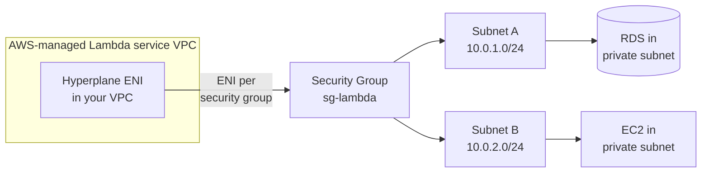

# L51 — Lambda — VPC Networking Configuration

> A Lambda function *not* in a VPC lives in an AWS-managed network
> with internet access through a NAT, but it cannot reach anything
> in your private VPC. To talk to RDS, ElastiCache, or a private
> ALB, you must connect the function to your VPC — and that means
> dealing with ENIs, subnets, and security groups.

## Prereqs

- Section 4 of the Glue course (VPC, subnets, security groups).
- L48 (concurrency).

## Key terms

- **ENI** — Elastic Network Interface. A virtual NIC in your VPC.
- **Hyperplane ENI** — AWS's shared, internal network function that
  gives a Lambda a private IP without creating a per-invocation ENI
  (post-2019).
- **Subnet** — must be *private* (no route to an Internet Gateway).
- **Security group** — controls traffic *in and out* of the Lambda's
  ENI.
- **`AWSLambdaVPCAccessExecutionRole`** — managed policy your function
  role needs to attach an ENI.

## 1. The default "no VPC" reality

Out of the box, your Lambda runs in an AWS-owned VPC. It can reach
public internet services (S3 public endpoints, external APIs) via an
AWS-managed NAT, but it has **no** private IP in *your* VPC and so
**cannot** reach:

- RDS / Aurora in a private subnet.
- ElastiCache Redis/Memcached.
- A private ALB or NLB in your account.
- Anything behind a VPC endpoint that requires being inside the VPC.

It *can* still talk to public AWS service endpoints like
`s3.amazonaws.com` — but not via VPC endpoints unless the endpoint is
configured as a *Gateway* endpoint, which S3 and DynamoDB support.

## 2. What changes when you join a VPC



What happens step-by-step:

1. You specify a **VPC**, a list of **subnets** in that VPC, and a
   list of **security groups**.
2. Lambda's Hyperplane ENI takes a private IP from each subnet
   (typically a `/28`).
3. Hyperplane uses the security group for *inbound* traffic to
   your RDS, EC2, etc.
4. **Cold start gets slower** — first call needs ~10–60 s of ENI
   setup, plus the existing init tax. Modern Hyperplane ENIs reduce
   this dramatically after the first call in a region/function/SG
   combination.

## 3. Why private subnets

Public subnets route 0.0.0.0/0 through an Internet Gateway. Lambda
cannot use them for outbound NAT — it has no public IP. The right
topology is:

```
Public subnets    → ALB / NAT Gateway
Private subnets   → Lambda ENI + RDS/ElastiCache/EC2
```

Lambda should land in the same AZ as the RDS primary to keep
cross-AZ data transfer free.

## 4. Security group rules

| Direction | Source/Dest | Port | Why |
|---|---|---|---|
| Outbound | RDS SG | 5432 (Postgres) | Lambda → RDS traffic |
| Outbound | `0.0.0.0/0` | 443 | Lambda → public AWS APIs (S3, Secrets) |
| Inbound | none | – | Lambda is *never* called via its ENI from inside the VPC |

> Tip: instead of `0.0.0.0/0` outbound, attach **interface VPC
> endpoints** to your VPC for S3, Secrets Manager, SSM, etc. — saves
> NAT cost and keeps traffic on the AWS backbone.

## 5. The execution role policy

Your function's execution role **must** have
`AWSLambdaVPCAccessExecutionRole` attached (or an equivalent inline
policy that grants `ec2:CreateNetworkInterface`,
`ec2:DescribeNetworkInterfaces`, `ec2:DeleteNetworkInterface` on
`*`).

```json
{
  "Version": "2012-10-17",
  "Statement": [{
    "Effect": "Allow",
    "Action": [
      "ec2:CreateNetworkInterface",
      "ec2:DescribeNetworkInterfaces",
      "ec2:DeleteNetworkInterface",
      "ec2:AssignPrivateIpAddresses",
      "ec2:UnassignPrivateIpAddresses"
    ],
    "Resource": "*"
  }]
}
```

## 6. Common pitfalls

- **Forgot the role policy** — fails to start with `EC2Unauthorized`.
- **Lambda in a public subnet** — no internet, no NAT, no
  resolutions. Function times out.
- **Lambda SG cannot talk to RDS SG** — `connection timed out` on
  port 5432. Add an inbound rule on the RDS SG allowing the Lambda
  SG.
- **Cold start tax** — first call in a region/function/SG combo
  takes 10–60 s. Provisioned concurrency (L49) helps.

## Lecture summary

- To reach anything private, join the function to a VPC.
- Lambda attaches a **Hyperplane ENI** to private subnets; security
  groups control traffic.
- The execution role needs VPC access permissions.
- Cold start gets longer the first time per (region, function, SG).

## Hands-on (≈ 4 minutes, expanded in L52)

```bash
# Pick VPC + private subnets
VPC=$(aws ec2 describe-vpcs --filters Name=isDefault,Values=true \
       --query 'Vpcs[0].VpcId' --output text)
SUBS=$(aws ec2 describe-subnets --filters Name=vpc-id,Values=$VPC \
        Name=map-public-ip-on-launch,Values=false \
        --query 'Subnets[*].SubnetId' --output text)

# Create a security group for the Lambda
SG=$(aws ec2 create-security-group \
       --group-name lambda-sg \
       --description "Lambda ENI" \
       --vpc-id $VPC \
       --query 'GroupId' --output text)

# Attach VPC
aws lambda update-function-configuration \
    --function-name my-vpc-worker \
    --vpc-config "SubnetIds=$SUBS,SecurityGroupIds=$SG"
```

## Quiz prep

- Why is a private subnet required for Lambda in a VPC?
- What managed policy grants the function permission to attach an
  ENI?
- How long can a VPC-configured function's first cold start take?

## Further reading

- AWS — [Lambda VPC networking](https://docs.aws.amazon.com/lambda/latest/dg/configuration-vpc.html)
- AWS — [Hyperplane ENI](https://aws.amazon.com/blogs/compute/announcing-improved-vpc-networking-for-aws-lambda-functions/)
