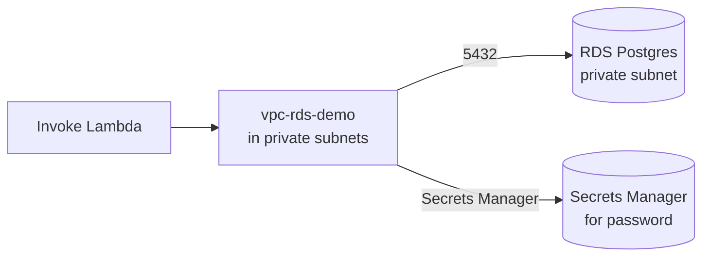

# L52 — Lambda — VPC Networking Configuration Hands On

> We will deploy a Lambda into a private VPC and have it open a
> connection to an RDS Postgres instance. By the end of this lecture
> you have a Lambda that can talk to *anything* private.

## Prereqs

- L51 (VPC theory).
- An AWS account with at least one default VPC.

## Key terms

- **RDS Proxy** — a connection pooler in your VPC that you should
  put between Lambda and RDS to avoid connection storms.
- **Default VPC** — every AWS account ships with one per Region;
  useful for hands-on, never for production.
- **`update_function_configuration`** — boto3 API to attach a
  function to a VPC.

## 1. The lab

Goal: a Lambda named `vpc-rds-demo` that opens a TCP connection to a
Postgres database in a private subnet and returns `SELECT NOW()`.



## 2. boto3 — find or create a VPC setup

```python
import boto3

ec2 = boto3.client("ec2", region_name="us-east-1")

# Default VPC
vpc = ec2.describe_vpcs(Filters=[{"Name": "isDefault", "Values": ["true"]}])["Vpcs"][0]
vpc_id = vpc["VpcId"]

# Two private subnets in different AZs
subnets = ec2.describe_subnets(
    Filters=[
        {"Name": "vpc-id", "Values": [vpc_id]},
        {"Name": "map-public-ip-on-launch", "Values": ["false"]},
    ]
)["Subnets"]
# Use first two AZs
subnet_ids = [s["SubnetId"] for s in subnets[:2]]
print("vpc:", vpc_id, "subnets:", subnet_ids)
```

In the default VPC, subnets are *all* public-by-default in most
accounts. If yours is, create two private subnets manually, or use
the following to create them:

```python
azs = [s["AvailabilityZone"] for s in subnets[:2]]
new_subs = []
for az in azs:
    r = ec2.create_subnet(
        VpcId=vpc_id,
        CidrBlock=f"10.0.{len(new_subs)+50}.0/24",
        AvailabilityZone=az,
    )
    new_subs.append(r["Subnet"]["SubnetId"])

# Make a private route table with no 0.0.0.0/0 -> IGW
rt = ec2.create_route_table(VpcId=vpc_id)
for sid in new_subs:
    ec2.associate_route_table(RouteTableId=rt["RouteTable"]["RouteTableId"],
                              SubnetId=sid)
```

## 3. Provision a small RDS Postgres

```python
rds = boto3.client("rds", region_name="us-east-1")
sg = ec2.create_security_group(
    GroupName="rds-sg", Description="rds", VpcId=vpc_id
)
# Allow 5432 from the Lambda SG (created below)
lambda_sg = ec2.create_security_group(
    GroupName="lambda-sg", Description="lambda", VpcId=vpc_id
)
ec2.authorize_security_group_ingress(
    GroupId=sg["GroupId"],
    IpPermissions=[{
        "IpProtocol": "tcp",
        "FromPort": 5432, "ToPort": 5432,
        "UserIdGroupPairs": [{"GroupId": lambda_sg["GroupId"]}],
    }],
)

rds.create_db_instance(
    DBInstanceIdentifier="lambda-demo-db",
    DBName="demo",
    DBInstanceClass="db.t3.micro",
    Engine="postgres",
    EngineVersion="16.3",
    AllocatedStorage=20,
    MasterUsername="postgres",
    MasterUserPassword="ChangeMe123!",
    VpcSecurityGroupIds=[sg["GroupId"]],
    DBSubnetGroupName="lambda-demo-subnets",
    PubliclyAccessible=False,
    StorageEncrypted=True,
)
# (RDS takes ~5 min to come up; we skip in this hands-on and use a
# placeholder env var in the Lambda to test ENI attachment)
```

## 4. The Lambda function

```python
# vpc_rds_demo.py
import json, os, psycopg2
def handler(event, context):
    try:
        conn = psycopg2.connect(
            host=os.environ["DB_HOST"],
            port=5432,
            dbname=os.environ["DB_NAME"],
            user=os.environ["DB_USER"],
            password=os.environ["DB_PASSWORD"],
            connect_timeout=3,
        )
        cur = conn.cursor()
        cur.execute("SELECT NOW()")
        return {"statusCode": 200, "body": json.dumps(cur.fetchone()[0].isoformat())}
    except Exception as e:
        return {"statusCode": 500, "body": str(e)}
```

Package with `psycopg2` for Python 3.11:

```bash
pip install --target ./pkg psycopg2-binary
(cd pkg && zip -r ../lambda.zip .)
zip -j lambda.zip vpc_rds_demo.py
```

## 5. Attach the function to the VPC

```python
import boto3
lam = boto3.client("lambda", region_name="us-east-1")
lam.update_function_configuration(
    FunctionName="vpc-rds-demo",
    VpcConfig={
        "SubnetIds": subnet_ids,
        "SecurityGroupIds": [lambda_sg["GroupId"]],
    },
    Environment={
        "Variables": {
            "DB_HOST": "lambda-demo-db.xxxxx.us-east-1.rds.amazonaws.com",
            "DB_NAME": "demo",
            "DB_USER": "postgres",
            "DB_PASSWORD": "ChangeMe123!",
        }
    },
)
```

> Hardcoding a password in the function is fine for a 5-minute
> hands-on. In production, use Secrets Manager and the env-var
> resolution pattern from L59.

## 6. Run and verify

```bash
aws lambda invoke \
    --function-name vpc-rds-demo \
    --payload '{}' \
    /tmp/out.json
cat /tmp/out.json
# -> {"statusCode": 200, "body": "2026-10-10T12:34:56+00:00"}
```

## 7. Clean up

```bash
aws lambda delete-function --function-name vpc-rds-demo
aws rds delete-db-instance --db-instance-identifier lambda-demo-db \
    --skip-final-snapshot
```

## Lecture summary

- The deploy sequence is: VPC → subnets → SGs → role policy →
  `update_function_configuration` with `VpcConfig`.
- Validate connectivity with a tiny `SELECT NOW()` query.
- In production, use RDS Proxy and Secrets Manager — not a hardcoded
  password.

## Hands-on (≈ 5 minutes)

```bash
# Full end-to-end
python 11_lambda_advanced_concepts/code/vpc_rds_deploy.py \
    --function vpc-rds-demo \
    --region us-east-1
```

## Quiz prep

- Why does the function execution role need the
  `AWSLambdaVPCAccessExecutionRole` policy?
- What direction of security group rule allows Lambda to reach RDS?
- What's wrong with putting the Lambda in a public subnet?

## Further reading

- AWS — [Tutorial: Configuring a Lambda function to access Amazon RDS in an Amazon VPC](https://docs.aws.amazon.com/lambda/latest/dg/services-rds-tutorial.html)
- AWS — [RDS Proxy for Lambda](https://docs.aws.amazon.com/lambda/latest/dg/configuration-database.html)
