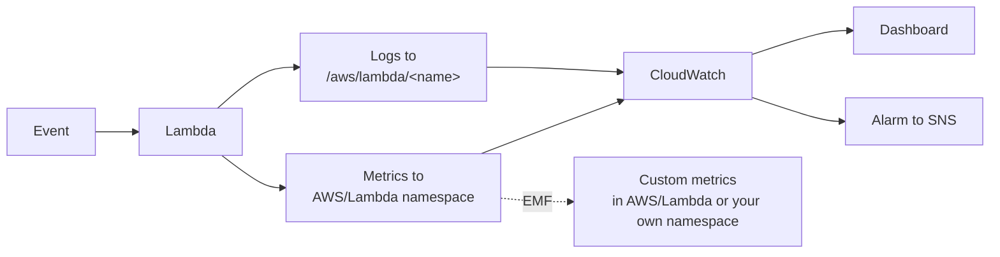

# L53 — Lambda Monitoring — CloudWatch Metrics

> Every Lambda, by default, ships a small fixed set of CloudWatch
> metrics. You don't configure anything to turn them on — they exist
> the moment your function is created. Knowing which metrics are
> emitted and what each one means is the difference between "the
> function failed once yesterday" and "the function is failing for
> the next 8 hours and I'm the one who noticed".

## Prereqs

- L19–L22 (Lambda basics).
- AWS CloudWatch basics — namespace, metric, dimension, statistic.

## Key terms

- **Namespace** — `AWS/Lambda` for everything in this lecture.
- **Dimensions** — `FunctionName` and `Qualifier` (version or alias).
- **Standard metrics** — `Invocations`, `Errors`, `Throttles`,
  `ConcurrentExecutions`, `UnreservedConcurrentExecutions`,
  `Duration`, `IteratorAge` (stream sources).
- **EMF** — Embedded Metric Format. Custom metrics emitted to
  CloudWatch via structured `print()`.

## 1. The five metrics you must watch

| Metric | Unit | What a high value means |
|---|---|---|
| `Invocations` | count | How often the function is called |
| `Errors` | count | Invocations that failed — function error *or* platform error |
| `Throttles` | count | Invocations rejected with HTTP 429 |
| `Duration` | ms | Cold + warm execution time |
| `ConcurrentExecutions` | count | Busy function instances right now |

Five derived insights come out of these:

1. **Error rate** = `Errors / Invocations`. Anything > 1% on a sync
   API is a page.
2. **Throttles** > 0 means you've hit a concurrency ceiling (L48).
3. **`Duration` mean and p99** should both be under your SLO. p99 is
   the noisy one — it captures cold starts.
4. **`IteratorAge`** for Kinesis/DynamoDB stream consumers tells you
   how far behind you are. Sustained nonzero is a problem.
5. **`ConcurrentExecutions` vs. account limit** shows headroom.

## 2. How Lambda emits them



> All standard metrics are **free**. CloudWatch charges $0.30/metric
> per month for custom metrics after the first 10k.

## 3. Where to find them

- **CloudWatch console → Metrics → AWS/Lambda** — pick the function
  name and the metric.
- **Per-function "Monitoring" tab** in the Lambda console — boto3
  stack that uses `GetMetricData` under the hood.
- **`get_metric_data`** in CloudWatch boto3 client — scriptable.

## 4. boto3 — read a metric directly

```python
import boto3
from datetime import datetime, timedelta

cw = boto3.client("cloudwatch", region_name="us-east-1")
resp = cw.get_metric_data(
    MetricDataQueries=[
        {
            "Id": "m1",
            "MetricStat": {
                "Metric": {
                    "Namespace": "AWS/Lambda",
                    "MetricName": "Errors",
                    "Dimensions": [
                        {"Name": "FunctionName", "Value": "my-api"},
                    ],
                },
                "Period": 60,
                "Stat": "Sum",
            },
            "ReturnData": True,
        }
    ],
    StartTime=datetime.utcnow() - timedelta(hours=6),
    EndTime=datetime.utcnow(),
)
for ts, val in zip(resp["MetricDataResults"][0]["Timestamps"],
                   resp["MetricDataResults"][0]["Values"]):
    print(ts, val)
```

## 5. Custom metrics via EMF

The cheapest way to emit *custom* metrics from inside your Lambda is
the Embedded Metric Format. You `print()` a JSON object; the
CloudWatch agent (baked into the Lambda runtime) parses it.

```python
import json, time
def handler(event, context):
    t0 = time.perf_counter()
    # ... do work ...
    elapsed_ms = (time.perf_counter() - t0) * 1000

    print(json.dumps({
        "_aws": {
            "Timestamp": int(time.time() * 1000),
            "CloudWatchMetrics": [{
                "Namespace": "MyApp",
                "Dimensions": [["FunctionName"]],
                "Metrics": [
                    {"Name": "ItemsProcessed", "Unit": "Count"},
                    {"Name": "LatencyMs",      "Unit": "Milliseconds"},
                ],
            }],
        },
        "FunctionName": context.function_name,
        "ItemsProcessed": event.get("n", 0),
        "LatencyMs": elapsed_ms,
    }))
```

No client initialization, no PutMetricData call — the runtime does
the batched publish for you.

## 6. Alarms

A standard pattern: alarm on
`Errors / Invocations > 0.01` for 3 of 5 minutes.

```python
cw = boto3.client("cloudwatch", region_name="us-east-1")
cw.put_metric_alarm(
    AlarmName="my-api-errors-high",
    Namespace="AWS/Lambda",
    MetricName="Errors",
    Statistic="Sum",
    Period=60,
    EvaluationPeriods=5,
    DatapointsToAlarm=3,
    Threshold=10,
    ComparisonOperator="GreaterThanThreshold",
    Dimensions=[{"Name": "FunctionName", "Value": "my-api"}],
    AlarmActions=["arn:aws:sns:us-east-1:111122223333:my-team-topic"],
    TreatMissingData="notBreaching",
)
```

## Lecture summary

- Every Lambda emits `Invocations`, `Errors`, `Throttles`,
  `ConcurrentExecutions`, and `Duration` automatically.
- Build dashboards from these first; only add custom metrics after
  the basics are exhausted.
- EMF is the cheapest way to add custom metrics.
- Alarms on `Errors`, `Throttles`, and `Duration` cover the standard
  paging signals.

## Hands-on (≈ 4 minutes, expanded in L54)

```bash
# Pull a few hours of metrics to JSON
python 11_lambda_advanced_concepts/code/cw_metrics_dump.py \
    --function my-api --hours 6

# Add EMF prints and deploy
python 11_lambda_advanced_concepts/code/emf_patch.py \
    --function my-api
```

## Quiz prep

- Which standard Lambda metric tells you HTTP 429 happened?
- What's the cheapest way to emit custom metrics from a Lambda?
- How does Lambda get its metrics to CloudWatch without explicit
  configuration from you?

## Further reading

- AWS — [Lambda CloudWatch metrics](https://docs.aws.amazon.com/lambda/latest/dg/monitoring-metrics.html)
- AWS — [Embedded Metric Format](https://docs.aws.amazon.com/AmazonCloudWatch/latest/monitoring/CloudWatch_Embedded_Metric_Format.html)
