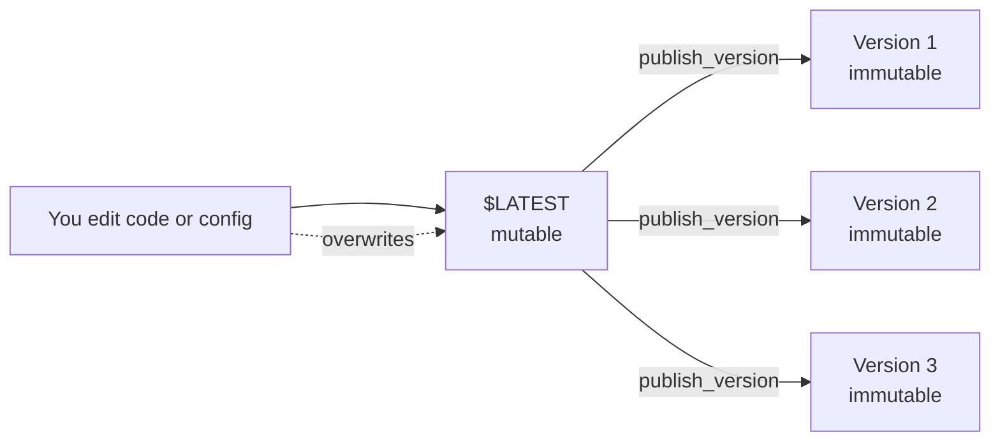

# L57 — Lambda Versions

> A Lambda function has two states: **mutable** (`$LATEST`) and
> **immutable** (a numbered version). Versions are how you ship a
> snapshot of your code + config that *cannot* be changed under
> you.

## Prereqs

- L19–L22 (Lambda basics, invocation model).

## Key terms

- **`$LATEST`** — the always-mutable, in-progress working copy. Every
  save updates it. This is the default `Qualifier`.
- **Version** — an immutable snapshot of `$LATEST`'s code and
  configuration. Numbered monotonically (`1`, `2`, `3`, ...).
- **ARN** — `arn:aws:lambda:region:acct:function:name:VERSION` —
  each version has its own ARN.
- **`publish_version`** — boto3 / console action to take a snapshot
  of `$LATEST`.
- **Code-only vs. code+config** — `publish_version` captures the
  package **and** the function configuration (env vars, memory,
  timeout, role, VPC). Updating the function's code or config on
  `$LATEST` does *not* mutate past versions.

## 1. The mental model



Once published:

- Version 1, 2, 3 will **always** run the same code with the same
  config.
- You can roll back by pointing API Gateway (or whatever invokes the
  function) at an older version.
- You can A/B test by pointing different invokers at different
  versions.

## 2. Why this matters

A `Lambda` invocation accepts a `Qualifier` parameter. Without it,
Lambda invokes `$LATEST` — the working copy. That means every
deploy *overwrites* what was running, and you cannot roll back
without redeploying.

A common pattern:

1. Develop against `$LATEST`.
2. `publish_version` → version 17.
3. Have a stable client (API Gateway stage, EventBridge rule, S3
   event notification) invoke `version 17` (or, more commonly, an
   *alias* — see L58).
4. When the next release is ready, `publish_version` → version 18,
   shift the alias to point at it.

## 3. boto3 — publish and invoke a version

```python
import boto3
lam = boto3.client("lambda", region_name="us-east-1")

# Publish the current $LATEST
resp = lam.publish_version(
    FunctionName="my-api",
    Description="release 2026-10-10 - swagger update",
)
version = resp["Version"]
arn_v17 = resp["FunctionArn"]
print("Published", version, arn_v17)

# Invoke that specific version
lam.invoke(
    FunctionName="my-api",
    InvocationType="RequestResponse",
    Payload=b'{"hello": "world"}',
    Qualifier=version,
)
```

## 4. Limits

| Resource | Limit |
|---|---|
| Versions per function | 100 (older versions can be deleted) |
| `publish_version` rate | 1 per 10 s |
| Code size | 50 MB zipped direct / 250 MB with layers / 10 GB container image |

## 5. What does *not* change between versions

- **Alias assignments.** Aliases (L58) are pointers to versions; they
  can be moved. Versions themselves do not "remember" which alias
  pointed at them.
- **Event source mappings** for async sources (S3, EventBridge) are
  not versioned. They always target the function (which by default
  means `$LATEST`). You can pin an event source to a specific
  version or alias.
- **IAM execution role** — same role applies to all versions of
  the function. (Role ARNs are kept on the function, not on the
  version.)

## 6. Common pitfalls

- **Pinning to `$LATEST` in production.** Anything that does
  `invoke` without `Qualifier` is the same as a developer pushing to
  production without a gate. Always set a `Qualifier` to a version
  or an alias.
- **Forgetting config.** `publish_version` includes env vars, VPC
  config, and memory. If you change env vars on `$LATEST` and
  publish, the new version gets the new env. Roll back to a prior
  version to roll back the env. This is usually what you want.
- **Updating code without publishing.** If you edit and *only*
  invoke with no publish, your "old" version keeps running, but the
  `Lambda Function Code` listing in the console now shows the
  `$LATEST` artifact that nobody is using.

## Lecture summary

- `$LATEST` is mutable; versions are immutable snapshots of
  `$LATEST`.
- Always invoke by version (or alias, L58). Never `$LATEST` in
  production.
- `publish_version` captures code *and* configuration.

## Hands-on (≈ 4 minutes)

```bash
# 1. Publish $LATEST as a new version
python 11_lambda_advanced_concepts/code/publish_version.py \
    --function my-api --note "ship v0.2"

# 2. List versions
aws lambda list-versions-by-function --function-name my-api

# 3. Invoke a specific version
aws lambda invoke --function-name my-api \
    --qualifier 17 \
    --payload '{}' /tmp/out.json
```

## Quiz prep

- What is the difference between `$LATEST` and a version?
- Does changing the function's role on `$LATEST` affect a previously
  published version?
- What does `publish_version` capture?

## Further reading

- AWS — [Lambda versions](https://docs.aws.amazon.com/lambda/latest/dg/versioning-aliases.html)
- AWS — [`publish_version` reference](https://docs.aws.amazon.com/lambda/latest/dg/API_PublishVersion.html)
