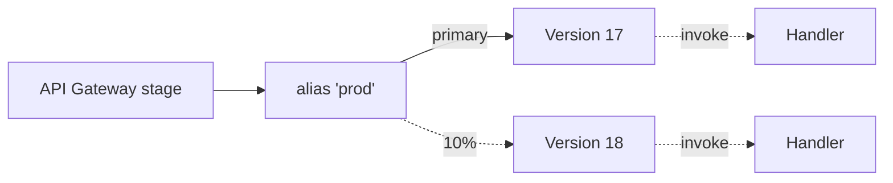

# L58 — Lambda Aliases

> An alias is a named pointer to a version. They are *mutable*, so
> they are the layer you actually use to route traffic. The combination
> of versions (L57) + aliases is how you do blue/green, canary, and
> weighted traffic shifting on Lambda.

## Prereqs

- L57 (versions).

## Key terms

- **Alias** — a named resource pointing at one version. Mutable.
- **Alias ARN** — `arn:aws:lambda:region:acct:function:name:ALIAS`.
- **Weighted alias** — a special alias that splits traffic between
  two function versions, e.g. 90/10.
- **`RoutingConfig`** — the `AdditionalVersionWeights` map on a
  weighted alias.
- **Canary** — weighted alias with the new version getting a small
  slice; the rest of the traffic goes to the old version.

## 1. Why aliases exist

Without aliases, every time you want to move a stage of API Gateway
to a new version, you'd update the stage's `function` config. With
an alias, you update the alias *once* and all callers follow it.



Above: the `prod` alias points primarily at version 17 but routes
10% of traffic to version 18. When version 18 is good, you update
the alias to make 18 primary, and 0% to 17.

## 2. Create an alias

```python
import boto3
lam = boto3.client("lambda", region_name="us-east-1")

lam.create_alias(
    FunctionName="my-api",
    Name="prod",
    FunctionVersion="17",
    Description="production",
)
# arn = resp["AliasArn"]
```

## 3. Move the alias

```python
lam.update_alias(
    FunctionName="my-api",
    Name="prod",
    FunctionVersion="18",          # now primary
    # RoutingConfig only needed for weighted routing
)
```

## 4. Weighted routing — the canary

```python
lam.update_alias(
    FunctionName="my-api",
    Name="prod",
    FunctionVersion="17",
    RoutingConfig={
        "AdditionalVersionWeights": {"18": 0.10},   # 10% to 18
    },
)
```

This is the pattern AWS recommends for safe Lambda deploys:

1. Publish a new version.
2. Update the alias with a small canary weight (e.g. 10%).
3. Watch error rate / p99 latency dashboards (L54).
4. If healthy, remove the canary (move 18 to primary).
5. If unhealthy, update the alias back to the old version.

## 5. Invoking an alias

Aliases work as a `Qualifier` in every Lambda client operation:

```python
lam.invoke(
    FunctionName="my-api",
    Qualifier="prod",
    Payload=b'{}',
)

# Also from API Gateway: the integration URI uses
#   arn:aws:lambda:...:function:my-api:prod
```

API Gateway has the alias baked into its stage configuration; if you
change the alias, the stage routes the new version automatically.

## 6. Aliases and provisioned concurrency

Recall from L49: provisioned concurrency targets a *qualifier*. The
qualifier can be a version *or* an alias. The platform will pre-warm
environments for the alias, which means warming *whichever version
the alias is pointing at*.

```python
lam.put_provisioned_concurrency_config(
    FunctionName="my-api",
    Qualifier="prod",
    ProvisionedConcurrentExecutions=10,
)
```

Move the alias, get the new version warm. A very clean rollout
pattern.

## 7. Things aliases can't do

- **Stack across multiple functions.** They are a *single function*
  pointer.
- **Replace aliases with versions** — they are not interchangeable
  in some contexts (e.g. event source mapping). Always check the
  AWS API you are configuring.
- **Carry a fixed `RoutingConfig`**. If you change the primary
  version and want to keep the same `AdditionalVersionWeights`, you
  must pass the new `FunctionVersion` *and* the same `RoutingConfig`.

## Lecture summary

- An alias is a named pointer to a version.
- Use aliases to decouple your stages / event sources from specific
  version numbers.
- Weighted aliases enable canary deploys without any extra
  infrastructure.
- Combine with provisioned concurrency for zero-downtime rollouts.

## Hands-on (≈ 5 minutes)

```bash
# 1. Create the prod alias
python 11_lambda_advanced_concepts/code/create_alias.py \
    --function my-api --version 17 --name prod

# 2. Weighted canary: 90% on 17, 10% on 18
python 11_lambda_advanced_concepts/code/canary.py \
    --function my-api --name prod \
    --primary 17 --canary 18 --weight 0.10

# 3. Roll back by removing the canary
python 11_lambda_advanced_concepts/code/canary_remove.py \
    --function my-api --name prod
```

## Quiz prep

- What's the difference between a version and an alias?
- How do you set up a 95/5 weighted canary on `prod`?
- Why is pointing API Gateway at an alias better than a version?

## Further reading

- AWS — [Lambda aliases](https://docs.aws.amazon.com/lambda/latest/dg/configuration-aliases.html)
- AWS — [Gradual code shifts with aliases](https://docs.aws.amazon.com/lambda/latest/dg/lambda-traffic-shifting-using-aliases.html)
