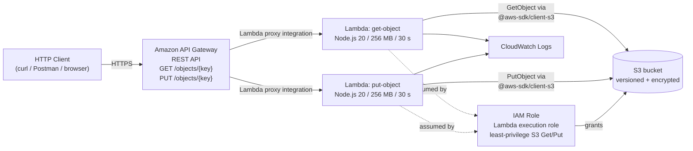

# L73 — Implementing Serverless Use Case 2 using AWS CDK v2

> **Section:** 12 — AWS CDK v2
> **Duration target:** 0:39
> **Author:** Prem Vishnoi <prem.vishnoi@example.com>

## Prereqs

- L71 — CDK concepts.
- L72 — CDK toolchain installed and bootstrapped.
- Section 8 — the use case we are re-implementing.

## Key terms

- **Use Case 2 (Section 8)** — an API Gateway + Lambda + S3 CRUD API
  where clients read and write S3 objects via a public REST endpoint.
- **`@aws-sdk/client-s3`** — the AWS SDK v3 package the Lambdas use to
  call S3 from Node 20.
- **CloudFormation comparison** — section 13 deploys the same use case
  using a raw CFN template; section 12 deploys it using CDK. The
  end-state in AWS is identical.

## Lecture

In the next four lectures (L74–L77) we will rebuild **Serverless Use Case 2
from Section 8** in AWS CDK v2. The architecture is identical to the
section 8 / section 13 design — we are only changing *how* we declare the
resources.

### Target architecture

### Resource map

| # | AWS resource | CDK construct (L2) | Lecture |
|---|---|---|---|
| 1 | S3 bucket | `s3.Bucket` | L74 |
| 2 | IAM role | `iam.Role` | L75 |
| 3 | Lambda x2 | `lambda.Function` | L76 |
| 4 | REST API | `apigateway.RestApi` | L77 |

### Comparison: CDK vs SAM vs CloudFormation for this stack

| Tool | Lines of code for the same stack | Type safety | Asset bundling | Notes |
|---|---|---|---|---|
| CloudFormation (section 13) | ~300–400 YAML | None | Manual zip + S3 upload | Hand-rolled `AWS::Lambda::Function` with `Code`/`ZipFile` or `S3Bucket`/`S3Key` |
| SAM | ~150 YAML | None | `sam build` handles zip | SAM `Transform` and shorthand `AWS::Serverless::Function` |
| **CDK v2 (section 12)** | ~120 TypeScript | Full | `cdk synth` auto-bundles with `esbuild` | This section |

The CDK version is roughly the same length as SAM but you get full
TypeScript IntelliSense, loops, helper functions, and access to the entire
`aws-cdk-lib` L2 catalog.

### File map for the upcoming lectures

| Step | File edited | What is added |
|---|---|---|
| L74 | `lib/serverless-stack.ts` | `s3.Bucket` construct with versioning + encryption |
| L75 | `lib/serverless-stack.ts` | `iam.Role` construct with S3 Get/Put policy |
| L76 | `lib/serverless-stack.ts` + `lambda/*.ts` | Two `lambda.Function` constructs + handler code |
| L77 | `lib/serverless-stack.ts` | `apigateway.RestApi` + resources + methods + integration |

By the end of L77, `npx cdk deploy` will create every box in the diagram
above.

## Hands-on

> **Nothing to do in this lecture.** It is intentionally short — the next
> four lectures (L74–L77) are where the typing happens.

## Quiz prep

- Which four AWS resources will the final CDK stack create?
- Which L2 CDK construct produces the S3 bucket?
- Why does the diagram show a single IAM role shared by both Lambdas?
- How does the CDK version of this stack compare to the SAM version in
  line count and type safety?

## Further reading

- [Section 8 — Use Case 2 architecture (L30)](../08_usecase2_apigw_lambda_s3/lecture_scripts/L30_usecase2_architecture.md)
- [Section 13 — same use case in raw CloudFormation](../13_cloudformation_serverless/lecture_scripts/L61_cfn_architecture.md)
- [aws-cdk-lib L2 construct catalog](https://docs.aws.amazon.com/cdk/api/v2/docs/aws-construct-library.html)
