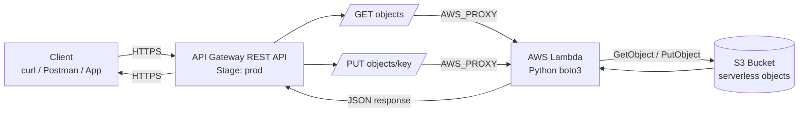

# L61 — AWS CloudFormation — Serverless Architecture (API Gateway, AWS Lambda, S3)

> **Author:** Prem Vishnoi &lt;prem.vishnoi@example.com&gt;
> **Section:** 13
> **Duration target:** 2:16
> **Lecture ID:** L61

## Prereqs

- L60 (CFN basics) complete.
- Section 8 (Use Case 2: API GW + Lambda + S3 CRUD) — at minimum
  the architecture overview in L30.

## Key terms

- **Use Case 2** — the serverless CRUD app: client → API Gateway →
  Lambda → S3.
- **Standalone templates** — one CFN template per resource type
  (L62–L67), used for teaching.
- **Full-stack template** — one CFN template that declares every
  resource for the use case (L68).
- **Stack boundary** — the unit of deploy + rollback. We will deploy
  one stack that contains every resource for this use case.

## Lecture

The goal of this section is to take **Use Case 2** from section 8 —
the API Gateway → Lambda → S3 CRUD app — and re-implement it as a
single CloudFormation stack. By the end of L68 you will stand up
the entire architecture with one `aws cloudformation deploy`
command.

### What we are building

The same architecture you built by hand in section 8:

1. A client (curl, Postman, or a frontend) calls the API.
2. **API Gateway REST API** receives the request, matches a method
   (`GET /objects` or `PUT /objects/{key}`) on a resource.
3. The method uses **`AWS_PROXY` integration** to forward the
   request to a **Lambda function**.
4. The Lambda function (Python + boto3) reads or writes to the
   **S3 bucket** and returns a JSON response.
5. API Gateway returns the Lambda response to the client.

### Stack contents

The full-stack template (template 06) declares 15 resources:

| Resource | CFN type | Role |
|---|---|---|
| Data S3 bucket | `AWS::S3::Bucket` | Object store (L62) |
| CFN-assets S3 bucket | `AWS::S3::Bucket` | Holds the packaged Lambda zips |
| Lambda execution role | `AWS::IAM::Role` | Trust + permissions for Lambda (L63) |
| Inline role policy | `AWS::IAM::Policy` | s3:GetObject + s3:PutObject on the bucket |
| GET Lambda function | `AWS::Lambda::Function` | Code + env vars + handler (L64) |
| PUT Lambda function | `AWS::Lambda::Function` | Code + env vars + handler (L64) |
| REST API | `AWS::ApiGateway::RestApi` | The API container (L65) |
| Two resources | `AWS::ApiGateway::Resource` | `/objects` and `/objects/{key}` (L65) |
| Two methods | `AWS::ApiGateway::Method` | `GET` and `PUT` (L66) |
| Two invoke permissions | `AWS::Lambda::Permission` | Allow API GW to invoke each Lambda (L67) |
| Deployment | `AWS::ApiGateway::Deployment` | Snapshots the API for a stage (L66) |
| Stage | `AWS::ApiGateway::Stage` | e.g. `prod` (L66) |

### Mermaid diagram

### Why one stack, not many?

You *could* split the stack (one stack for S3, one for Lambda, one
for API Gateway) and stitch them with cross-stack references
(`!ImportValue`). For a serverless app this size, a single stack is
simpler: one deploy, one rollback unit, one set of outputs. We
revisit splitting strategies in the further-reading section.

### How the lectures build up

- L62: declare the S3 bucket on its own.
- L63: declare the IAM role on its own.
- L64: declare the Lambda on its own (depends on role + bucket).
- L65: declare the REST API + two resources.
- L66: declare the methods + deployment + stage.
- L67: declare the `AWS::Lambda::Permission`.
- L68: collapse everything into the full-stack template and deploy.

## Hands-on

Look at the templates in `code/templates/`. The numbering matches
the lecture order. You do not have to deploy them individually —
that is just a teaching aid so each lecture is small. L68 ships
the consolidated full-stack template.

## Quiz prep

- The five architectural components (Client, API GW, Lambda, S3,
  IAM).
- Which CFN type is responsible for which architectural component.
- The order in which CloudFormation creates resources within a
  stack (it follows the dependency graph, not the YAML order).

## Further reading

- [AWS::ApiGateway::RestApi reference](https://docs.aws.amazon.com/AWSCloudFormation/latest/UserGuide/aws-resource-apigateway-restapi.html)
- [Best practices for CloudFormation](https://docs.aws.amazon.com/AWSCloudFormation/latest/UserGuide/best-practices.html)
