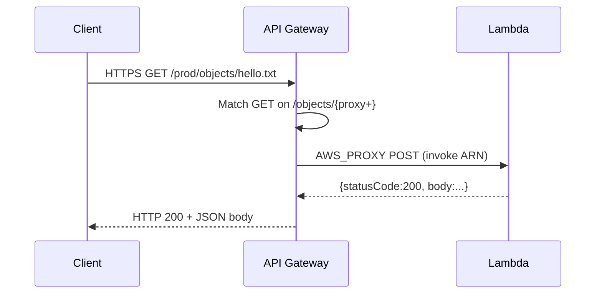

# L66 — AWS CloudFormation — API Method and API Deployment

> **Author:** Prem Vishnoi &lt;prem.vishnoi@example.com&gt;
> **Section:** 13
> **Duration target:** 14:35
> **Lecture ID:** L66

## Prereqs

- L65 (REST API + resources).
- L64 (Lambda functions exist and you know their ARNs).

## Key terms

- **`AWS::ApiGateway::Method`** — binds an HTTP method to a
  resource and chooses the integration (where requests are
  forwarded).
- **`AWS_PROXY` integration** — API Gateway forwards the **entire
  request** (headers, body, path, query, stage vars) to the
  backend as a JSON event. Your Lambda is responsible for shaping
  the full response.
- **`MethodArn` pattern** — the API Gateway-managed execution
  permission string used in `AWS::Lambda::Permission.SourceArn`.
- **`AWS::ApiGateway::Deployment`** — a snapshot of the API at a
  point in time. Stages point at deployments, not at the live API.
- **`AWS::ApiGateway::Stage`** — a named environment (`prod`,
  `staging`, `dev`) that points at a deployment. The URL
  `<api-id>.execute-api.<region>.amazonaws.com/<stage>` is what
  clients actually call.
- **`DependsOn`** — an explicit dependency declaration. We use it
  on the deployment so CloudFormation creates the methods *before*
  the deployment snapshot is taken.

## Lecture

L66 attaches HTTP methods to the resources from L65, configures
`AWS_PROXY` integration, and ships a `Deployment` + `Stage` so
the API is invokable. The standalone template
(`05_method_deployment.yaml`) includes the Lambda invoke
permissions as well so it is self-contained — we walk through
those in L67.

### The Method

```yaml
GetObjectMethod:
  Type: AWS::ApiGateway::Method
  Properties:
    RestApiId: !Ref ServerlessApi
    ResourceId: !Ref ObjectKeyResource
    HttpMethod: GET
    AuthorizationType: NONE
    Integration:
      Type: AWS_PROXY
      IntegrationHttpMethod: POST
      Uri: !Sub "arn:aws:apigateway:${AWS::Region}:lambda:path/2015-03-31/functions/${GetObjectFunctionArn}/invocations"
```

Six things to internalize.

#### 1. `RestApiId` + `ResourceId` + `HttpMethod`

The three mandatory linkage properties. `RestApiId` and
`ResourceId` are both `!Ref`s against resources we declared
earlier. `HttpMethod` is one of `GET`, `POST`, `PUT`, `DELETE`,
`PATCH`, `HEAD`, `OPTIONS`. API Gateway is case-sensitive in the
template even though HTTP itself is uppercase by convention —
both happen to be uppercase here.

#### 2. `AuthorizationType: NONE`

The API is public. Section 9 (Lambda Authorizer + Cognito
Authorizer) shows how to switch this to `COGNITO_USER_POOLS` or
`CUSTOM` and pass an `AuthorizerId`. For this course's use case 2
we are happy with an open API.

#### 3. `Integration.Type: AWS_PROXY`

`AWS_PROXY` (a.k.a. Lambda proxy integration) is the modern way
to wire API Gateway to Lambda. The whole request is serialized
into a JSON event shaped like:

```json
{
  "httpMethod": "GET",
  "path": "/objects/hello.txt",
  "pathParameters": {"proxy": "hello.txt"},
  "queryStringParameters": null,
  "headers": {...},
  "body": "...",
  "isBase64Encoded": false
}
```

Your Lambda returns a JSON object with `statusCode`, optional
`headers`, and a `body` string. API Gateway turns that into a
real HTTP response. There is no mapping template, no
method-response, no integration-response — the Lambda is in
charge of the wire format.

#### 4. `IntegrationHttpMethod: POST`

A subtlety: even though the public method is `GET`, the
**integration** to Lambda always uses `POST`. API Gateway sends
the request to Lambda using `POST` on the invoke URL. This is a
constant in the Lambda service contract and does not change.

#### 5. `Uri` — the Lambda invoke ARN

The `Uri` of an `AWS_PROXY` integration is fixed in shape:
`arn:aws:apigateway:<region>:lambda:path/2015-03-31/functions/<lambda-arn>/invocations`.

We use `!Sub` to splice in the region and the parameter. The
`2015-03-31` is the Lambda invoke API version and is itself a
constant.

If you use the **function name** (not the full ARN), the
integration will work but the IAM permission `SourceArn` (L67)
will not line up correctly. Always use the full ARN.

#### 6. PUT (mirrored)

The PUT method is the same shape as the GET method, but the
integration points at the PUT Lambda.

### The deployment

```yaml
ApiDeployment:
  Type: AWS::ApiGateway::Deployment
  DependsOn:
    - GetObjectMethod
    - PutObjectMethod
  Properties:
    RestApiId: !Ref ServerlessApi
    Description: Initial deployment for L66 standalone.
```

A `Deployment` is a **snapshot** of the API at the moment it is
created. It captures all resources, methods, integrations, and
authorizers. Stages point at deployments to get a stable
URL — the URL never changes, but you can swap which deployment
the stage points at to push a new "version" of the API.

#### Why `DependsOn`

CloudFormation normally figures out the dependency graph from
`!Ref`s. The methods do not have any `!Ref` to the deployment
and vice versa, so the graph leaves the deployment free to be
created in parallel with the methods. We want the deployment to
happen *after* the methods, so we add an explicit `DependsOn`
list. If the deployment runs first, it snapshots an empty API
and the stage will return 404s.

In the full-stack template we can usually get away without
`DependsOn` because there is a long enough chain of `!Ref`s
(role → Lambda → method ... no, actually still need it), but
the safer pattern is to be explicit. We add it everywhere we
ship a deployment.

#### Stage

```yaml
ApiStage:
  Type: AWS::ApiGateway::Stage
  Properties:
    RestApiId: !Ref ServerlessApi
    DeploymentId: !Ref ApiDeployment
    StageName: !Ref StageName
```

`StageName` becomes the path prefix in the URL:

```
https://<rest-api-id>.execute-api.<region>.amazonaws.com/<stage>
```

For our full-stack template we default `StageName` to `prod`.

### Output: the API URL

```yaml
Outputs:
  ApiUrl:
    Value: !Sub "https://${ServerlessApi}.execute-api.${AWS::Region}.amazonaws.com/${StageName}"
```

`!Sub` substitutes three values: the API ID (from `!Ref`),
`AWS::Region` (a pseudo-parameter), and `StageName`. This is the
URL the client calls. We surface it as a stack output so the
deploy script can read it back with `aws cloudformation
describe-stacks`.

### Full method/deployment invocation flow



## Hands-on

1. Validate: `aws cloudformation validate-template --template-body file://templates/05_method_deployment.yaml`
2. Deploy (you need two Lambda function ARNs from L64):
   ```bash
   aws cloudformation deploy \
     --stack-name l66-sandbox \
     --template-file templates/05_method_deployment.yaml \
     --capabilities CAPABILITY_IAM \
     --parameter-overrides \
       GetObjectFunctionArn=arn:aws:lambda:...:function:l64-get-object \
       PutObjectFunctionArn=arn:aws:lambda:...:function:l64-put-object
   ```
3. Read the API URL from the stack outputs.
4. Try a `curl` to the URL — you should see a Lambda error
   because the invoke permission is not yet granted. That is
   what L67 fixes.
5. Tear down.

## Quiz prep

- The four properties every `AWS::ApiGateway::Method` needs
  (`RestApiId`, `ResourceId`, `HttpMethod`, `AuthorizationType`).
- What `AWS_PROXY` does and what the Lambda event shape looks
  like.
- Why the integration uses `POST` even for `GET` public methods.
- What a `Deployment` captures and why a `Stage` points at one.
- Why `DependsOn` matters on a deployment.

## Further reading

- [`AWS::ApiGateway::Method` reference](https://docs.aws.amazon.com/AWSCloudFormation/latest/UserGuide/aws-resource-apigateway-method.html)
- [`AWS::ApiGateway::Deployment` reference](https://docs.aws.amazon.com/AWSCloudFormation/latest/UserGuide/aws-resource-apigateway-deployment.html)
- [`AWS::ApiGateway::Stage` reference](https://docs.aws.amazon.com/AWSCloudFormation/latest/UserGuide/aws-resource-apigateway-stage.html)
- [Lambda proxy integration](https://docs.aws.amazon.com/apigateway/latest/developerguide/set-up-lambda-proxy-integrations.html)
