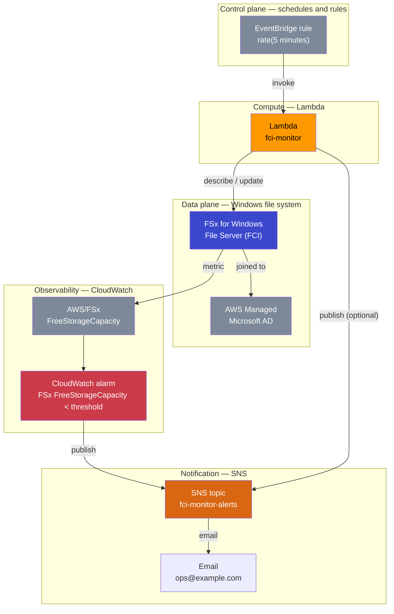

# L83 — Architecture — FCI Cluster Storage Monitor

> **Author:** Prem Vishnoi &lt;pvishnoi@avilx.com&gt;
> **Section:** 15
> **Duration:** 6:00
> **Prereqs:** L82 (Section Overview)

## What you will learn

By the end of this lecture you will be able to:

1. draw the full FCI Cluster Monitor architecture from memory and
   name every moving part;
2. explain the four-step monitoring loop the system implements
   (schedule → read → decide → grow + notify);
3. place each AWS service in the right tier of the architecture
   (control plane, data plane, observability plane);
4. articulate the difference between the **Lambda's self-healing
   grow** and the **CloudWatch alarm → SNS** path, and why you need
   both.

## Key terms

- **Monitor Lambda** — the scheduled Lambda that calls
  `fsx.describe_file_systems`, decides whether to grow, and calls
  `fsx.update_file_system`.
- **EventBridge schedule** — the cron that fires the monitor Lambda
  every 5 minutes.
- **CloudWatch alarm** — the independent threshold watcher on the
  `AWS/FSx FreeStorageCapacity` metric that publishes to SNS even
  if the Lambda fails.
- **SNS topic + email subscription** — the human-facing alert
  channel.
- **AWS Managed Microsoft AD** — the directory the FSx file system
  is joined to.
- **FCI (File Server Cluster Instance)** — the multi-node Windows
  file-server cluster pattern FSx for Windows supports through its
  Multi-AZ deployment option.
- **FreeStorageCapacity** — the CloudWatch metric on
  `AWS/FSx` that reports the file system's free storage in MiB.

## The use case in plain English

A manufacturing plant runs an on-premises FCI cluster to host
Windows shares for its design, finance, and production teams. The
plant is migrating that file workload to AWS and is using **FSx for
Windows File Server** as the cloud file system. The file system is
joined to an **AWS Managed Microsoft AD** so the same Windows
identities work both on-premises and in the cloud.

The plant's storage growth pattern is bursty: a daily batch process
ingests ~30 GiB of new CAD files into the same share, the file
system runs fine for a few days, and then someone notices a
"disk full" error on a workstation because the share ran out of
room. By that time the production line is already stalled.

The plant wants three things:

1. a *monitor* that watches the file system's free storage every
   few minutes;
2. a *grow* action that automatically expands the volume when free
   storage drops below a threshold;
3. a *notify* path that pages ops whenever the file system is low
   so they can audit the auto-grow or intervene if it didn't work.

We build all three as a serverless system. No EC2, no cron, no
WinRM.

## Architecture



Three planes, one Lambda, and one trust boundary (the Lambda's IAM
role). That is the whole production system.

## The four-step monitoring loop

Walk the diagram top-to-bottom and you see four logical steps:

### Step 1 — schedule (control plane)

An **EventBridge scheduled rule** with the cron expression
`rate(5 minutes)` fires every five minutes. The target is the
monitor Lambda's ARN. EventBridge also requires a
`Lambda::Permission` resource granting the `events.amazonaws.com`
service principal permission to invoke the function — without it the
rule fires but the invoke fails with "Access denied".

### Step 2 — read (data plane)

The Lambda calls `fsx.describe_file_systems` with the file system
ID it got from its `FSX_FILE_SYSTEM_ID` env var. The response
includes `StorageCapacity` (the file system's *current* provisioned
size, in GiB) and `Lifecycle` (e.g. `AVAILABLE`, `UPDATING`).
`StorageCapacity` is what we compare to the threshold; we use the
`AWS/FSx FreeStorageCapacity` CloudWatch metric only for the
separate alarm path.

### Step 3 — decide + grow (compute)

The handler compares `StorageCapacity` to `THRESHOLD_GB` (env var,
default 100). When below, and when the cooldown is not active, the
handler calls `fsx.update_file_system` with the new capacity
(current × `GROW_FACTOR`, rounded up to the next 10 GiB, clamped
between 32 GiB and 65 536 GiB). On success it logs
`monitor.grew` with the old and new capacities. On a still-cooling
file system it logs `monitor.skip reason=cooldown`. On an
`AVAILABLE`-but-above-threshold file system it logs
`monitor.skip reason=above_threshold`.

### Step 4 — notify (observability + notification)

There are **two** notify paths, not one:

- **CloudWatch alarm → SNS.** A separate CloudWatch alarm watches
  the `AWS/FSx FreeStorageCapacity` metric, dimensioned by
  `FileSystemId` and `StorageTier`. When the metric is below the
  threshold, the alarm transitions to `IN_ALARM` and publishes to
  the SNS topic. This path is **independent of the Lambda** — it
  pages ops even if the Lambda is broken or throttled.
- **Lambda → SNS (optional).** The Lambda's IAM role grants
  `sns:Publish` so the handler can publish a more detailed
  notification ("grew 50 → 60 GiB at 12:00 UTC") directly. We do
  not enable this by default in the template to avoid notification
  spam, but it is one line away in the handler (see L86).

Both paths fan out to a single SNS topic. Ops is subscribed to that
topic with an email endpoint; the platform team can add additional
subscriptions (PagerDuty, Slack via an SNS-to-Lambda bridge, OpsGenie
webhook, etc.) without changing the producer.

## Why two notify paths?

You might wonder: if the Lambda can grow the file system
automatically, do we even need the CloudWatch alarm?

Yes, and the reason is **defence in depth**:

| Failure mode | Lambda path | Alarm path |
|---|---|---|
| Lambda runs, grows, but grow silently failed (e.g. fsx throttle) | Pages *no one* | Pages ops (the metric stays low) |
| Lambda is throttled or has a bad deploy | Pages *no one* | Pages ops |
| Alarm's `Statistic: Average` over a 5-min window hides a transient dip | Grows, OK | Pages ops unnecessarily (acceptable noise) |
| File system is low for a sustained 1+ hour | Grows once, cooldown stops further grows | Pages ops continuously until the file system is healthy |

The Lambda is the **self-healing** path: it makes the system
self-recover without a human in the loop. The alarm is the
**human-in-the-loop** path: it tells ops when self-healing didn't
work or when the system needs attention. Together they are
strictly better than either alone.

## The trust boundary

Everything that the Lambda does happens *as the Lambda's execution
role*. The role is named `fci-monitor-lambda-exec` and contains
three inline policies:

1. `fci-monitor-fsx` — `fsx:DescribeFileSystems` and
   `fsx:UpdateFileSystem` on the one file system ARN.
2. `fci-monitor-sns` — `sns:Publish` on the one SNS topic ARN.
3. `fci-monitor-logs` — the standard Lambda log group / stream /
   put-events permissions on `arn:aws:logs:*:*:*`.

That is the entire trust policy. The Lambda cannot list EC2
instances, cannot read S3 buckets, cannot write to DynamoDB. If
the function is ever compromised (e.g. through a dependency
vulnerability) the blast radius is one file system and one SNS
topic. See `code/monitor_lambda/iam_policy.json` for the literal
JSON.

## State that lives outside the function

The handler keeps a `_last_grow_at` module-level timestamp to
enforce the cooldown across invocations within the same Lambda
execution environment. This is enough for a single-concurrency
function, but if you raise the reserved concurrency above 1, two
concurrent invocations could both pass the cooldown check. For
multi-concurrency fleets persist the timestamp in DynamoDB with a
`ConditionExpression` and use that as the source of truth. We
cover that variant in L86.

## Putting it together

The four decisions we have made in this lecture:

1. **One Lambda, one job.** The function does *read → decide → grow*.
   No branching by event type, no second concern. Single
   Responsibility Principle applied to functions.
2. **EventBridge does the cron.** Five-minute cadence, serverless,
   no maintenance.
3. **Two notify paths, one topic.** The CloudWatch alarm and the
   optional Lambda publish both fan out to the same SNS topic; ops
   sees a single stream of alerts.
4. **Least-privilege IAM.** The Lambda can describe and grow one
   file system, publish to one topic, and write logs. Nothing else.

In L84 we will look at AWS Managed Microsoft AD, the directory the
FSx file system is joined to. In L85 we will look at FSx for Windows
itself. In L86 we will write the Lambda. In L87 we will wire the
whole stack in a single CloudFormation template.

## Hands-on preview (deferred to L86 + L87)

You do not need to deploy anything to AWS yet. Two things you can
do right now, on your laptop:

1. **Read the IAM policy** at `code/monitor_lambda/iam_policy.json`.
   Notice that every statement has a `Sid`, a specific `Action`
   list, and a `Resource` ARN.
2. **Run the test suite**:

   ```bash
   cd code/monitor_lambda
   pip install boto3 moto pytest
   pytest -v
   ```

   All seven tests should pass. They prove (a) the handler is
   idempotent within the cooldown, (b) it grows when below
   threshold, (c) it does not grow when above threshold, (d) it
   never raises, and (e) the module loads with the documented
   defaults.

The full deploy (Lambda, IAM role, SNS topic, email subscription,
EventBridge rule, CloudWatch alarm) is the `deploy.sh` script in
`code/cloudformation/`. We will cover the script and the template
in L87.

## Quiz prep

You should now be able to answer:

- What three AWS services *trigger* the monitor Lambda, and which
  one is the human-facing alert channel?
- Why is the CloudWatch alarm necessary if the Lambda already
  grows the file system?
- Which IAM permissions does the monitor Lambda need, and which
  should you **not** grant it?
- Where does the cooldown timestamp live, and what is its
  single-concurrency limitation?
- What is the difference between `StorageCapacity` (control-plane)
  and `FreeStorageCapacity` (metric)?

## Further reading

- AWS docs: [EventBridge scheduled rules](https://docs.aws.amazon.com/eventbridge/latest/userguide/eb-create-rule-schedule.html)
- AWS docs: [Monitoring Amazon FSx for Windows File Server](https://docs.aws.amazon.com/fsx/latest/WindowsGuide/monitoring-cloudwatch.html)
- AWS docs: [Using Amazon CloudWatch alarms](https://docs.aws.amazon.com/AmazonCloudWatch/latest/monitoring/AlarmThatSendsEmail.html)
- AWS docs: [Updating an FSx for Windows file system](https://docs.aws.amazon.com/fsx/latest/WindowsGuide/managing-file-systems.html)
- `code/monitor_lambda/iam_policy.json` — the exact inline policies
- L84 — AWS Managed Microsoft AD
- L85 — FSx for Windows File Server
- L86 — the monitor Lambda
- L87 — the wiring
