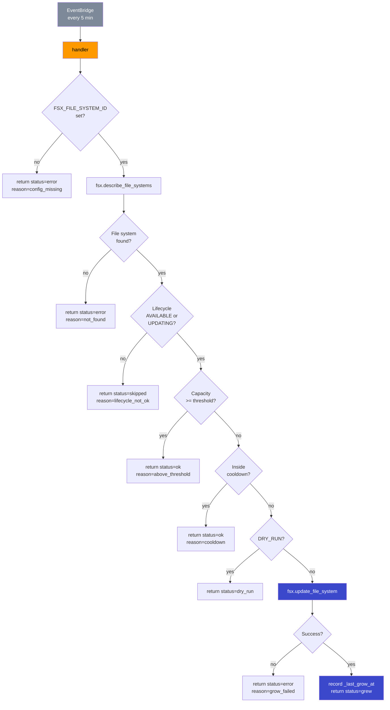

# L86 — The Monitor Lambda — check storage + grow volume

> **Author:** Prem Vishnoi &lt;pvishnoi@avilx.com&gt;
> **Section:** 15
> **Duration:** 15:00
> **Prereqs:** L82–L85

## What you will learn

By the end of this lecture you will be able to:

1. explain the full handler flow: read → check lifecycle → compare
   to threshold → check cooldown → grow;
2. implement a Lambda that reads `FSX_FILE_SYSTEM_ID`,
   `THRESHOLD_GB`, `GROW_FACTOR`, and `COOLDOWN_SECONDS` from
   environment variables;
3. call `fsx.describe_file_systems` and `fsx.update_file_system`
   with the right argument shapes and error handling;
4. emit structured JSON log lines that CloudWatch Logs Insights
   can query by `event` name;
5. implement idempotency using a process-level cooldown timestamp
   and reason about the multi-concurrency edge case;
6. use `DRY_RUN` to validate the deploy without making real
   changes;
7. write a `pytest` suite using `moto.mock_aws` and
   `unittest.mock.patch` that covers every branch.

## Key terms

- **Handler** — the `handler(event, context)` function Lambda
  invokes on every run. It must be importable and named exactly
  `handler`.
- **boto3 client** — a low-level service client. Built at module
  import time so the same connection pool is reused across
  invocations.
- **Environment variable** — a key-value string Lambda injects
  into the function's process at startup. We use four:
  `FSX_FILE_SYSTEM_ID`, `THRESHOLD_GB`, `GROW_FACTOR`,
  `COOLDOWN_SECONDS`.
- **`describe_file_systems`** — read-only FSx API call. Returns
  the current `StorageCapacity` and `Lifecycle`.
- **`update_file_system`** — write API call. Grows the file
  system to a new `StorageCapacity`. Cannot shrink.
- **Idempotency** — the property that running an operation
  multiple times has the same effect as running it once. Required
  for any system that consumes a possibly-duplicated trigger.
- **Cooldown** — the minimum wall-clock time between two grow
  calls. Held in a module-level variable in this lecture;
  swapped for a DynamoDB conditional write in production-grade
  multi-concurrency deployments.
- **Structured logging** — emitting one JSON object per log line,
  with a stable `event` key, so CloudWatch Logs Insights can
  `filter event = "..."`.
- **DRY_RUN** — an env-var flag (`true` / `false`) that lets the
  handler log its decision without calling `fsx.update_file_system`.
- **`botocore.exceptions.ClientError`** — the exception type
  boto3 raises for any non-2xx response from AWS. The `exc.response`
  dict has the AWS-shaped error code and message.

## The handler in one paragraph

Every five minutes, EventBridge invokes the `fci-monitor` Lambda
with a parameterless `event` payload. The handler reads the FSx
file system ID from its `FSX_FILE_SYSTEM_ID` env var, calls
`fsx.describe_file_systems` to get the current `StorageCapacity`
and `Lifecycle`, and decides whether to grow the file system. If
`Lifecycle` is `AVAILABLE` (or `UPDATING`), if the capacity is
below `THRESHOLD_GB`, and if a previous grow is not still inside
the `COOLDOWN_SECONDS` window, the handler calls
`fsx.update_file_system` with a new capacity (current ×
`GROW_FACTOR`, rounded up to the next 10 GiB). Every decision is
logged as a structured JSON line; the function never raises — a
failure is logged and a structured `status` is returned so the
schedule keeps firing.

## The flow as a diagram



Each terminal node (`X1`–`X7`) is a `return` with a structured
`status` field. The function never raises, so EventBridge never
has to retry the invoke — the schedule simply keeps firing.

## The full handler, line by line

The handler lives at
`code/monitor_lambda/lambda_function.py`. Below is the same code
in a presentation that highlights the four logical steps.

### Step 0 — module-level configuration

```python
import json
import logging
import math
import os
import time
from typing import Any

import boto3
from botocore.exceptions import ClientError

FSX_FILE_SYSTEM_ID = os.environ.get("FSX_FILE_SYSTEM_ID", "")
THRESHOLD_GB = int(os.environ.get("THRESHOLD_GB", "100"))
GROW_FACTOR = float(os.environ.get("GROW_FACTOR", "1.2"))
COOLDOWN_SECONDS = int(os.environ.get("COOLDOWN_SECONDS", "1800"))
DRY_RUN = os.environ.get("DRY_RUN", "false").lower() in {"1", "true", "yes"}
LOG_LEVEL = os.environ.get("LOG_LEVEL", "INFO").upper()

logger = logging.getLogger()
logger.setLevel(LOG_LEVEL)

_region = os.environ.get("AWS_REGION", "us-east-1")
_fsx = boto3.client("fsx", region_name=_region)

# Process-level "last grow time" in epoch seconds.
_last_grow_at: float | None = None
```

Why this is at module scope:

- The four numeric config values are read once at import. The
  Lambda runtime reuses the same execution environment across
  invocations, so the values are stable for the life of the
  container.
- The `boto3.client("fsx", ...)` is built once. boto3 clients
  are thread-safe and maintain an internal connection pool;
  re-building them per invocation wastes TLS handshakes and
  re-reads the credentials provider chain.
- `_last_grow_at` is module-level so a second invocation within
  the same container sees the previous grow's timestamp. This is
  *only* effective for single-concurrency deployments; see
  "Multi-concurrency edge case" below.

### Step 1 — entry point and config check

```python
def handler(event: dict[str, Any], context: Any) -> dict[str, Any]:
    request_id = getattr(context, "aws_request_id", "local")
    now = time.time()
    global _last_grow_at

    _log(logging.INFO, "monitor.start", request_id=request_id,
         file_system_id=FSX_FILE_SYSTEM_ID, threshold_gb=THRESHOLD_GB,
         grow_factor=GROW_FACTOR, cooldown_seconds=COOLDOWN_SECONDS,
         dry_run=DRY_RUN)

    if not FSX_FILE_SYSTEM_ID:
        msg = "FSX_FILE_SYSTEM_ID is not set"
        _log(logging.ERROR, "monitor.config_missing",
             request_id=request_id, reason=msg)
        return {"status": "error", "reason": msg}
```

`_log` emits one structured JSON line per call. The format is

```json
{"event": "monitor.start", "request_id": "...", "threshold_gb": 100, ...}
```

so a Logs Insights query like `filter event = "monitor.start"` is
one statement. We log every decision, including the "do nothing"
ones, so an investigator can reconstruct what the function
decided in any 5-minute window.

The `request_id` is the Lambda `aws_request_id`, which uniquely
identifies the invocation. It appears in every log line so you
can correlate a structured decision with the underlying AWS
API call (which also carries the request ID).

The `global _last_grow_at` declaration must appear *before* any
read of the name inside this function (the call to
`_cooldown_active(now)` further down reads it). Python's
`global` is a function-scope statement, not a statement that can
be scattered.

### Step 2 — read current state

```python
try:
    response = _fsx.describe_file_systems(FileSystemIds=[FSX_FILE_SYSTEM_ID])
except ClientError as exc:
    _log(logging.ERROR, "monitor.describe_failed", request_id=request_id,
         file_system_id=FSX_FILE_SYSTEM_ID,
         error=exc.response["Error"]["Code"])
    return {"status": "error", "reason": "describe_failed"}

file_systems = response.get("FileSystems", [])
if not file_systems:
    _log(logging.WARNING, "monitor.not_found", request_id=request_id,
         file_system_id=FSX_FILE_SYSTEM_ID)
    return {"status": "error", "reason": "file_system_not_found"}

fs = file_systems[0]
lifecycle = fs.get("Lifecycle", "UNKNOWN")
current_gb = int(fs.get("StorageCapacity", 0))
lifecycle_ok = lifecycle in {"AVAILABLE", "UPDATING"}

_log(logging.INFO, "monitor.snapshot", request_id=request_id,
     file_system_id=FSX_FILE_SYSTEM_ID, current_capacity_gb=current_gb,
     lifecycle=lifecycle)
```

We do not raise on `ClientError`. AWS APIs return structured
errors; the function logs the error code and returns a
`status=error` summary. This is the right pattern for a
*scheduled* Lambda: the next invocation will try again, and the
CloudWatch alarm in L87 will still page ops on a sustained
metric breach.

The `Lifecycle` field is checked explicitly. Calling
`update_file_system` on a `CREATING` or `DELETING` file system
raises `InvalidFileSystem`; calling it on an `AVAILABLE` file
system is the happy path; calling it on an `UPDATING` file
system is allowed (the second grow is queued), and we treat
both as eligible.

### Step 3 — decide whether to grow

Three "do not grow" exits, in priority order:

```python
if not lifecycle_ok:
    _log(logging.WARNING, "monitor.skip", request_id=request_id,
         reason="lifecycle_not_ok", lifecycle=lifecycle)
    return {"status": "skipped", ..., "reason": f"lifecycle={lifecycle}"}

if current_gb >= THRESHOLD_GB:
    _log(logging.INFO, "monitor.skip", request_id=request_id,
         reason="above_threshold", current_capacity_gb=current_gb,
         threshold_gb=THRESHOLD_GB)
    return {"status": "ok", ..., "reason": "above_threshold"}

if _cooldown_active(now):
    _log(logging.INFO, "monitor.skip", request_id=request_id,
         reason="cooldown", last_grow_at=_last_grow_at,
         cooldown_seconds=COOLDOWN_SECONDS)
    return {"status": "ok", ..., "reason": "cooldown"}
```

Each exit is logged with a distinct `reason` value. Operators can
ask Logs Insights "how often are we skipping for `cooldown` vs
`above_threshold`?" and get a histogram in seconds.

`lifecycle_not_ok` is a *warning* because the file system is in
a transient state we should investigate; the other two are
*info* because they are the routine path.

### Step 4 — compute the new capacity and grow

```python
def _new_capacity(current_gb: int) -> int:
    grown = current_gb * GROW_FACTOR
    rounded = int(math.ceil(grown / 10.0) * 10)
    return max(32, min(65536, rounded))

# ...inside the handler, after the three exits:
new_gb = _new_capacity(current_gb)
if new_gb <= current_gb:
    new_gb = current_gb + 10  # force a minimum 10 GiB grow
```

The FSx `update_file_system` API has three constraints we have
to respect:

1. `StorageCapacity` must be **at least 32 GiB**.
2. `StorageCapacity` must be **at most 65 536 GiB**.
3. The new value must be a **multiple of 10 GiB** *greater* than
   the current value.

`_new_capacity` rounds up to the next 10 GiB and clamps to the
documented range. The follow-up `if new_gb <= current_gb` guard
handles the edge case where rounding collapses to the same
value (e.g. `current_gb=100`, `GROW_FACTOR=1.0` after a config
typo) — we force a 10 GiB grow to satisfy constraint 3.

The actual grow:

```python
if DRY_RUN:
    _log(logging.INFO, "monitor.grow_dry_run", request_id=request_id,
         file_system_id=FSX_FILE_SYSTEM_ID,
         current_capacity_gb=current_gb, new_capacity_gb=new_gb)
    return {"status": "dry_run", ..., "reason": "dry_run"}

try:
    _fsx.update_file_system(FileSystemId=FSX_FILE_SYSTEM_ID,
                            StorageCapacity=new_gb)
except ClientError as exc:
    _log(logging.ERROR, "monitor.grow_failed", request_id=request_id,
         file_system_id=FSX_FILE_SYSTEM_ID,
         current_capacity_gb=current_gb, new_capacity_gb=new_gb,
         error=exc.response["Error"]["Code"])
    return {"status": "error", ..., "reason": "grow_failed"}

_last_grow_at = now

_log(logging.INFO, "monitor.grew", request_id=request_id,
     file_system_id=FSX_FILE_SYSTEM_ID,
     old_capacity_gb=current_gb, new_capacity_gb=new_gb)
return {"status": "grew", ..., "grew": True, "reason": "below_threshold"}
```

The cooldown timestamp is updated **only after a successful grow**.
A failed grow does not consume the cooldown, so a transient FSx
throttle does not extend the effective cooldown.

## Why `boto3.client` (low-level) and not `boto3.resource`

The FSx control plane is covered by a low-level client only;
there is no `boto3.resource("fsx")` in modern botocore. The
closest convenience is the `FileSystem` waiter, but we do not
need it here — the handler is parameterless and short-lived, and
the `update_file_system` call returns synchronously.

## Why we do not log the full FSx response

`describe_file_systems` returns a lot of fields — VPC IDs,
subnet IDs, network interface IDs, the Windows configuration
block, the Lustre configuration block (if any), tags, and so
on. Most of these change rarely and would inflate the log
volume and possibly leak IDs that should not be in CloudWatch
Logs long-term. The handler logs only what is *relevant to the
decision* (`StorageCapacity`, `Lifecycle`) and what is useful
for correlation (`FileSystemId`).

If you ever need a richer trail, add `model_dump = fs` to the
snapshot log line — the function is yours, and the right level
of detail is the one that matches your security review.

## The multi-concurrency edge case

The module-level `_last_grow_at` enforces the cooldown *within a
single Lambda execution environment*. If you set the function's
**reserved concurrency** to 1 (the default for a scheduled
function is 1), this is enough.

If you raise the reserved concurrency — for example, to make the
function react faster to a backlog after an outage — two
concurrent invocations can both pass the cooldown check and both
call `update_file_system`. FSx will queue the second call (you
do not get a corruption or a 400), but the file system will
grow twice in quick succession and the operator's audit log
will show two "grew" events for the same business decision.

The fix in a production multi-concurrency deployment is to
persist the timestamp in DynamoDB with a conditional write:

```python
# Pseudo-code; see "Further reading" for the full snippet.
_dynamodb.update_item(
    TableName="fci-monitor-state",
    Key={"file_system_id": FSX_FILE_SYSTEM_ID},
    UpdateExpression="SET last_grow_at = :now",
    ConditionExpression="attribute_not_exists(last_grow_at) "
                        "OR last_grow_at < :cooldown_threshold",
    ExpressionAttributeValues={
        ":now": int(now),
        ":cooldown_threshold": int(now - COOLDOWN_SECONDS),
    },
)
```

A `ConditionalCheckFailedException` on this call means another
invocation grew the file system within the cooldown window; we
return `status=ok, reason=cooldown` exactly as the in-process
timestamp path does.

We do not include the DynamoDB variant in the section-15
template because it is a different operational pattern (table
provisioning, IAM, eventual consistency) and the in-process
timestamp is enough for a single-concurrency scheduled function.

## What the handler *does not* do

It is worth listing the things the handler does **not** do, so
you do not assume they are in scope:

- It does not read the `FreeStorageCapacity` CloudWatch metric.
  It reads the *control-plane* `StorageCapacity`. The
  CloudWatch metric is what the *alarm* in L87 watches.
- It does not publish to SNS. The CloudWatch alarm in L87 does
  that. (The handler *can* publish; the IAM role grants
  `sns:Publish` so you can add an `sns.publish` call inside
  the `monitor.grew` branch if you want a richer notification
  than the alarm can produce.)
- It does not write to CloudWatch Metrics directly. Lambda
  *automatically* publishes `Invocations`, `Errors`, `Duration`,
  `Throttles`, and `ConcurrentExecutions` to the
  `AWS/Lambda` namespace; we rely on those rather than emitting
  custom metrics.
- It does not retry on `ClientError`. The next 5-minute
  invocation will try again, and the CloudWatch alarm will
  page ops on a sustained failure.
- It does not handle multi-file-system scenarios. The handler
  monitors exactly one file system per environment; for
  multiple file systems, deploy the same stack once per file
  system, each with a different `FSX_FILE_SYSTEM_ID` parameter.

## DRY_RUN: validating the deploy

`DRY_RUN=true` makes the handler compute and log the new capacity
but skip the actual `fsx.update_file_system` call. This is the
right knob to flip on the **first** deploy:

1. Deploy the stack with `DRY_RUN=true` in the environment
   variables.
2. Wait for one EventBridge invocation (or invoke manually with
   `aws lambda invoke`).
3. Read the CloudWatch logs — you should see `monitor.snapshot`
   followed by either `monitor.skip reason=above_threshold` or
   `monitor.grow_dry_run` with the would-be new capacity.
4. If the decision is what you expected, flip `DRY_RUN=false`
   and redeploy.

This catches a misconfigured threshold or a typo'd file system
ID *before* it grows a production file system by accident.

## The test suite

The tests live at
`code/monitor_lambda/test_lambda_function.py` and cover seven
cases:

| Test | What it proves |
|---|---|
| `test_module_loads_with_defaults` | The module's documented defaults are right. |
| `test_handler_does_not_grow_when_above_threshold` | Capacity above threshold -> no grow call. |
| `test_handler_grows_when_below_threshold` | Capacity below threshold -> grow to `current × factor`, rounded up to the next 10 GiB. |
| `test_handler_is_idempotent_within_cooldown` | A second invocation within the cooldown window does not call `update_file_system` again. |
| `test_handler_returns_error_when_fsx_id_missing` | A missing `FSX_FILE_SYSTEM_ID` returns a structured error rather than raising. |
| `test_handler_dry_run_does_not_call_update` | `DRY_RUN=true` computes the new capacity but never calls FSx. |
| `test_local_main_block_runs` | The `if __name__ == "__main__":` block runs and prints a structured result. |

### Why `moto` + `unittest.mock.patch`

`moto 5.x` implements `fsx.create_file_system` and
`fsx.describe_file_systems` but does **not** implement
`fsx.update_file_system` (it raises `NotImplementedError`). The
test suite uses `moto.mock_aws` for the *no-grow* paths (where
we drive `describe_file_systems` and assert the handler did not
call update) and `unittest.mock.patch` to inject a
`MagicMock` for the *grow* path (where we assert the call shape
and the arguments).

This is a common pattern when the AWS service surface is
partially covered. The alternative — `responses`-based mocking
of the boto3 transport — is more verbose and not necessary
here.

## Hands-on — run the tests

```bash
cd code/monitor_lambda
python -m venv .venv && source .venv/bin/activate
pip install -r ../../../requirements.txt
pytest -v
```

You should see all seven tests pass in under two seconds. Try
also:

```bash
# Trigger the handler locally with a fake context and no FSx ID.
python lambda_function.py
# {"status": "error", "reason": "FSX_FILE_SYSTEM_ID is not set"}
```

The local run uses the same code path as Lambda; the only
difference is that the `_log` calls print to your terminal
instead of CloudWatch.

## Quiz prep

You should now be able to answer:

- What are the four env vars the handler reads, and what is the
  default for each?
- Why is the cooldown timestamp module-level, and what is the
  multi-concurrency limitation?
- Why does the handler round the new capacity *up* to the next
  10 GiB?
- What is the difference between `monitor.skip reason=cooldown`
  and `monitor.skip reason=above_threshold`?
- Why do we use `boto3.client("fsx")` (low-level) and not
  `boto3.resource("fsx")`?
- What does the `DRY_RUN` knob do, and when in the deploy
  lifecycle should you flip it off?

## Further reading

- AWS docs: [`fsx.update_file_system` API reference](https://docs.aws.amazon.com/fsx/latest/WindowsGuide/API_UpdateFileSystem.html)
- AWS docs: [`fsx.describe_file_systems` API reference](https://docs.aws.amazon.com/fsx/latest/WindowsGuide/API_DescribeFileSystems.html)
- AWS docs: [Lambda environment variables](https://docs.aws.amazon.com/lambda/latest/dg/configuration-envvars.html)
- AWS docs: [CloudWatch Logs Insights query syntax](https://docs.aws.amazon.com/AmazonCloudWatch/latest/logs/CWL_QuerySyntax.html)
- AWS docs: [Lambda function handler in Python](https://docs.aws.amazon.com/lambda/latest/dg/python-handler.html)
- `code/monitor_lambda/lambda_function.py` — the production handler
- `code/monitor_lambda/test_lambda_function.py` — the test suite
- L87 — the SNS, CloudWatch, and EventBridge wiring
