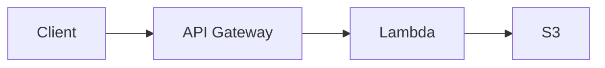

# Assets — Architecture Diagrams

> **Author:** Prem Vishnoi <prem.vishnoi@example.com>

This directory contains the Mermaid source files for every architecture
diagram in the AWS Lambda course. The PNG/SVG renderings are produced on
demand by `scripts/render_diagrams.sh` (or by the GitHub Pages workflow in
the parent repo).

## Files

| File | Used in | Describes |
|---|---|---|
| `architecture_usecase1.mmd` | Assignment 2, lecture L23–L24, README | S3 -> Lambda -> DynamoDB banking pipeline with DLQ + CloudWatch alarm + DLQ redrive. |
| `architecture_usecase2.mmd` | Assignment 3, lecture L30–L35, README | API Gateway + Lambda + S3 CRUD API with Cognito auth, /health, throttling, WAF rate-based rule. |
| `architecture_bedrock.mmd` | Assignment 6, lecture L40–L46, README | Generative-AI summarizer: API Gateway -> Bedrock (Cohere Command) via Lambda. |
| `architecture_cfn.mmd` | Assignment 5, lecture L60–L70, README | Non-serverless CFN stack: VPC + public subnet + IGW + EC2 + IAM role + SG + S3 + bucket policy. |
| `architecture_cdk.mmd` | Assignment 6, lecture L71–L77, README | CDK v2 stack: `bin/` -> `lib/serverless-stack.ts` -> S3, IAM, 2x Lambda, API Gateway, synthesized to CFN. |

## How to view

### Option A — Mermaid CLI (preferred)

Renders the `.mmd` to a PNG/SVG locally:

```bash
# one-time
npm install -g @mermaid-js/mermaid-cli

# render one diagram
mmdc -i assets/architecture_usecase1.mmd -o out/usecase1.png -t neutral -b transparent

# render every diagram
for f in assets/architecture_*.mmd; do
  mmdc -i "$f" -o "${f%.mmd}.png" -t neutral -b transparent
done
```

The output is a standard PNG that you can paste into slides, READMEs, and the
Udemy resource tab.

### Option B — Inline in Markdown

GitHub, GitLab, VS Code (with the Mermaid extension), Obsidian, and most
modern editors render `.mmd` blocks natively. In a `.md` file:

````markdown

````

Drop the contents of any `.mmd` file into a `mermaid` fenced block.

### Option C — Live editor

[mermaid.live](https://mermaid.live/) — paste the `.mmd` source and copy the
rendered image.

### Option D — Jupyter / Marp / Quarto

`mermaid` is supported as a built-in code fence in Marp and as a cell-magic
in Jupyter (`%load_ext mermaid`).

## Conventions

- All diagrams use `graph LR` or `sequenceDiagram` syntax (no `flowchart`).
- Node colors follow a consistent palette so the same logical role (compute,
  storage, networking, security) is the same color across diagrams:

  | Role | Color (hex) |
  |---|---|
  | Compute (Lambda) | `#dfe7fd` |
  | Storage (S3, DynamoDB) | `#fdf5e2` |
  | API / Gateway | `#e2f3fd` |
  | Auth / IAM | `#f0e2fd` |
  | Error / DLQ | `#fde2e2` |
  | Network (VPC, IGW, RTB) | `#dfe7fd` |
  | External (user, client, CloudWatch) | `#eeeeee` |

- Every edge is labeled with the **protocol or action** (e.g., `s3:ObjectCreated:*`, `get_object`, `AWS_PROXY`).

## Updating

When you change an `.mmd` file:

1. Re-run `mmdc` to regenerate the PNG.
2. Update the corresponding `assets/architecture_*.png` (if checked in).
3. Update any `README.md` that references the diagram.

The lecture scripts in `01_introduction` through `13_cloudformation_serverless`
embed these diagrams inline via the `mermaid` fenced block — no manual
re-render is needed for GitHub viewing.

## Tools

| Tool | Use |
|---|---|
| `@mermaid-js/mermaid-cli` (`mmdc`) | CLI rendering to PNG/SVG/PDF |
| `mermaid.live` | Quick interactive view in a browser |
| VS Code + `bierner.markdown-mermaid` | Inline preview in `.md` |
| Marp / Quarto | Slide-deck embedding |