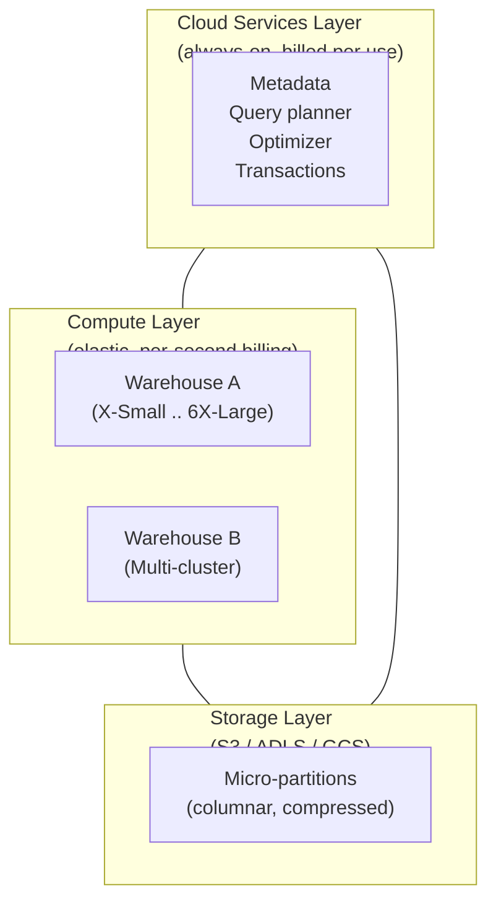

# L08 — Snowflake Architecture

> **Author:** Prem Vishnoi <pvishnoi@avilx.com>
> **Section:** 2 — Getting Started
> **Duration:** ~10:00

## Prereqs

L07 — Understanding Workspaces & Querying Data. The concepts
in this lecture are conceptual, but the next lecture (L09) will
go deeper.

## Key terms

- **Three-layer architecture** — storage, compute, and cloud
  services. Each layer scales independently.
- **Storage layer** — columnar compressed data stored as
  micro-partitions in cloud object storage (S3 / ADLS / GCS).
- **Compute layer** — one or more **virtual warehouses** (clusters
  of EC2 / Azure VM / GCP VM instances) that execute queries.
- **Cloud services layer** — the metadata, query planner,
  optimizer, transaction manager, security, and result cache.
  Always-on, billed only when active.

## Lecture

Snowflake's three-layer architecture is the single most
important mental model in the course. Every pricing, scaling,
and concurrency decision flows from these three layers being
independent.

### The three layers



### Storage layer

Snowflake stores all table data as **micro-partitions** —
immutable columnar files of 50–500 MB compressed each. Every
micro-partition contains metadata:

- Min/max values per column
- Number of distinct values per column
- NULL count per column

That metadata is what makes Snowflake queries so fast: the
query planner **prunes** micro-partitions whose min/max ranges
exclude the query predicate. A `WHERE sale_date = '2024-01-15'`
query might scan 0.01% of the table even if the table is
petabytes.

> **Key insight.** Storage is **independent of compute**. You
> can drop all warehouses, keep your data, and re-create
> warehouses next month — your data is still there. Storage
> billing continues regardless of compute activity.

### Compute layer — virtual warehouses

A **virtual warehouse** is a cluster of compute resources
that runs queries. You can create as many warehouses as you
need; they all read from the same shared storage but don't
share compute with each other.

Properties you set per warehouse:

- **Size** — X-Small, Small, Medium, Large, X-Large, 2X-Large,
  3X-Large, 4X-Large. Each step doubles the compute.
- **Auto-suspend** — seconds of inactivity before pausing.
  Default 60s. Set to 60–600s for most workloads.
- **Auto-resume** — when `true` (default), a query against a
  paused warehouse automatically resumes it.
- **Scaling policy** — `Economy` (slower scale-out, lower cost)
  vs `Standard` (default, balanced).
- **Min/max clusters** — for multi-cluster warehouses
  (Enterprise+ edition), how many clusters to run.
- **Resource monitor** — caps on credit consumption (L23).

```sql
-- Create a small ETL warehouse
CREATE WAREHOUSE etl_wh
  WITH WAREHOUSE_SIZE = 'MEDIUM'
       AUTO_SUSPEND   = 300
       AUTO_RESUME    = TRUE
       INITIALLY_SUSPENDED = TRUE;
```

### Cloud services layer

The cloud services layer is the always-on brain of Snowflake.
It includes:

- **Metadata** — the catalog of databases, schemas, tables,
  columns, micro-partition statistics.
- **Query planner + optimizer** — turns SQL into a distributed
  execution plan, picks join orders, decides partition pruning.
- **Transaction manager** — provides ACID guarantees across
  concurrent reads and writes.
- **Security** — enforces RBAC, manages authentication, handles
  key-pair and SSO.
- **Result cache** — caches the result of every query for 24
  hours; identical queries return instantly.

The cloud services layer is metered and billed only when
**active**. In practice, services cost ~10% of total compute
for most accounts; the rest is warehouse compute.

### Why this architecture matters

Because compute and storage are independent, you can:

- **Spin up 100 warehouses** to handle a Black Friday spike,
  then drop them all the next day — storage bill is unchanged.
- **Pay for compute only when queries run.** A warehouse that
  is auto-suspended bills nothing.
- **Share data across compute clusters** with zero copying —
  every warehouse reads the same micro-partitions.
- **Scale one workload without affecting another.** ETL on a
  Large warehouse, ad-hoc analyst on an X-Small — no
  contention.

This is the fundamental differentiator from traditional
shared-nothing warehouses (Teradata, Netezza, Vertica) where
compute and storage are co-located on each node.

## Hands-on

```sql
-- Inspect the storage layer for a table
SELECT table_name,
       row_count,
       bytes,
       bytes / 1024 / 1024 AS mb
FROM SNOWFLAKE.INFORMATION_SCHEMA.TABLES
WHERE table_schema = 'TPCH_SF1'
ORDER BY bytes DESC
LIMIT 5;

-- Inspect the compute layer
SHOW WAREHOUSES;
```

`SHOW WAREHOUSES` returns one row per warehouse with size,
state (started / suspended), and current cluster count.

## Quiz prep

- What are the three layers of Snowflake's architecture?
  (Storage, compute, cloud services)
- What is a micro-partition? (50–500 MB columnar file with
  min/max metadata per column)
- How long does the result cache live? (24 hours)

## What's next

Next up is **L09 — Architecture (deeper)**, where we drill
into micro-partitions, clustering, and the data lifecycle.
