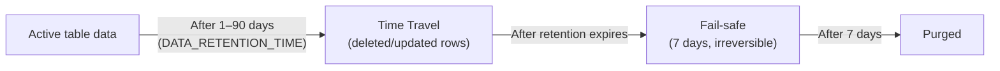

# L09 — Architecture (Deeper)

> **Author:** Prem Vishnoi <pvishnoi@avilx.com>
> **Section:** 2 — Getting Started
> **Duration:** ~9:00

## Prereqs

L08 — Snowflake architecture. This lecture goes deeper into the
storage layer, the data lifecycle, and how the cloud services
layer stays consistent.

## Key terms

- **Micro-partition** — immutable columnar file. 50–500 MB
  compressed; ~16 MB per column on average. Snowflake
  automatically groups rows into micro-partitions as data is
  loaded.
- **Partition pruning** — the optimizer uses min/max metadata
  to skip micro-partitions that cannot contain matching rows.
- **Clustering key** — a user-defined column (or columns) that
  Snowflake uses to organize micro-partitions. Section 8 covers
  clustering in depth.
- **Time Travel** — Snowflake retains deleted/updated data for
  a configurable retention period (1–90 days), enabling
  `AT`/`BEFORE` queries and `UNDROP`.
- **Fail-safe** — an additional 7-day disaster-recovery window
  after Time Travel expires. Section 15 covers Fail-safe.

## Lecture

In L08 we introduced the three-layer architecture. In this
lecture we drill into the storage layer and the data lifecycle,
because the lifecycle of a row in Snowflake is the key to
understanding performance and cost.

### Inside a micro-partition

Every micro-partition stores a contiguous block of rows in
**columnar** form, with metadata for every column:

```text
Micro-partition MP_0042 (245 MB compressed)
├── Columns:
│   ├── sale_id    (INTEGER)     min=100423  max=100899  nulls=0
│   ├── sale_date  (DATE)        min=2024-01-15  max=2024-01-21  nulls=0
│   ├── amount     (NUMBER(10,2)) min=10.00  max=4999.99  nulls=0
│   └── region     (VARCHAR)     distinct=4  nulls=0
└── Rows: ~750,000 (varies by column widths)
```

This metadata is what enables **partition pruning**. Consider:

```sql
SELECT SUM(amount)
FROM sales
WHERE sale_date = '2024-01-17';
```

The optimizer looks at the `sale_date` min/max of every
micro-partition and only reads the ones where
`min ≤ '2024-01-17' ≤ max`. For a year of daily data, that's
1/365th of the partitions — a 365x speed-up.

> **This is why Snowflake can scan a petabyte in seconds.**
> Pruning is automatic; you don't have to define partitions
> (the way you do in BigQuery, Redshift, or Hive).

### Clustering — when pruning isn't enough

If your data is **naturally ordered** (e.g. inserts are sorted
by date), pruning works perfectly. But if rows are loaded in
random order, micro-partitions span the entire value range and
pruning degrades.

The fix: define a **clustering key**:

```sql
ALTER TABLE sales CLUSTER BY (sale_date);
```

Snowflake re-organizes micro-partitions so that the
clustering-key values are contiguous. This is automatic and
incremental — it happens in the background without blocking
queries. Section 8 covers clustering depth.

### The data lifecycle

Every byte of table data in Snowflake has a lifecycle:



- **Active** — the current state of every row.
- **Time Travel** — every change (insert, update, delete, drop)
  is preserved for the table's `DATA_RETENTION_TIME_IN_DAYS`
  (default 1, max 90 on Enterprise+). You can query past states
  with `AT (OFFSET => -600)` or `BEFORE (STATEMENT => ...)`.
- **Fail-safe** — once Time Travel expires, the data enters a
  7-day window where **Snowflake support can recover it for
  you** in a true disaster. You cannot query Fail-safe data
  yourself.
- **Purged** — gone.

Section 14 covers Time Travel; section 15 covers Fail-safe.

### How Snowflake stays consistent

Two readers and one writer in the same table? No problem —
Snowflake uses **ACID transactions** with **multi-version
concurrency control (MVCC)**:

- Readers see a consistent snapshot at query start, even if
  writers are committing mid-query.
- Writers use **optimistic concurrency** — no read locks.
- A failed `MERGE` or `UPDATE` rolls back cleanly; no
  half-applied state.

This is the same model used by Postgres, Oracle, and
CockroachDB. The difference is that Snowflake applies it
across **millions of micro-partitions** in S3, not a single
local store.

### Storage cost recap

You're billed per **average compressed** terabyte per month.
Snowflake compresses columnar data very efficiently — typical
compression ratios are 5–10x for structured data, 2–3x for
JSON. Storage cost is in the cents-per-GB-per-month range;
L21 covers the pricing details.

## Hands-on

```sql
-- Look at micro-partition metadata for a table
SELECT partition_id,
       row_count,
       bytes,
       bytes / 1024 / 1024 AS mb,
       Trim(MIN(sale_date)::VARCHAR) AS min_date,
       Trim(MAX(sale_date)::VARCHAR) AS max_date
FROM TABLE(INFORMATION_SCHEMA.AUTOMATIC_CLUSTERING_HISTORY(
   TABLE_NAME => 'DEMO.ANALYTICS.SALES'))
GROUP BY partition_id, row_count, bytes
ORDER BY partition_id;
```

If `AUTOMATIC_CLUSTERING_HISTORY` returns no rows, your table
is too small to be clustered. Load more data and re-run.

## Quiz prep

- What metadata does Snowflake store per micro-partition?
  (Min/max per column, distinct counts, null counts)
- How long is the **Time Travel** retention period by
  default? (1 day, max 90 days on Enterprise+)
- How long is **Fail-safe**? (7 days, irreversible,
  Snowflake support only)

## What's next

Next up is **L10 — Setting up warehouse**, where we put the
compute layer into practice.
