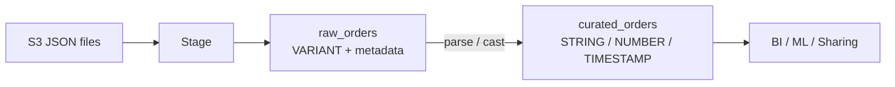

# L41 — High-level steps

> **Section:** 6 — Loading unstructured data
> **Duration:** 5:00

## Prereqs

- L40 — TRUNCATECOLUMNS + FORCE + Load history
- Comfort with `COPY INTO`, file format objects, and `VARIANT` columns

## Key terms

- **Unstructured / semi-structured data** — JSON, Parquet, Avro, ORC.
  Snowflake ingests it into a single `VARIANT` column first, then you
  query it with `:` and `:.` path navigation.
- **VARIANT** — Snowflake's universal semi-structured type. Stores any
  JSON value (object, array, scalar, null) and is queryable in place.
- **Raw layer** — first landing table with a single `VARIANT` column
  plus the file metadata (`METADATA$FILENAME`, etc.). Cheap and
  forgiving — the schema is the JSON itself.
- **Curated layer** — final typed table with strongly-typed columns
  (`STRING`, `NUMBER`, `TIMESTAMP`, …) you actually use for analytics.

## Lecture

Welcome to **Section 6 — Loading unstructured data**. So far every
file we have loaded has been CSV — comma-separated, schema-known,
flat. Real life is not like that. Most of the data you'll be asked to
load in 2026 is JSON, and JSON is **nested**. Today's section is
about turning that mess into tidy, strongly-typed Snowflake tables.

### Why this section matters

CSV loads are forgiving because every row has the same shape. JSON
isn't. One order might have **one** line item, another might have
**fifteen**, and a third might be missing a `customer.email` field
entirely. The `COPY INTO` command is happy to load the mess as-is, but
the moment you `SELECT *` you get back a single `VARIANT` column and
your BI tool explodes.

The job of this section is to teach you the **two-step pattern** that
every Snowflake JSON pipeline eventually settles on:

1. **Land the JSON raw** into a `raw` table with a `VARIANT` column.
2. **Flatten + cast** into a typed `curated` table that the rest of
   the warehouse can join against.

### The 9 lectures in this section

Here is the arc:

```text
L41 High-level steps            ← you are here
L42 Understanding our data      (peek at the JSON file)
L43 Creating stage & raw table
L44 Load raw JSON
L45 Parsing JSON                 (the `:` and `:.` operators)
L46 Handling nested data        (objects inside objects)
L47 Parsing & handling array     (the `[]` brackets)
L48 Flatten hierarchical data   (LATERAL FLATTEN)
L49 Insert final data           (INSERT … SELECT into the curated table)
```

### The two-step pattern in one diagram



The `raw` table is your safety net — it is the **exact bytes** Snowflake
loaded, plus the source filename and load timestamp. If your parsing
logic is wrong, you re-run L49 against `raw_orders` and never have to
re-ingest from S3.

### What "raw" actually means

A `raw` table is deliberately boring:

```sql
CREATE OR REPLACE TABLE raw_orders (
    raw           VARIANT,
    filename      VARCHAR AS METADATA$FILENAME::VARCHAR,
    loaded_at     TIMESTAMP_LTZ DEFAULT CURRENT_TIMESTAMP()
);
```

The interesting column is `raw VARIANT` — every JSON object in the
file becomes one row. `filename` tells you *which* file the row came
from, and `loaded_at` tells you *when*. Those two columns are how you
debug any "the number is wrong" conversation later.

The `curated` table is what you actually report against. We build it
in L49 with `INSERT INTO … SELECT … FROM raw_orders, LATERAL
FLATTEN(…)` and from then on, every consumer reads curated.

### Why not just `COPY INTO` JSON straight to typed columns?

You *can* — Snowflake lets you write `COPY INTO … (col1, col2) FROM
(SELECT $1:field1, $1:field2 FROM @stage)`. The problem is that one
missing `:` in a single JSON object rejects the entire load. The
two-step pattern decouples **ingestion** from **transformation**: the
ingest can never fail on a shape mismatch, and the transformation is a
`SELECT` you can re-run as many times as you like.

## Hands-on

Nothing to do yet — orientation lecture. Open the Snowflake UI and
look at the `SNOWFLAKE_SAMPLE_DATA` database; the
`WEATHER.DAILY_14_TOTAL` table is real JSON-shaped VARIANT data you
can practice on in L42.

## Quiz prep

- What is a `VARIANT` column?
- What is the difference between the `raw` and the `curated` table?
- Why is the two-step pattern safer than loading JSON straight into
  typed columns?

## Key takeaways

- Unstructured / semi-structured data is loaded into a **single
  `VARIANT` column** first.
- The **two-step pattern** is *raw landing → curated typed table*.
- The `raw` table keeps the **exact bytes** plus filename/timestamp
  metadata, so re-parsing is cheap.
- This section teaches you `:` / `:.` path navigation, nested-object
  access, arrays, and `LATERAL FLATTEN`.

## What's next

In **L42 — Understanding our data** we'll preview the JSON file
we'll be loading: nested orders, arrays of line items, and a
hierarchical `customer` object.
