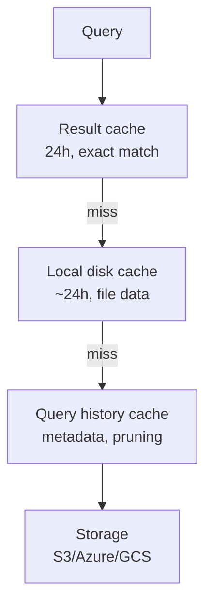

# L52 — Performance Considerations in Snowflake

> **Section:** 7 — Performance optimization
> **Duration:** 7:00

## Prereqs

- L51 — Loading PARQUET data

## Key terms

- **Compute vs storage** — Snowflake separates them. Storage is
  cheap; compute is what you pay per second.
- **Warehouse size** — controls the **per-second** credit cost
  and the **per-query** parallelism. Bigger = faster but more
  expensive.
- **Scale up** — bigger warehouse, same number of clusters.
- **Scale out** — more clusters, same size.
- **Caching** — three layers (result, local disk, query
  history) that make a repeat query free or near-free.

## Lecture

This is a **map-of-the-territory** lecture — we don't change any
SQL yet, but we name the levers you'll pull for the rest of
section 7. There are exactly three performance levers in
Snowflake:

1. **Warehouse sizing** — bigger = more CPUs, more memory.
2. **Clustering** — physical sort order on disk; relevant for
   very large tables (covered in section 8).
3. **Caching** — three layers, all designed to make the second
   query cheaper than the first.

### Lever 1 — warehouse size

Snowflake warehouses are pre-sized T-shapes: `X-Small`, `Small`,
`Medium`, `Large`, `X-Large`, … Each step doubles the resources
**and the credit cost per second**.

| Size | Credits/sec | Approx. relative speed |
|---|---|---|
| X-Small | 1 | 1× |
| Small  | 2 | 2× |
| Medium | 4 | 4× |
| Large  | 8 | 8× |
| X-Large | 16 | 16× |

Two rules of thumb:

- **Big queries get faster with bigger warehouses**, but only
  up to a point. A 2 TB scan on an `X-Small` might take 20 min;
  on a `Large` it might take 2.5 min. The cost is the same.
- **Small queries don't get faster past a certain size.** A
  100-row lookup is fast on every warehouse size; the overhead
  dominates.

### Lever 2 — scale up vs scale out

Snowflake supports two directions:

- **Scale up** — resize the warehouse from `Small` to `Large`.
  One cluster, more resources per cluster.
- **Scale out** — add **clusters** to a multi-cluster warehouse.
  Multiple clusters, same size per cluster.

```sql
-- Scale up
ALTER WAREHOUSE compute_wh SET WAREHOUSE_SIZE = 'LARGE';

-- Scale out (only for multi-cluster warehouses)
ALTER WAREHOUSE compute_wh SET MAX_CLUSTER_COUNT = 4;
```

When to use which:

- **Scale up** — when one query is too slow and parallelism
  inside the query is the bottleneck.
- **Scale out** — when **many concurrent users** are queuing
  behind each other. Multi-cluster warehouses fan out queries
  to different clusters, eliminating the queue.

### Lever 3 — caching (the section's last three lectures)

Snowflake has **three** caches, stacked on top of each other:



- **Result cache** — exact-match re-runs return in **milliseconds**
  for 24 hours. Free.
- **Local disk cache** — file-level data cached on the
  warehouse's SSD for ~24 hours. Cheap.
- **Query history cache** — Snowflake's metadata index over
  micro-partitions, used to **prune** unneeded partitions
  before scanning. Always on, no user config.

### The five things that "waste" Snowflake performance

- **One shared warehouse for everything.** Ad-hoc queries
  competing with nightly loads → use **dedicated warehouses**
  (L53–L54).
- **Same warehouse size for every workload.** A daily 10 GB
  load wants a `Large`; a dashboard query wants an `X-Small`.
  Resize instead of buying more clusters.
- **No clustering on huge tables.** A 5 TB table with no
  clustering key does a full scan even when your filter
  matches 1% of rows. Covered in section 8.
- **`SELECT *` on Parquet.** Defeats column pruning.
- **No warehouse auto-suspend.** A warehouse left running bills
  credits even when idle. Always set `AUTO_SUSPEND = 60`.

### The cost of a "free" query

Result cache is "free" in the sense that you don't pay credits
for it — but you still pay for the **storage** of the cached
result. For huge result sets this can be more expensive than
re-running the query. Use it for dashboards, not for ad-hoc
"show me everything" sessions.

### Section 7 arc

```text
L50 Parquet: query
L51 Parquet: load
L52 Performance overview     ← you are here
L53 Dedicated warehouse: theory
L54 Dedicated warehouse: implement
L55 Scale up
L56 Scale out
L57 Caching theory
L58 Maximise caching
```

The next two lectures are about **warehouse isolation** — giving
each workload its own warehouse. Then we look at scale up and
scale out. Then the three caches, top to bottom.

## Hands-on

Open **Account → Warehouses** in the Snowflake UI. Note the size
and the auto-suspend for your default warehouse. We'll modify
both in L53.

## Quiz prep

- What are the three performance levers in Snowflake?
- What is the difference between scale up and scale out?
- Name the three caches and roughly how long each lasts.

## Key takeaways

- The three performance levers are **warehouse size**, **scale
  up vs scale out**, and **caching**.
- Bigger warehouse = more credits per second, but also more
  parallelism per query.
- **Result, local disk, and query history** are the three
  caches, in order of latency.
- **Always set `AUTO_SUSPEND`** on every warehouse you create.

## What's next

In **L53 — Create dedicated virtual warehouse** we'll go deep on
**warehouse isolation**: one warehouse per workload, sized per
workload, so a dashboard query never blocks a nightly load.