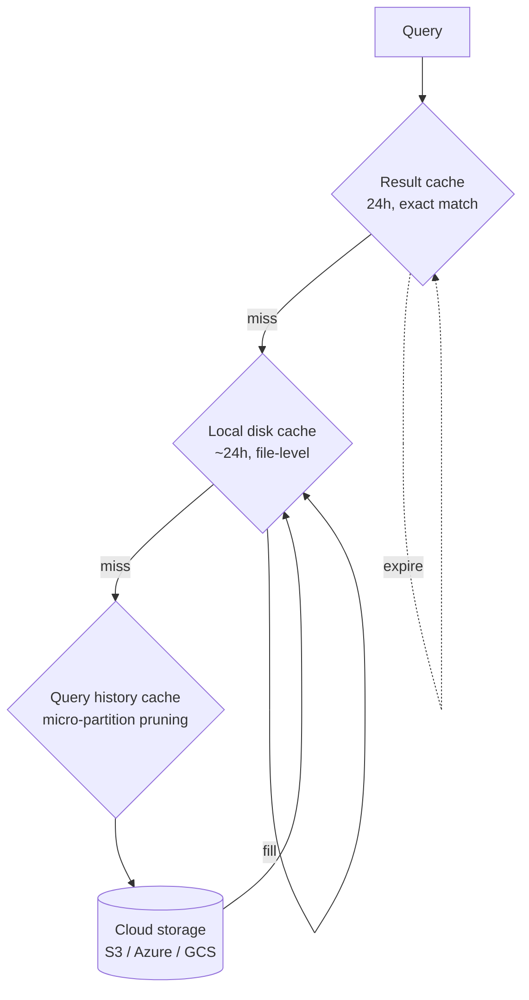

# L57 — Caching — Theory

> **Section:** 7 — Performance optimization
> **Duration:** 6:00

## Prereqs

- L56 — Scaling out

## Key terms

- **Result cache** — Snowflake remembers the **result** of a
  query for 24 hours. A byte-for-byte identical re-run returns
  instantly and costs zero credits.
- **Local disk cache** — file-level data cached on the
  warehouse's SSD for ~24 hours. The data, not the result.
- **Query history cache** — micro-partition metadata used to
  **prune** partitions before scanning. Always on, never
  cleared, free.
- **Metadata service** — Snowflake's per-account service that
  owns the result cache and the micro-partition index.

## Lecture

Snowflake has **three** distinct caches, stacked on top of each
other. Understanding them is the difference between a query that
takes 5 seconds and one that takes 5 minutes — for the same
exact SQL.

### The cache hierarchy



A query walks the stack from top to bottom and serves the
**first** cache that hits.

### Cache 1 — result cache

- **What it caches**: the final result of a query.
- **When it hits**: a new query is **byte-for-byte identical**
  to a previous query (same SQL text, same role, same
  underlying data).
- **Latency**: milliseconds.
- **Cost**: zero credits.
- **TTL**: 24 hours.
- **Where it lives**: the **metadata service** (a separate
  service from your warehouse).

Two important properties:

- **The result is reused even if the warehouse is
  suspended.** A result-cached query doesn't resume the
  warehouse.
- **New data invalidates the cache.** If a micro-partition is
  modified after the result was cached, the result is
  discarded.

```sql
-- Run 1: full scan
SELECT COUNT(*) FROM raw_orders_parquet;   -- 30 s, billed

-- Run 2: identical SQL
SELECT COUNT(*) FROM raw_orders_parquet;   -- 80 ms, FREE
```

### Cache 2 — local disk cache

- **What it caches**: the **raw file data** (micro-partitions)
  read from cloud storage.
- **When it hits**: the warehouse has read those
  micro-partitions recently.
- **Latency**: sub-second.
- **Cost**: ~50% of a normal scan (you still pay for compute
  to process the cached bytes).
- **TTL**: ~24 hours, until the warehouse's SSD fills.
- **Where it lives**: the **warehouse's local SSD**.

This cache is what makes "I queried this table 5 minutes ago,
let me check something else" so fast — the second query reads
from SSD, not S3.

It is **per-warehouse**: a `bi_wh` cache and a `loading_wh`
cache are independent. A query on `bi_wh` won't benefit from a
prior `loading_wh` read of the same table.

### Cache 3 — query history cache (micro-partition pruning)

- **What it caches**: **metadata** about which
  micro-partitions exist, what column ranges they cover, and
  how many rows they have.
- **When it hits**: every query that has a `WHERE` clause.
- **Latency**: zero — Snowflake uses it before scanning.
- **Cost**: zero.
- **TTL**: forever (the metadata is regenerated as data
  changes).
- **Where it lives**: the metadata service.

This is the cache you **always** benefit from. The Query
Profile shows `Partitions scanned / Partitions total`. Aim for
< 5% on selective queries; 100% means no pruning happened.

### How the three interact

For a query like:

```sql
SELECT * FROM orders WHERE order_ts >= '2026-09-01';
```

1. **Result cache** — exact match? If yes, return instantly.
2. **Local disk cache** — has the warehouse read the relevant
   micro-partitions before? If yes, skip S3.
3. **Query history cache** — which micro-partitions overlap
   `'2026-09-01'`? Read only those.
4. **S3** — the final read source for everything else.

If your query is run **once a day** by an analyst, only the
query history cache helps. If it is run **every 5 seconds** by a
dashboard, all three caches light up.

### A cache that is **not** in Snowflake

The "warehouse metadata cache" and "compiled query plan cache"
also exist but are invisible to the user. They are part of the
warehouse's runtime, not user-tunable. We don't talk about
them in this course.

### What you can do to maximise caching (preview of L58)

- **Run repeated queries on the same warehouse** so the local
  disk cache is warm.
- **Keep the result cache valid** — don't change data
  underneath the queries that should reuse it.
- **Pick good clustering keys** so the query history cache
  prunes aggressively (covered in section 8).
- **Use parameterised SQL** for dashboards so a single result
  cache entry can serve many requests.

## Hands-on

Run `SELECT COUNT(*) FROM raw_orders_parquet` three times in a
row. Open the Query History — the second and third should show
`Partitions scanned: 0` and a wall-clock of milliseconds.

## Quiz prep

- What is the difference between the result cache and the
  local disk cache?
- Why does the result cache not survive a data modification?
- What is the query history cache, and is it free?

## Key takeaways

- **Result cache** — exact match, 24 h, free, no resume.
- **Local disk cache** — file-level, ~24 h, per-warehouse,
  ~50% cost.
- **Query history cache** — micro-partition pruning, always
  on, free.
- Run repeated queries on the **same warehouse** to keep the
  local disk cache warm.

## What's next

In **L58 — Maximize Caching** we'll look at the practical
patterns: parameterised SQL, result cache stability across
data loads, and the `USE_CACHED_RESULT` session parameter.