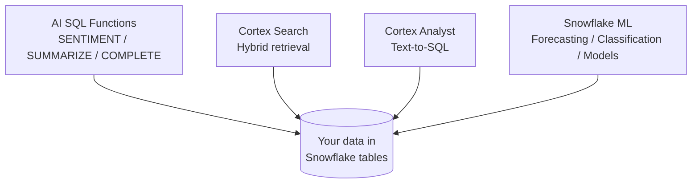

# L87 — Snowflake Cortex AI - Overview

> **Author:** Prem Vishnoi &lt;pvishnoi@avilx.com&gt;
> **Section:** 12 — Cortex AI & Machine Learning
> **Duration:** 7:30

## Prereqs

None. You should be comfortable with `SELECT` and basic Snowflake
roles. The rest is conceptual in this lecture.

## Lecture

Cortex is **AI/ML inside Snowflake** — your data never leaves the
platform, you don't manage GPUs, and the billing model is per-token
or per-row, not per-GPU-hour.

### The four pillars of Cortex

1. **AI SQL functions** — `SNOWFLAKE.CORTEX.*` functions you call
   from any `SELECT`. Sentiment, summarization, translation,
   classification, entity extraction, embedding, and direct
   completion.
2. **Cortex Search** — a managed, serverless search service that
   builds and maintains a hybrid (keyword + vector) index over a
   table column. You query it via SQL or REST.
3. **Cortex Analyst** — a text-to-SQL agent. You give it a
   semantic model (YAML) describing your tables, and a REST
   endpoint turns natural-language questions into safe SQL.
4. **Snowflake ML** — feature store + model registry + Snowpark
   Python training on warehouse compute. Bring your own model, or
   use one of the built-in ML functions like
   `SNOWFLAKE.ML.FORECAST`.

### Where compute runs

| Service | Compute |
|---|---|
| AI SQL functions | Snowflake-managed serverless GPU/CPU pool |
| Cortex Search | Snowflake-managed serverless |
| Cortex Analyst | Snowflake-managed serverless (calls an LLM) |
| Snowflake ML training | **Your warehouse** (you size it) |
| Snowflake ML inference | Your warehouse (or a SPCS container) |

The first three are pure serverless — you pay only for what you
call. Snowflake ML training is the outlier: you bring a warehouse.

### Pricing intuition

- **AI SQL functions** — per token (input + output) for LLM
  functions; per row for some classic ML functions.
- **Cortex Search** — per service-hour while the index is live.
- **Cortex Analyst** — per request (LLM tokens + service fees).
- **Snowflake ML** — warehouse seconds for training; per-row for
  forecasting/anomaly functions.

### What's available by region

Not every model is in every region. The general pattern: more
regions get the **smaller / cheaper** models first, larger
reasoning models follow. `SHOW FUNCTIONS IN SCHEMA
SNOWFLAKE.CORTEX;` (or the equivalent) is the local way to confirm
what's exposed in *your* account.

### When to use what

- "Score sentiment on 50M support tickets" → `SENTIMENT` AI SQL.
- "Let users search our docs from a chat box" → Cortex Search.
- "Let analysts ask questions in plain English" → Cortex Analyst.
- "Forecast next quarter's revenue" → `ML.FORECAST`.
- "Train a custom fraud model" → Snowflake ML + Snowpark Python.

## Key takeaways

- Cortex = four pillars (AI SQL, Search, Analyst, ML) that run
  *inside* Snowflake.
- Three of the four are serverless; ML training uses your
  warehouse.
- All pricing is consumption-based (per token, per row, per
  service-hour).

## What's next

In **L88 — AI SQL Functions** we get concrete with `SENTIMENT`,
`SUMMARIZE`, and `TRANSLATE` and call them from a `SELECT`.
