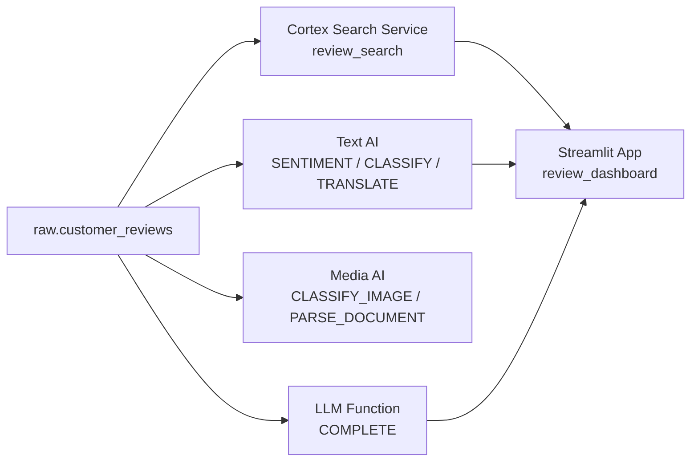

# L94 — Hands-on: Overview Of Scenario

> **Author:** Prem Vishnoi &lt;pvishnoi&commat;avilx.com&gt;
> **Section:** 12 — Cortex AI & Machine Learning
> **Duration:** 5:00

## Prereqs

The setup we have been building all section — table, stage, file
formats, Cortex access — is enough to follow this scenario.

## Lecture

Over the next five lectures we will build a single end-to-end
**AI support-triage** scenario. One dataset, multiple Cortex
surfaces, one Streamlit app.

### The dataset

A `customer_reviews` table with:

- `review_id` (PK)
- `customer_id`
- `review_date` (DATE)
- `review_text` (TEXT) — the actual review
- `language` (TEXT) — `'en'`, `'de'`, `'fr'`, etc.
- `product` (TEXT) — what they bought
- `image_url` (TEXT) — optional attached image (S3/GCS/presigned)

### What we will build

### Lecture-by-lecture plan

| L# | What we build | What it gives us |
|---|---|---|
| L95 | Load the dataset | Working `customer_reviews` table |
| L96 | Text AI — sentiment, classify, translate | A scored view |
| L97 | LLM function — `COMPLETE` for triage | A draft reply per review |
| L98 | Media AI — analyze the attached image | Image label + caption |
| L99 | Cortex Search + Streamlit app | A UI to search & triage |

### Conventions we will use

- Schema: `raw.customer_reviews` — one table, one source of truth.
- All Cortex calls go through a single **scored view**:
  `analytics.scored.customer_reviews`. The view is the contract
  the Streamlit app reads from.
- All secrets (S3 keys, PATs) live in a Snowflake **secret**
  object — never in the app code.
- Notebooks and Streamlit apps live under `ml.*` and
  `analytics.app.*` schemas respectively.

### A quick checklist before we start

- [ ] `USAGE` on `SNOWFLAKE.CORTEX` and `SNOWFLAKE.ML`.
- [ ] A warehouse (`compute_wh`) sized XS–S for the demo.
- [ ] A role with `CREATE TABLE`, `CREATE STAGE`, `CREATE NOTEBOOK`,
      `CREATE STREAMLIT`, `CREATE CORTEX SEARCH SERVICE`.
- [ ] A stage pointing at a public S3 / GCS bucket where the
      sample dataset lives.

We'll wire all of this in the next lecture.

## Key takeaways

- One scenario, one table, many Cortex surfaces.
- We materialize a **scored view** so every downstream surface
  reads the same numbers.
- Secrets in Snowflake, not in code.

## What's next

In **L95 — Hands-on: Load The Data** we load the dataset and set
up the schemas and roles.
