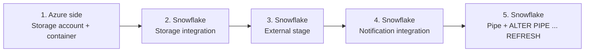

# L101 — High-level steps (Snowpipe Azure)

> **Author:** Prem Vishnoi &lt;pvishnoi&commat;avilx.com&gt;
> **Section:** 13 — Snowpipe for Azure
> **Duration:** 6:00

## Prereqs

An Azure subscription, a Snowflake account on Azure (any region
that supports your account), and a role with `CREATE INTEGRATION`
in Snowflake.

## Lecture

The Azure version of Snowpipe has the same five steps as the GCS
one, but each step has an Azure-flavored name. Memorize the
**shape**, not the strings.

### The five steps



### Step 1 — Azure side

You need:

- A **storage account** in the same Azure region as your
  Snowflake account (or one you've whitelisted via consent
  properties on the storage integration).
- A **container** inside the storage account where files will
  land.
- An **app registration** (service principal) with the
  `Storage Blob Data Contributor` role on the container.

### Step 2 — Storage integration

```sql
CREATE STORAGE INTEGRATION azure_snowpipe_int
  TYPE = EXTERNAL_STAGE
  STORAGE_PROVIDER = 'AZURE'
  ENABLED = TRUE
  AZURE_TENANT_ID = '<your-tenant-guid>'
  STORAGE_ALLOWED_LOCATIONS = (
    'azure://<account>.blob.core.windows.net/<container>/',
    'azure://<account>.blob.core.windows.net/<other-container>/'
  )
  AZURE_CONSENT_URL = 'https://login.microsoftonline.com/<tenant>/v2.0/oauth2/authorize?client_id=<app-id>...'
  AZURE_MULTI_TENANT_APP_NAME = 'snowflake_app_<unique-suffix>';
```

After creation, `DESC STORAGE INTEGRATION` gives you
`AZURE_CONSENT_URL` and `AZURE_MULTI_TENANT_APP_NAME`. The app
admin clicks the consent URL to grant Snowflake the
`Storage Blob Data Reader` role on the tenant.

### Step 3 — External stage

```sql
CREATE STAGE raw.azure_stage
  STORAGE_INTEGRATION = azure_snowpipe_int
  URL = 'azure://<account>.blob.core.windows.net/<container>/orders/'
  FILE_FORMAT = ff_csv_gcs;  -- same file format object as GCS
```

### Step 4 — Notification integration

This is the Azure-specific bit:

```sql
CREATE NOTIFICATION INTEGRATION azure_eventgrid_int
  TYPE = QUEUE
  NOTIFICATION_PROVIDER = AZURE_EVENT_GRID
  ENABLED = TRUE
  AZURE_STORAGE_QUEUE_PRIMARY_URI = 'https://<account>.queue.core.windows.net/snowpipe-events'
  AZURE_TENANT_ID = '<your-tenant-guid>';
```

`DESC NOTIFICATION INTEGRATION` returns the Event Grid topic and
resource ID you paste into the Azure event subscription.

### Step 5 — Pipe

```sql
CREATE OR REPLACE PIPE raw.orders_azure_pipe
  AUTO_INGEST = TRUE
AS
COPY INTO raw.orders_azure
FROM @raw.azure_stage
FILE_FORMAT = (FORMAT_NAME = 'ff_csv_gcs')
ON_ERROR = 'CONTINUE';
```

Snowflake provisions the Event Grid subscription. Once the Azure
event subscription is set to `Provisioning succeeded`, the pipe
is live.

### Differences from GCS Snowpipe

| Step | GCS | Azure |
|---|---|---|
| Storage integration | Service account JSON | App registration + consent URL |
| Notification | Pub/Sub subscription | Event Grid system topic |
| Filter | `OBJECT_FINALIZE` | `Microsoft.Storage.BlobCreated` |
| Notification channel URI | `gcs://snowflake-customer-...` | Azure resource ID |

Everything else — `LIST @stage`, `DESC PIPE`, `ALTER PIPE ... REFRESH`,
`PIPE_USAGE_HISTORY` — is identical.

## Key takeaways

- Five steps; the shape is the same as GCS, the names are
  Azure-flavored.
- Storage integration needs a one-time consent click from the
  Azure admin.
- Notification integration is an Event Grid topic; the channel
  you paste back is an Azure resource ID.

## What's next

In **L102 — Create stage & storage integration** we do the
cloud-side setup and the Snowflake `STORAGE INTEGRATION` DDL.
