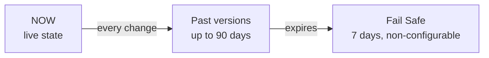

# L105 — What is Time Travel?

> **Author:** Prem Vishnoi &lt;pvishnoi&commat;avilx.com&gt;
> **Section:** 14 — Time Travel
> **Duration:** 8:00

## Prereqs

None beyond a Snowflake role with `USAGE` on a database and
`SELECT` on a table.

## Lecture

Snowflake is the only major warehouse that ships **Time Travel**
as a first-class, table-level feature. Every table, schema, and
database in a Snowflake account is automatically versioned for
`DATA_RETENTION_TIME_IN_DAYS` (default 1, up to 90 on
Enterprise+). You can `SELECT`, `CLONE`, or `UNDROP` those
versions without thinking about backups, snapshots, or
point-in-time replication.

### Why it exists

- **Human error is the #1 cause of data loss.** A bad
  `UPDATE`/`DELETE`, an over-eager `TRUNCATE`, a "I thought I
  was in the dev database" `DROP` — all recoverable in seconds.
- **Auditing and comparison.** "What did the customer table
  look like on Monday?" is a one-line query, not a restore
  from a backup.
- **Cheap clones of past states.** `CREATE TABLE clone AS
  SELECT ... AT | BEFORE ...` is a zero-copy clone of the
  historical state.

### The mental model

- **Live state.** What you `SELECT` today.
- **Time Travel window.** Configurable per table via
  `DATA_RETENTION_TIME_IN_DAYS`. Default 1 day.
- **Fail Safe.** After Time Travel ends, Snowflake holds the
  data for 7 more days in a non-configurable safety net.
  Fail Safe data is **only** accessible by Snowflake Support
  (covered in section 15).

### Three ways to anchor a query in the past

| Clause | What you specify | Example |
|---|---|---|
| `AT (TIMESTAMP => '<ts>')` | Absolute UTC timestamp | `AT (TIMESTAMP => '2024-06-15 09:00:00'::TIMESTAMP)` |
| `AT (OFFSET => -<n> <unit>)` | Relative offset from now | `AT (OFFSET => -60 MINUTES)` |
| `BEFORE (STATEMENT => '<id>')` | The state just before a specific query | `BEFORE (STATEMENT => '01a3-...'::STRING)` |

`BEFORE (STATEMENT => ...)` is the surgical tool: give it the
query ID of the bad statement, and the resulting query returns
the table as it was just before that statement ran.

### What you can do with a past state

- `SELECT` — read the past state.
- `CREATE TABLE ... CLONE ... AT | BEFORE ...` — zero-copy clone
  (L117 covers cloning in detail).
- `UNDROP` — recover a dropped object.
- `CREATE TABLE ... AS SELECT ... AT | BEFORE ...` — restore to
  a new table.
- `INSERT` from a past version into the current table — but
  this is **not** recommended; cloning is cheaper and clearer.

### Edition limits

| Edition | Max `DATA_RETENTION_TIME_IN_DAYS` |
|---|---|
| Standard | 1 |
| Enterprise | 90 |
| Business Critical & above | 90 |

Standard users get the default 1-day window — plenty for "I
broke it an hour ago", not enough for "what did this look like
last quarter?". If you need more, upgrade or use Snowflake
Marketplace data shares (which retain their own history).

## Key takeaways

- Time Travel = automatic, table-level version history.
- Default 1 day, configurable up to 90 days.
- Query past states with `AT | BEFORE`; clone them with
  `CREATE TABLE ... CLONE ... AT | BEFORE ...`.

## What's next

In **L106 — Using time travel** we work through the three
`AT | BEFORE` forms with concrete queries.
