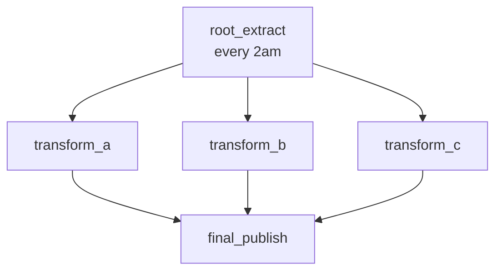

# L140 — Creating trees of tasks

> **Author:** Prem Vishnoi &lt;pvishnoi@avilx.com&gt;
> **Section:** 20 — Extra topics
> **Sub-group:** 1. Tasks
> **Duration:** 5:00

## Prereqs

L139 — Understand tree of tasks.

## Key terms

- **Task graph** — the same idea as "task tree"; Snowflake uses
  "graph" to allow fan-out.
- **Fan-out / fan-in** — one root task that triggers *multiple*
  children in parallel; those children feed into one final
  task.
- **Idempotent body** — the property that running a task twice
  has the same effect as running it once. Critical for
  retries.

## Lecture

Welcome back. Today we build a real production task tree. The
end-to-end pattern is "extract → transform in parallel → publish".
The parallel step is the interesting part: Snowflake supports
fan-out from a single root into multiple children, and a
fan-in back into a final task. No Airflow required.

### The pattern: extract → fan-out → fan-in → publish

```text
                root_extract
               /      |      \
              ▼       ▼       ▼
         transform_a  transform_b  transform_c
              \       |       /
               ▼      ▼      ▼
                final_publish
```

Five tasks. Two of them (`transform_a`, `transform_b`,
`transform_c`) run in parallel after the root. The
`final_publish` waits for *all* of them.

### The SQL

```sql
-- 1. Root
CREATE TASK root_extract
  WAREHOUSE = etl_wh
  SCHEDULE  = 'USING CRON 0 2 * * * UTC'
AS INSERT INTO raw_events SELECT ...;

-- 2. Three parallel transforms
CREATE TASK transform_a
  WAREHOUSE = etl_wh
  AFTER     root_extract
AS INSERT INTO marts.fact_orders SELECT ... FROM raw_events WHERE type = 'order';

CREATE TASK transform_b
  WAREHOUSE = etl_wh
  AFTER     root_extract
AS INSERT INTO marts.fact_returns SELECT ... FROM raw_events WHERE type = 'return';

CREATE TASK transform_c
  WAREHOUSE = etl_wh
  AFTER     root_extract
AS INSERT INTO marts.dim_customer SELECT ... FROM raw_events WHERE type = 'customer';

-- 3. Fan-in final
CREATE TASK final_publish
  WAREHOUSE = etl_wh
  AFTER transform_a, transform_b, transform_c
AS CALL sp_publish_to_consumer();
```

The `AFTER transform_a, transform_b, transform_c` line is the
fan-in: `final_publish` waits for *all three* to succeed before
running.

### The orchestration in one view



The graph is acyclic. Snowflake's scheduler walks it
topologically: `root_extract` fires, then any/all of the
transforms whose predecessors succeeded, then `final_publish` if
all of them succeeded.

### Idempotency: the design discipline

If `transform_a` succeeds but `transform_b` fails, the next run
of the chain re-tries `transform_b` *and* `transform_a` (because
the root is re-fired). If your task body is not idempotent,
`transform_a` will double-insert.

The fix is to make tasks idempotent. Two common patterns:

- **Use a unique key + merge.** `MERGE INTO target USING ... ON
  key = ...` — duplicates overwrite, not append.
- **Use a stream offset** (L152). Each run consumes only new
  changes; previous runs are no-ops.

### Resume order (recap)

```sql
-- Bottom-up
ALTER TASK final_publish RESUME;
ALTER TASK transform_a    RESUME;
ALTER TASK transform_b    RESUME;
ALTER TASK transform_c    RESUME;
ALTER TASK root_extract   RESUME;
```

## Hands-on

Build the 5-task tree above in a sandbox schema. Use
`compute_wh` for every task. Suspend, then resume bottom-up.
Inspect `TASK_HISTORY` to confirm the dependencies are correct.

## Key takeaways

- A task graph supports fan-out (one root, many children) and
  fan-in (many predecessors, one final).
- Resume tasks bottom-up.
- Idempotency is a design discipline, not a Snowflake setting.
- Use streams (L152) when idempotency is hard to achieve by hand.

## What's next

L141 — Calling a stored procedure. We put multi-statement logic
inside a stored procedure so the task body isn't a single SQL
expression.