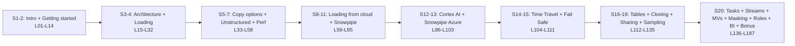

# L187 — Bonus lecture

> **Author:** Prem Vishnoi &lt;pvishnoi@avilx.com&gt;
> **Section:** 20 — Extra topics
> **Sub-group:** 7. Best Practices & Bonus
> **Duration:** 5:00

## Prereqs

L186 — Retention period. This is the final lecture of the
course; everything from L01 to L186 is fair game.

## Key terms

- **The full course arc** — 187 lectures, 19 published
  sections, 1 "extra topics" section.
- **Where to go from here** — Snowpark, dynamic tables,
  Snowflake Cortex, and the Marketplace as next steps.

## Lecture

Welcome to the last lecture. By completing L186 you've
finished the entire course. Today's lecture is a brief
recap of the full arc, plus pointers to where to go next.

### The arc, in one view

Seven sub-arcs. The course is built so each arc ends with a
"complete picture" of a layer of the Snowflake platform:

1. **Foundation** (S1–2): sign up, run a query.
2. **Architecture + loading** (S3–4): how data gets in.
3. **Copy options + unstructured + performance** (S5–7):
   fast, correct loads.
4. **Cloud loading + Snowpipe** (S8–11): S3, Azure, GCS,
   continuous loading.
5. **Cortex AI + Snowpipe Azure** (S12–13): the modern
   AI surface.
6. **Time Travel + Fail Safe** (S14–15): the safety net.
7. **Tables + Cloning + Sharing + Sampling + Extra** (S16–20):
   the operational primitives, and the deep dives on tasks,
   streams, MVs, masking, RBAC, BI, and best practices.

### The three superpowers

If you have to summarize the course in three sentences:

1. **Snowflake separates storage from compute.** You scale
   each independently; you pay for what you use.
2. **Zero-copy cloning + data sharing let you move and
   distribute data for free.** Cloning is metadata;
   sharing is metadata. The bytes never move.
3. **Tasks + streams + materialized views let you build
   pipelines natively.** No Airflow, no external scheduler.

### Where to go next

- **Snowpark** — Python and Java APIs that let you push
  computation to Snowflake's elastic engine. The
  natural extension of `CREATE PROCEDURE ... LANGUAGE
  PYTHON`.
- **Dynamic tables** — the modern alternative to
  materialized views. Supports joins, window functions,
  explicit refresh scheduling.
- **Snowflake Cortex** — generative AI functions directly
  inside Snowflake. The L86–L99 series introduced them.
- **The Marketplace** — already covered in L181; worth
  exploring beyond the course material.
- **Iceberg tables** — open-table-format support; lets
  Snowflake query data stored externally as Iceberg.
- **Geospatial** — `GEOGRAPHY` and `GEOMETRY` types and
  the spatial functions.

### The most-asked question

After every cohort, the most-asked question is "what
should I do first in my own account?". The answer:

1. Create the role hierarchy (L171).
2. Set up a resource monitor (L185).
3. Set auto-suspend on every warehouse to 60s (L183).
4. Build the operational dashboard from L185.
5. Clone your production database daily to a `dev_clone`
   (L118).

Five steps. After that, you have a well-governed,
monitored, and documented Snowflake account. The rest is
just features on top.

### Thank you

If you've made it to L187, you've seen every primitive
Snowflake offers. The course was designed to be runnable
end-to-end on a free trial account; the same patterns
work at petabyte scale.

Best of luck with your Snowflake work.

— Prem

## Hands-on

There is no hands-on for L187. The final exercise is in
the assignments folder: design and implement a
production-grade data pipeline in your own Snowflake
account, using every primitive from L01 to L186.

## Key takeaways

- The course arc: foundation → architecture → loading →
  performance → safety net → operations.
- The three superpowers: separation of storage and
  compute, zero-copy clones and shares, native
  pipelines.
- The first-five steps: roles, monitor, auto-suspend,
  ops dashboard, daily dev clone.
- Where to go next: Snowpark, dynamic tables, Cortex,
  Iceberg, geospatial.

## What's next

Nothing — this is the last lecture of the course. If you
want to keep going, the next step is one of: Snowpark,
dynamic tables, or a deep dive on a single workload you
own. The primitives are now all under your belt.
