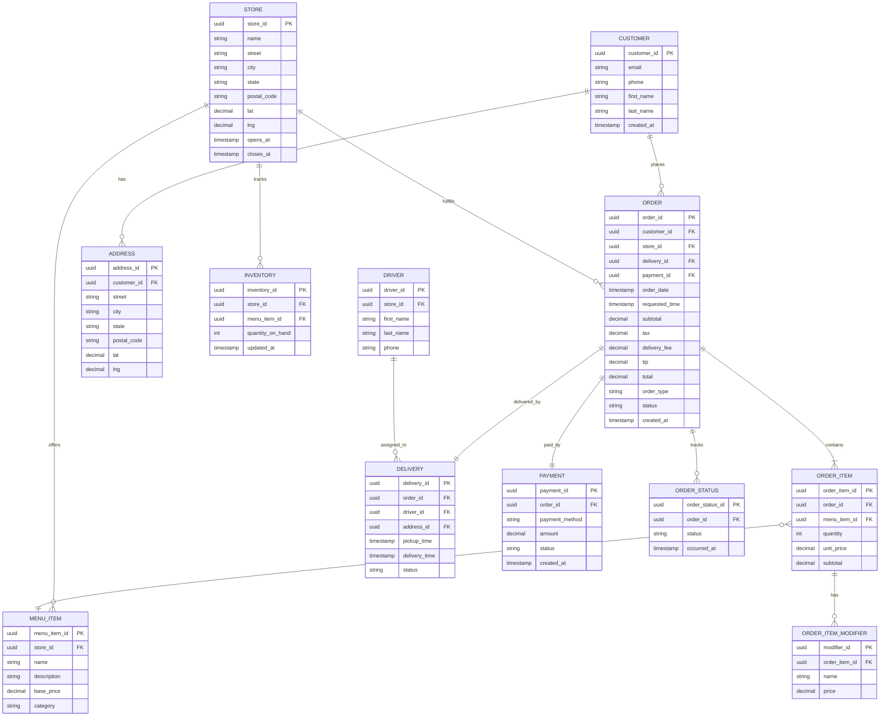

# 04 — Pizza Ordering DB Schema

> **Lesson 4 of 7 — Technical Questions for SAs** · ~25 min

A real-world database schema design problem: design the
schema for a pizza ordering system (think Domino's) with
100k daily orders, 500 stores, 10k menu items, customer
accounts, order history, and real-time order tracking.
Includes ER diagram (mermaid), table definitions, indexes,
and partitioning strategy.

---

## 1. The problem statement

> *"Design the database schema for a pizza ordering
> system (think Domino's) with 100k daily orders, 500
> stores, 10k menu items, customer accounts, order
> history, and real-time order tracking. Customers can
> place orders via web, mobile app, or phone. Each
> order has a payment, a delivery (or pickup), and a
> real-time status (received, in preparation, in oven,
> out for delivery, delivered)."*

The scale: 100k orders/day × 365 days = ~36M orders/
year. At 5 years, that's 180M orders. The schema needs
to handle 180M orders, 500 stores, 10k menu items, and
~10M customer accounts.

The hot path queries:

1. **Get the live order status** (real-time, every few
   seconds, by order_id).
2. **Place a new order** (writes that need to be
   transactional — payment, order, items, status).
3. **Get a customer's order history** (reads, with
   pagination, by customer_id).
4. **Get a store's current orders** (reads, for the
   store's kitchen display, by store_id + status).
5. **Get menu items for a store** (reads, with
   store-specific pricing, by store_id).

The 5 hot path queries shape the schema.

---

## 2. The clarifying questions (3 minutes)

Before designing, ask:

1. **What's the consistency requirement?** Order
   placement needs strong consistency (payment, order,
   items, status must be atomic). Order history reads
   can be eventually consistent.
2. **What's the real-time tracking requirement?** Real-
   time means sub-second freshness for the order status,
   which suggests a low-latency store (Redis or
   DynamoDB) on top of the OLTP database.
3. **What's the analytics requirement?** Separate
   reporting database (data warehouse) for analytics, or
   serve reports from the OLTP database? Most likely
   separate.
4. **What's the international scope?** Single region
   initially, or multi-region from day 1? Multi-region
   affects the schema (e.g., customer_id needs to be
   globally unique).
5. **What's the menu complexity?** Items have
   modifiers (size, toppings), combos (2 pizzas +
   breadsticks), time-based pricing (lunch vs dinner).
   The schema needs to handle this complexity.

---

## 3. The entity-relationship diagram



The ER diagram has 12 entities. The 4 main entities are
**Customer**, **Store**, **Order**, and **MenuItem**.
The 8 supporting entities model the order workflow
(items, modifiers, delivery, payment, status history,
drivers, addresses, inventory).

---

## 4. The 5 hot path queries, mapped to schema choices

| # | Hot path query | Schema choice |
|---|---|---|
| 1 | **Get the live order status** | `ORDER.status` for the current status (cached in Redis); `ORDER_STATUS` table for the history |
| 2 | **Place a new order** | Transactional INSERT into `ORDER`, `ORDER_ITEM`, `PAYMENT`, `ORDER_STATUS` (the first "received" status) |
| 3 | **Get a customer's order history** | Index on `ORDER.customer_id` + `ORDER.order_date DESC` |
| 4 | **Get a store's current orders** | Index on `ORDER.store_id` + `ORDER.status` |
| 5 | **Get menu items for a store** | Composite index on `MENU_ITEM.store_id` + `MENU_ITEM.category` |

The 5 choices are the *performance* decisions that shape
the schema. The hot path queries are the *why* behind
each index choice.

---

## 5. The table definitions

The 5 most important tables, in detail:

### CUSTOMER

```sql
CREATE TABLE customer (
  customer_id    UUID PRIMARY KEY,
  email          VARCHAR(255) UNIQUE NOT NULL,
  phone          VARCHAR(20),
  first_name     VARCHAR(100) NOT NULL,
  last_name      VARCHAR(100) NOT NULL,
  password_hash  VARCHAR(255) NOT NULL,
  created_at     TIMESTAMP NOT NULL DEFAULT NOW(),
  updated_at     TIMESTAMP NOT NULL DEFAULT NOW()
);

CREATE INDEX idx_customer_email ON customer (email);
CREATE INDEX idx_customer_phone ON customer (phone);
```

The `email` and `phone` are indexed because they're the
two common lookup paths (login, password reset).

### ORDER

```sql
CREATE TABLE "order" (
  order_id          UUID PRIMARY KEY,
  customer_id       UUID NOT NULL REFERENCES customer(customer_id),
  store_id          UUID NOT NULL REFERENCES store(store_id),
  delivery_id       UUID REFERENCES delivery(delivery_id),
  payment_id        UUID REFERENCES payment(payment_id),
  order_date        TIMESTAMP NOT NULL DEFAULT NOW(),
  requested_time    TIMESTAMP,
  subtotal          DECIMAL(10,2) NOT NULL,
  tax               DECIMAL(10,2) NOT NULL,
  delivery_fee      DECIMAL(10,2) DEFAULT 0,
  tip               DECIMAL(10,2) DEFAULT 0,
  total             DECIMAL(10,2) NOT NULL,
  order_type        VARCHAR(20) NOT NULL,  -- 'delivery', 'pickup'
  status            VARCHAR(30) NOT NULL,  -- current status
  created_at        TIMESTAMP NOT NULL DEFAULT NOW(),
  updated_at        TIMESTAMP NOT NULL DEFAULT NOW()
);

CREATE INDEX idx_order_customer ON "order" (customer_id, order_date DESC);
CREATE INDEX idx_order_store_status ON "order" (store_id, status);
CREATE INDEX idx_order_status_updated ON "order" (status, updated_at);
```

The 3 indexes are the 3 hot path queries:

- `idx_order_customer` — customer's order history.
- `idx_order_store_status` — store's current orders.
- `idx_order_status_updated` — order status lookup by
  recent updates (for the kitchen display).

### ORDER_ITEM

```sql
CREATE TABLE order_item (
  order_item_id     UUID PRIMARY KEY,
  order_id          UUID NOT NULL REFERENCES "order"(order_id),
  menu_item_id      UUID NOT NULL REFERENCES menu_item(menu_item_id),
  quantity          INT NOT NULL,
  unit_price        DECIMAL(10,2) NOT NULL,
  subtotal          DECIMAL(10,2) NOT NULL
);

CREATE INDEX idx_order_item_order ON order_item (order_id);
```

The `order_item` table is a classic line-item table. The
index on `order_id` is for the common query "get all
items for an order."

### ORDER_STATUS

```sql
CREATE TABLE order_status (
  order_status_id   UUID PRIMARY KEY,
  order_id          UUID NOT NULL REFERENCES "order"(order_id),
  status            VARCHAR(30) NOT NULL,
  occurred_at       TIMESTAMP NOT NULL DEFAULT NOW()
);

CREATE INDEX idx_order_status_order ON order_status (order_id, occurred_at);
```

The `order_status` table is the *history* of the order's
status transitions. The `idx_order_status_order` is for
the query "get the status history for an order."

### MENU_ITEM

```sql
CREATE TABLE menu_item (
  menu_item_id      UUID PRIMARY KEY,
  store_id          UUID NOT NULL REFERENCES store(store_id),
  name              VARCHAR(255) NOT NULL,
  description       TEXT,
  base_price        DECIMAL(10,2) NOT NULL,
  category          VARCHAR(50) NOT NULL,
  is_available      BOOLEAN NOT NULL DEFAULT TRUE,
  created_at        TIMESTAMP NOT NULL DEFAULT NOW(),
  updated_at        TIMESTAMP NOT NULL DEFAULT NOW()
);

CREATE INDEX idx_menu_item_store_category ON menu_item (store_id, category);
```

The composite index `(store_id, category)` supports the
hot path query "get menu items for a store, optionally
filtered by category."

---

## 6. The partitioning strategy

For the `ORDER` table at 180M rows, partition by
`order_date` (monthly partitions):

```sql
CREATE TABLE "order" (
  ...
) PARTITION BY RANGE (order_date);

CREATE TABLE order_2026_01 PARTITION OF "order"
  FOR VALUES FROM ('2026-01-01') TO ('2026-02-01');
CREATE TABLE order_2026_02 PARTITION OF "order"
  FOR VALUES FROM ('2026-02-01') TO ('2026-03-01');
-- etc.
```

The 3 benefits of partitioning:

1. **Performance.** Queries with a date range filter
   (e.g., "orders in the last 7 days") only scan the
   relevant partitions, not the whole table.
2. **Maintenance.** Old partitions can be archived or
   dropped without affecting the active data.
3. **Cost.** In cloud databases (e.g., Aurora, Cloud
   SQL), partitions can be moved to cheaper storage
   tiers.

The partition key (`order_date`) is chosen because most
queries have a date filter and because old orders are
read-rarely.

---

## 7. The sharding strategy (for > 1 year out)

At 180M rows, partitioning is sufficient. At 1B+ rows
(5-10 years out), the schema would need sharding by
`customer_id` or by `store_id`. The choice depends on the
hot path:

- **Shard by `customer_id`** — good for "get customer
  history" queries, which are scoped to one customer.
- **Shard by `store_id`** — good for "get store's current
  orders" queries, which are scoped to one store.

The senior SA signals "I've thought about scale" by
naming sharding even if the current scale doesn't
require it.

---

## 8. The real-time order tracking

Real-time tracking requires a low-latency lookup for the
order's current status. Two patterns:

### Pattern 1: Cache the current status in Redis

```
GET order:{order_id}:status
```

The `ORDER.status` column is the source of truth in
PostgreSQL. Redis is a cache, populated on write and
invalidated when the status changes. The kitchen display
and the customer-facing order tracker read from Redis.

### Pattern 2: Use DynamoDB for the status

A separate DynamoDB table with `order_id` as the key and
the current status as the value. Writes from the order
workflow update DynamoDB; reads from the kitchen
display and the customer tracker read DynamoDB
directly. Latency is single-digit milliseconds.

Pattern 2 is more operationally complex but gives
stronger consistency guarantees. Pattern 1 is simpler
but eventually consistent.

---

## 9. The 5 things the schema signals

If you design this schema in an interview, the 5 things
you signal:

1. **You think in entities and relationships.** The ER
   diagram is the *spine* of the design.
2. **You center on hot path queries.** The 5 hot path
   queries drive the index choices.
3. **You think about scale.** The partitioning strategy
   is the *scale* signal.
4. **You think about consistency.** The transactional
   INSERT for order placement, and the real-time
   tracking cache, are the *consistency* signals.
5. **You think about the operational side.** The order
   status history (separate from the current status) is
   the *operational* signal — for support, for
   analytics, for dispute resolution.

The 5 signals are the senior SA move. A junior SA designs
a schema with tables and columns but no indexes, no
partitioning, and no consistency thinking.

---

## Try it

For a different scenario (e.g., "design the schema for a
ride-sharing service like Uber with 10M rides/day, 500k
drivers, real-time driver locations, and ride history"),
apply the same 5-step structure:

1. **Identify the hot path queries** (e.g., "get
   available drivers near a pickup location,"
   "place a ride," "get ride history").
2. **Design the ER diagram** (with the 8-12 main
   entities).
3. **Define the table definitions** (with the indexes
   for the hot path queries).
4. **Identify the partitioning strategy** (e.g.,
   partition rides by `ride_date`).
5. **Identify the real-time requirements** (e.g., real-
   time driver locations require Redis or DynamoDB).

For more system design depth on schema design, see
`../system_design/07_message_queue/` and
`../system_design/09_uber_eats/`.
