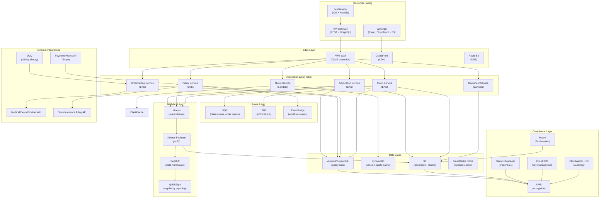

# 05 — Self-Serve Insurance Product Architecture

> **Lesson 5 of 7 — Technical Questions for SAs** · ~25 min

A real-world architecture design problem: design a self-
serve insurance product where customers pick coverage, get
a quote, buy a policy, file claims — all online. 100k
policies, 10k claims/month, regulatory requirements (PCI,
HIPAA-adjacent, state-level compliance). Includes full
architecture diagram (mermaid), key service choices with
rationale, data flow, security model, scalability, and DR.

---

## 1. The problem statement

> *"Design a self-serve insurance product: customers pick
> coverage, get a quote, buy a policy, and file claims —
> all online. The product starts with term life and auto
> insurance. Expected scale: 100k active policies, 10k
> claims/month, growing 5x over 3 years. Regulatory
> requirements: PCI-DSS for card data, HIPAA-adjacent for
> health data (term life requires medical exam results),
> state-level insurance regulations (each state has its
> own filing and approval process), and GDPR/CCPA for
> privacy. The team is 8 engineers, with 2 SREs. The
> budget is constrained — they want to use managed
> services where possible."*

The scale and regulatory requirements make this a serious
architecture problem. The candidate needs to:

- Model the customer journey (quote → buy → policy →
  claim).
- Choose services that handle PCI-DSS, HIPAA-adjacent,
  and state-level compliance.
- Design for scale (100k policies, 10k claims/month
  today; 5x in 3 years).
- Address DR (insurance data is highly regulated and
  must not be lost).
- Operate within a small team (8 engineers, 2 SREs).

---

## 2. The clarifying questions (5 minutes)

Before designing, ask:

1. **What's the regulatory frame?** (PCI-DSS for cards,
   state-level insurance regulations, possibly HIPAA-adjacent
   for medical data, GDPR/CCPA for privacy.)
2. **What's the latency requirement for quote generation?**
   (Sub-second to keep customers in the funnel. If quote
   generation takes 30 seconds, the customer abandons.)
3. **What's the data residency requirement?** (US data
   residency, multi-state. EU residency if expanding to EU.)
4. **What's the claim processing latency?** (Real-time
   for claim submission, 24-72 hours for adjudication.)
5. **What's the analytics requirement?** (Regulatory
   reporting, claims analytics, fraud detection. Likely a
   separate analytics pipeline.)

---

## 3. The customer journey

The 5 stages:

1. **Quote.** Customer enters basic info (age, driving
   history, desired coverage) and gets a quote.
2. **Application.** Customer completes the application,
   provides detailed info, and (for term life) completes
   a medical exam.
3. **Underwriting.** Underwriting engine evaluates the
   risk and approves/declines the application.
4. **Policy issuance.** If approved, the policy is
   issued, payment is processed, and the policy
   document is delivered.
5. **Claim.** Customer files a claim, claim is
   processed, payment is issued.

Each stage has different latency requirements and
different regulatory requirements:

- **Quote** — sub-second latency, no PII storage
  required (just the quote parameters).
- **Application** — minutes latency, requires PII
  storage with encryption at rest.
- **Underwriting** — minutes-to-hours latency,
  requires access to medical data (HIPAA-adjacent).
- **Policy issuance** — minutes latency, requires
  PCI-DSS for payment, requires regulatory state
  filing.
- **Claim** — minutes for submission, hours for
  adjudication, requires photo upload and adjuster
  review.

---

## 4. The architecture diagram



The architecture has 7 layers:

1. **Customer-facing** — web app, mobile app, API
   gateway.
2. **Edge layer** — WAF, CloudFront, Route 53.
3. **Application layer** — 6 services (quote,
   application, underwriting, policy, claim, document).
4. **Async layer** — SQS, SNS, EventBridge.
5. **Data layer** — Aurora, DynamoDB, S3, ElastiCache.
6. **Compliance layer** — KMS, Secrets Manager,
   CloudHSM, Macie, CloudWatch + S3 for audit log.
7. **Analytics layer** — Kinesis, Firehose, Redshift,
   QuickSight.

Plus external integrations: medical exam provider, DMV,
payment processor, state insurance filing.

---

## 5. The key service choices (with rationale)

### Compute choice: EKS for most services, Lambda for quote/document

**EKS for `Application`, `Underwriting`, `Policy`,
`Claim`.** These services are long-running, stateful,
and have complex runtime requirements (Python libraries,
stateful connections to databases). EKS gives the team
full control with managed orchestration.

**Lambda for `Quote` and `Document`.** The quote service
is spiky (most queries during business hours, almost
none overnight) and short-lived. Lambda auto-scales and
costs near-zero when idle. Same for document service
(which handles S3 events).

The mixed compute choice is the senior SA move: match
the compute model to the workload, not a one-size-fits-
all approach.

### Database choice: Aurora PostgreSQL for relational, DynamoDB for non-relational

**Aurora PostgreSQL** for the core policy, claim, and
customer data. ACID, strong consistency, mature tooling,
familiar to most engineers. Aurora's serverless option
gives the team auto-scaling without the operational
burden.

**DynamoDB** for the quote cache and the session data.
Single-digit-millisecond latency, horizontal scalability,
no ops. The quote cache is read-heavy, and DynamoDB's
latency is critical for the sub-second quote
requirement.

The dual-database choice is the senior SA move: each
workload gets the right tool.

### Storage choice: S3 for documents, ElastiCache for sessions

**S3** for policy documents, claim photos, and other
unstructured data. Cheap, durable, infinitely scalable.

**ElastiCache Redis** for session data and the quote
cache. Sub-millisecond latency, managed by AWS.

### Networking choice: VPC with public/private subnet, WAF, CloudFront

**VPC** with public subnets (for the load balancers) and
private subnets (for the application services and
databases). The application services and databases are
not directly accessible from the internet.

**WAF** for DDoS protection and SQL injection
prevention.

**CloudFront** for global CDN of the static assets.

The networking choice is the standard 3-tier web
architecture, adapted for the regulatory requirements.

---

## 6. The data flow (5 critical paths)

### Path 1: Quote generation (sub-second latency)

```
Customer → CloudFront → API Gateway → Quote Service
                                    ↓
                              DynamoDB (cache)
                                    ↓
                              ElastiCache (hot data)
                                    ↓
                          ← Quote response to customer
```

The quote service reads from DynamoDB (cache) and
ElastiCache (session data). If the cache misses, it
recomputes from Aurora. Total latency: <100ms.

### Path 2: Policy issuance (minutes latency)

```
Customer → CloudFront → API Gateway → Application Service
                                          ↓
                                    Underwriting Service
                                          ↓
                                    Medical Exam API
                                          ↓
                                    Approval / Decline
                                          ↓
                                    Policy Service
                                          ↓
                                    Payment Processor
                                          ↓
                                    State Filing API
                                          ↓
                                    Aurora (persist)
```

The policy issuance is the most regulated flow. It
involves the underwriting engine, the medical exam
provider, the payment processor, and the state filing
API. Each step is transactional; failure at any step
triggers rollback.

### Path 3: Claim filing (minutes for submission, hours for adjudication)

```
Customer → CloudFront → API Gateway → Claim Service
                                      ↓
                                    S3 (photos upload)
                                      ↓
                                    SNS (notify adjuster)
                                      ↓
                                    SQS (queue for adjuster)
                                      ↓
                                    Manual review
                                      ↓
                                    Aurora (claim status)
```

The claim filing is async. The customer gets immediate
confirmation; the adjudication happens in hours via a
queue of claims for the adjuster.

### Path 4: Underwriting (minutes-to-hours latency)

```
Application → Underwriting Service → Medical Exam API
                                          ↓
                                    Risk evaluation
                                          ↓
                                    Aurora (decision)
                                          ↓
                                    EventBridge (notify)
```

The underwriting is a stateful workflow that can take
minutes-to-hours (waiting on medical exam results).
EventBridge handles the workflow events.

### Path 5: Analytics (real-time + batch)

```
All services → Kinesis (events)
                  ↓
              Kinesis Firehose (to S3 + Redshift)
                  ↓
              Redshift (data warehouse)
                  ↓
              QuickSight (regulatory reporting)
```

The analytics layer captures all events from the
application services. Regulatory reporting is via
QuickSight dashboards. Fraud detection is via Redshift
SQL queries.

---

## 7. The security model

The security model has 5 layers:

### Layer 1: Identity (IAM + Cognito)

**Cognito** for customer identity (sign-up, sign-in,
password reset, MFA). **IAM roles** for the application
services and the SREs. Each role has the *minimum*
permissions needed.

### Layer 2: Encryption at rest (KMS + CloudHSM)

**KMS** for most encryption needs (Aurora, S3, EBS).
**CloudHSM** for the most sensitive keys (the master
encryption key for PII data). The CloudHSM choice is the
*senior SA* move — the HSM provides FIPS 140-2 Level 3
compliance, which is required for some state-level
insurance regulations.

### Layer 3: Encryption in transit (TLS 1.3)

All API traffic is TLS 1.3. Internal service-to-service
communication uses TLS 1.3 via service mesh (Istio or
App Mesh).

### Layer 4: Network isolation (VPC + private subnets)

The application services and databases run in private
subnets, not accessible from the internet. The only
public-facing components are the API Gateway, CloudFront,
and the web app / mobile app.

### Layer 5: Audit and monitoring (CloudWatch + S3)

All API calls, all database queries, all access to PII
data is logged. Logs go to CloudWatch and S3 for long-
term retention. **Macie** scans S3 for unencrypted PII
data and flags any findings.

The 5 layers are the senior SA move. The candidate who
designs with security as an afterthought will fail the
round; the candidate who designs with security as a
*foundation* passes.

---

## 8. The compliance posture

The 3 most important compliance frameworks:

### PCI-DSS for card data

**Stripe** is used for payment processing. Card data
*never touches* the insurance company's infrastructure —
Stripe is PCI-DSS Level 1, and the insurance company is
in scope only for the *non-card* data (the customer's
name, billing address, amount). This is the senior SA
move: use a payment processor to outsource the PCI-
DSS scope.

### HIPAA-adjacent for medical data

The medical exam data is the trickiest. The medical exam
provider returns the data via a HIPAA-compliant API.
The data is encrypted at rest with KMS and accessed only
by the underwriting service. Access is logged. The
insurance company is *not* a HIPAA-covered entity, but
the data is treated with HIPAA-like controls as a
precaution.

### State-level insurance regulation

Each state has its own filing requirements. The state
filing API is called when a policy is issued. The data
returned by the API is persisted in Aurora with a
`state_filing_id` link. The regulatory reporting
(QuickSight dashboards) provides the per-state reports
needed for compliance.

---

## 9. The scalability story

The current scale: 100k policies, 10k claims/month. The
5x growth in 3 years: 500k policies, 50k claims/month.

The architecture scales as follows:

| Component | Current scale | 5x scale | How it scales |
|---|---|---|---|
| **API Gateway** | 1k requests/sec | 5k requests/sec | API Gateway auto-scales |
| **Application services (EKS)** | 10 pods | 50 pods | HPA (Horizontal Pod Autoscaler) |
| **Aurora** | 2 db.r6g.large | 4-8 db.r6g.2xlarge | Aurora serverless auto-scales compute |
| **DynamoDB** | On-demand | On-demand | DynamoDB auto-scales |
| **S3** | N/A | N/A | S3 scales infinitely |
| **Redshift** | 2 nodes | 4-8 nodes | Redshift elastic resize |

The architecture is mostly *horizontally scalable* —
every component has an auto-scaling story. The bottleneck
is Aurora, but Aurora Serverless handles the auto-
scaling of compute.

---

## 10. The disaster recovery posture

DR for insurance data is critical. The RPO (Recovery
Point Objective) and RTO (Recovery Time Objective):

| Component | RPO | RTO | How |
|---|---|---|---|
| **Aurora** | 5 minutes | 30 minutes | Multi-AZ with automated failover; cross-region read replica |
| **DynamoDB** | 0 (point-in-time) | 5 minutes | DynamoDB global tables (multi-region replication) |
| **S3** | 0 (cross-region replication) | 5 minutes | S3 cross-region replication |
| **Application services** | N/A | 15 minutes | Multi-AZ EKS, automatic pod rescheduling |

The cross-region replication for Aurora, DynamoDB, and
S3 is the senior SA move. The candidate who designs
without cross-region DR will fail the round; insurance
data cannot be lost.

For the worst case (full region outage), the team has
a runbook to fail over to the secondary region. The
RTO for full-region failover is 4-6 hours, which is
acceptable for this workload.

---

## 11. The cost story (rough, monthly)

| Component | Cost (monthly, current scale) |
|---|---|
| **EKS** (3 clusters, ~30 pods) | $3,000 |
| **Aurora** (2 db.r6g.large) | $2,500 |
| **DynamoDB** (on-demand, 10M reads, 1M writes/day) | $1,500 |
| **S3** (1 TB) | $30 |
| **ElastiCache** (1 cache.r6g.large) | $200 |
| **Lambda** (10M invocations) | $200 |
| **API Gateway** (10M requests) | $35 |
| **CloudFront** (1 TB transfer) | $100 |
| **KMS + Secrets Manager + Macie** | $500 |
| **CloudWatch + S3 audit logs** | $1,500 |
| **QuickSight** (10 users) | $300 |
| **Total** | **~$10,000/month** |

The cost is reasonable for the workload. At 5x scale,
the cost scales roughly linearly to ~$40-50k/month,
which is well within budget for an insurance product.

---

## 12. The 5 signals the architecture sends

If you design this architecture in an interview, the 5
things you signal:

1. **You center the customer journey.** The 5 stages
   (quote, application, underwriting, policy, claim)
   drive the service decomposition.
2. **You think about regulatory compliance.** PCI, HIPAA-
   adjacent, state filing, GDPR/CCPA — all addressed.
3. **You think about operational efficiency.** The
   small team (8 engineers, 2 SREs) gets a managed-
   services-heavy architecture that minimizes ops burden.
4. **You think about scale.** The 5x growth in 3 years
   is accommodated by horizontal scalability and Aurora
   Serverless.
5. **You think about DR.** The cross-region replication
   is the *DR* signal.

The 5 signals are the senior SA move. A junior SA
designs a generic web application without the
regulatory, compliance, or DR considerations.

---

## Try it

For a different scenario (e.g., "design a self-serve
healthcare marketplace where patients book appointments
with doctors, 100k active patients, 10k monthly
appointments, HIPAA compliance"), apply the same 11-step
structure:

1. **Clarifying questions.**
2. **Customer journey.**
3. **Architecture diagram (mermaid).**
4. **Key service choices with rationale.**
5. **Data flow.**
6. **Security model.**
7. **Compliance posture.**
8. **Scalability story.**
9. **DR posture.**
10. **Cost story.**
11. **The 5 signals.**

The investment is 2-3 hours. The return is the
architecture round of the interview, and the ability to
design for any regulated-workload scenario in the future.
