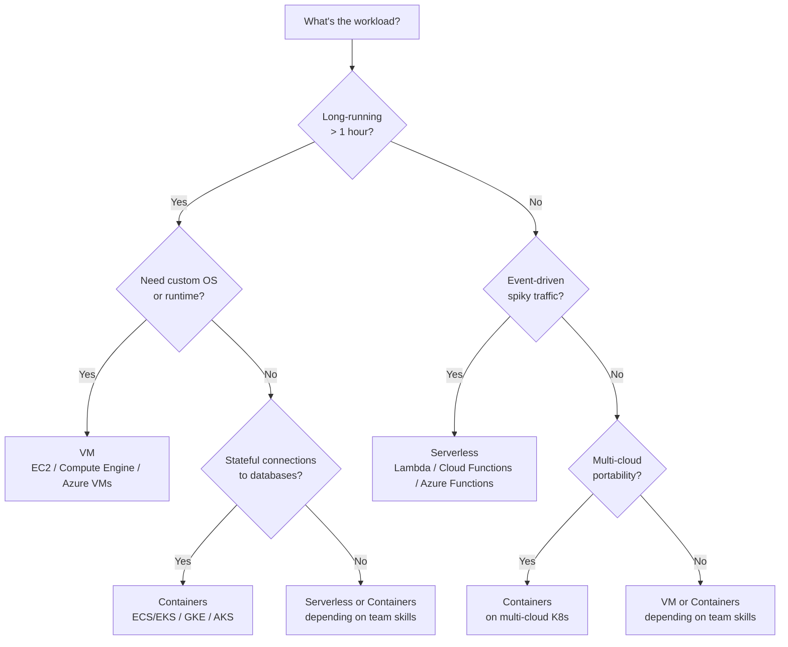
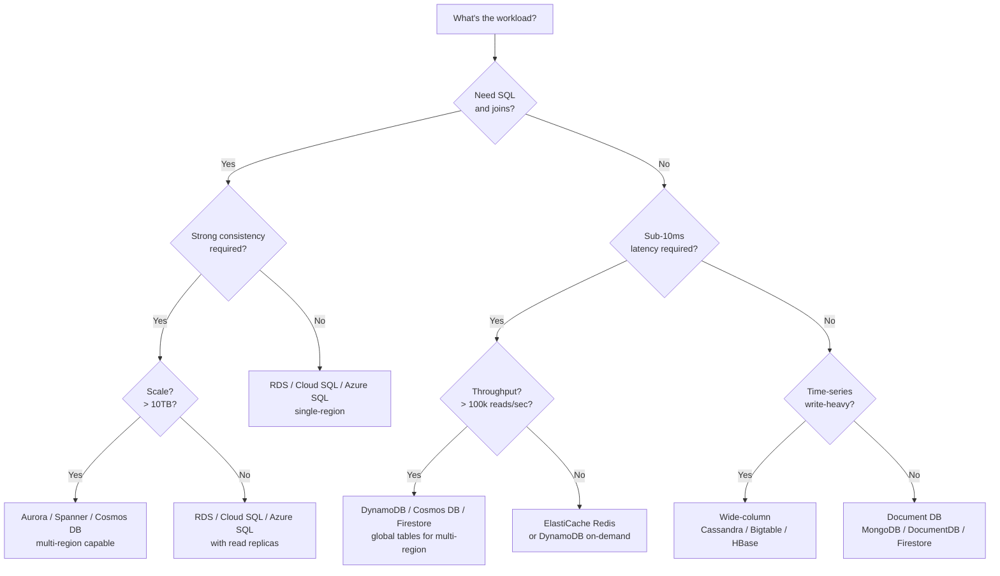
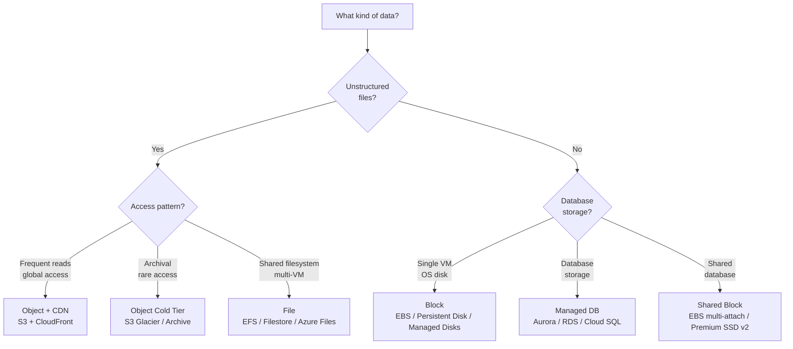
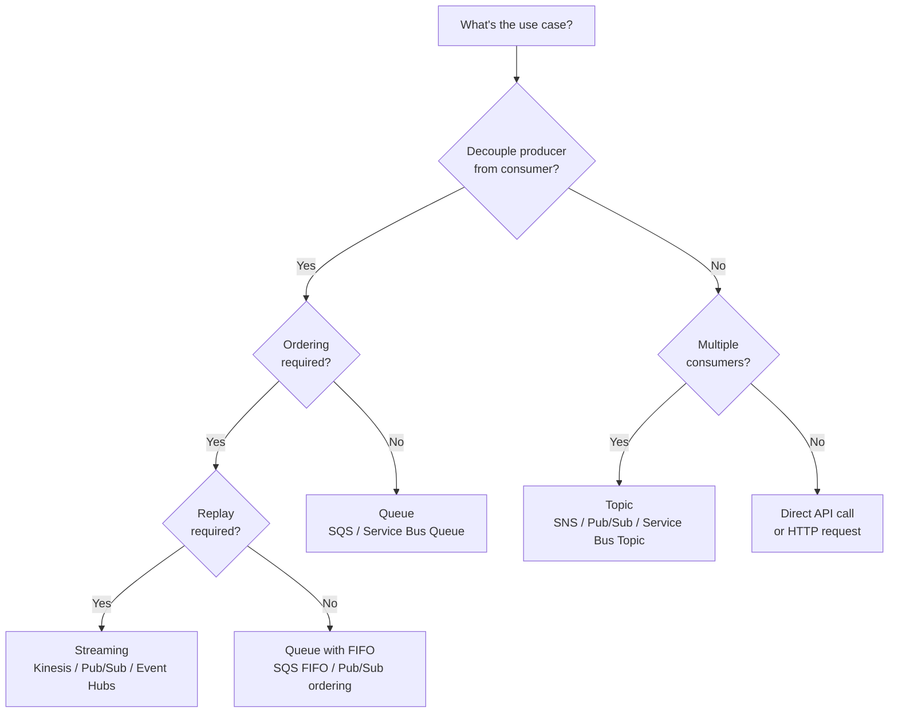
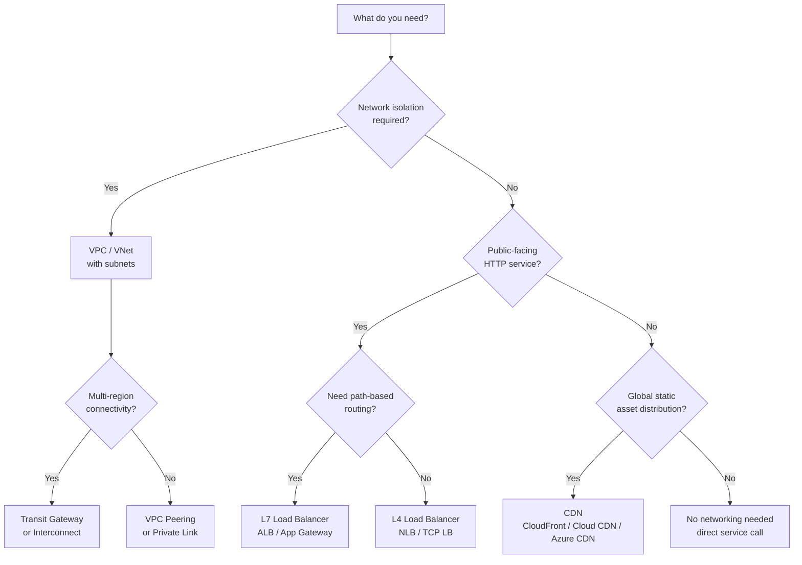
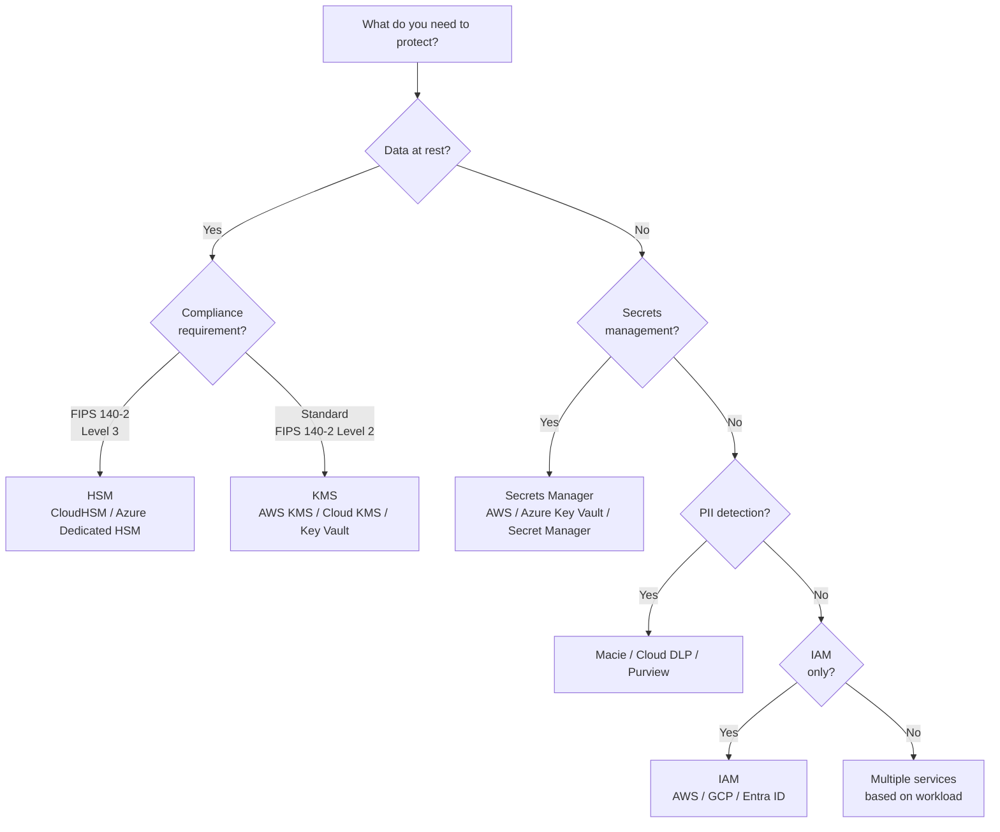

# 07 — When to Use What: The 30-Second Architecture Decision

> **Lesson 7 of 7 — Technical Questions for SAs** · ~15 min

A real decision tree (mermaid `graph TD`) for "given X
requirement, use Y service." The decision tree covers the
6 most common service categories from Lesson 02: compute,
storage, database, networking, messaging, and security.

This lesson is the *practice* of Lesson 06. The framework
is the theory; the decision tree is the application.

---

## 1. The decision tree (compute)

The compute decision tree has 3 main branches:
- **Long-running** → VM or Containers.
- **Event-driven, spiky** → Serverless.
- **Mid-range, multi-cloud** → Containers.

The decision at each node is a 1-question test:
"Long-running? Stateful? Spiky? Multi-cloud?" The
combination of answers points to the right compute model.

---

## 2. The decision tree (database)

The database decision tree has 3 main branches:
- **SQL + strong consistency** → RDS / Aurora.
- **Sub-10ms latency, no SQL** → DynamoDB / Redis.
- **Time-series** → Cassandra / Bigtable.

---

## 3. The decision tree (storage)

The storage decision tree has 3 main branches:
- **Unstructured files** → Object (S3) + optional CDN.
- **Database storage** → Managed DB or block storage.
- **Shared filesystem** → File storage (EFS).

---

## 4. The decision tree (messaging)

The messaging decision tree has 4 main branches:
- **Decouple + ordering + replay** → Streaming (Kinesis).
- **Decouple + no ordering** → Queue (SQS).
- **Fan-out to multiple consumers** → Topic (SNS).
- **No decoupling needed** → Direct API call.

---

## 5. The decision tree (networking)

The networking decision tree has 3 main branches:
- **Network isolation** → VPC + subnets.
- **Public HTTP service** → L7 or L4 load balancer.
- **Global static distribution** → CDN.

---

## 6. The decision tree (security)

The security decision tree has 3 main branches:
- **Data at rest + high compliance** → HSM.
- **Data at rest + standard compliance** → KMS.
- **Secrets management** → Secrets Manager.

---

## 7. The 30-second decision process

The decision tree is the *reference*. The 30-second
decision process is the *practice*. For any architecture
decision in an interview, the 5-step process:

1. **Identify the category.** (Compute, database,
   storage, networking, messaging, or security.)
2. **Identify the constraints.** (Latency, consistency,
   scale, cost, compliance.)
3. **Walk the decision tree.** (Follow the branches
   from the constraint to the service.)
4. **Name the alternative.** (What would you have used
   if the constraint was different?)
5. **Name the tradeoff.** (What's given up by choosing
   this service?)

The 5-step process takes 30-45 seconds in an interview.
The candidate who can produce it consistently passes
the round.

---

## 8. A worked example: 30-second decision

The question: "We're building a real-time fraud detection
pipeline with 1M transactions/day, 100ms p99 latency
requirement, and the data must be encrypted at rest with
FIPS 140-2 Level 3 compliance for our financial services
customer."

### Step 1: Identify the category

Multiple categories. The architecture has:
- Compute (for the fraud detection model)
- Database (for the transaction history and the feature
  store)
- Messaging (for the event stream)
- Security (for the encryption)

### Step 2: Identify the constraints

- **Latency:** 100ms p99 (sub-100ms end-to-end).
- **Consistency:** Strong consistency for the
  transaction history.
- **Compliance:** FIPS 140-2 Level 3 (HSM).
- **Scale:** 1M transactions/day = ~12 transactions/sec
  average, ~100/sec peak (manageable).

### Step 3: Walk the decision tree

- **Compute:** 100ms p99 latency, custom ML model → EKS
  with the model deployed as a service.
- **Database (transaction history):** SQL + strong
  consistency → RDS or Aurora with KMS encryption.
- **Database (feature store):** Sub-10ms latency →
  DynamoDB with on-demand mode.
- **Messaging:** Real-time, ordered, replayable → Kinesis
  or Pub/Sub.
- **Security (encryption at rest):** FIPS 140-2 Level 3 →
  CloudHSM, not just KMS.

### Step 4: Name the alternative

- If the latency requirement was 1s instead of 100ms,
  Lambda could replace EKS for the model.
- If the consistency was eventual, DynamoDB alone (no
  RDS) could handle the transaction history.

### Step 5: Name the tradeoff

- CloudHSM is more expensive than KMS. If the customer
  doesn't need FIPS 140-2 Level 3, KMS is sufficient.
- EKS has more operational overhead than Lambda. If the
  latency budget allowed 1s, Lambda would be cheaper
  and simpler.

The 5-step answer takes 30-45 seconds. The candidate who
can produce it consistently is the senior SA.

---

## 9. The 6 questions to ask before any decision

For any architecture decision, ask these 6 questions
first. The answers drive the decision tree:

1. **What's the latency requirement?** (Sub-millisecond,
   milliseconds, seconds, minutes?)
2. **What's the consistency requirement?** (Strong,
   eventual, read-after-write?)
3. **What's the scale?** (Requests/sec, data volume,
   growth rate?)
4. **What's the cost ceiling?** (Dollars/month,
   dollars/million requests?)
5. **What are the compliance requirements?** (PCI, HIPAA,
   FIPS 140-2 Level X, GDPR?)
6. **What's the team's operational capacity?** (How many
   SREs? What's their skill set?)

The 6 questions are the *checklist* before any decision.
The decision tree is the *output* of the checklist.

---

## 10. The 5 things the decision tree signals

If you use this decision tree in an interview, the 5
things you signal:

1. **You have a framework.** You can produce a consistent
   answer across categories.
2. **You know the services.** You can map any constraint
   to a specific service.
3. **You think about tradeoffs.** You name the alternative
   and the tradeoff.
4. **You think about constraints first.** The decision
   is driven by the customer's needs, not by your
   preference.
5. **You can adapt.** When the customer introduces a new
   constraint, you can re-walk the tree.

The 5 signals are the senior SA move. The decision tree
is the *practice*; the signals are the *outcome*.

---

## Try it

For each of the 6 service categories, pick a 2-3
paragraph scenario and walk the decision tree:

1. **Compute:** "Design the compute layer for a video
   transcoding service with 10k videos/day, each 1-hour
   long, 4K resolution, processed in batch at midnight."
2. **Database:** "Design the database for a social media
   app with 10M users, 1M posts/day, sub-50ms read
   latency for the home feed."
3. **Storage:** "Design the storage for a photo backup
   service with 1M users, 100GB/user, accessed
   infrequently."
4. **Messaging:** "Design the messaging for an order
   processing pipeline with 100k orders/day, ordered
   by customer_id, replayable for 30 days for audit."
5. **Networking:** "Design the networking for a multi-
   region SaaS with users in US, EU, Asia, 99.99%
   availability."
6. **Security:** "Design the encryption for a healthcare
   data lake with HIPAA-adjacent data, accessed by
   internal data scientists only."

Run each 2-3 times. By the 3rd time, the decision tree
will be in muscle memory. That's the 30-second decision
round of any architecture interview.
